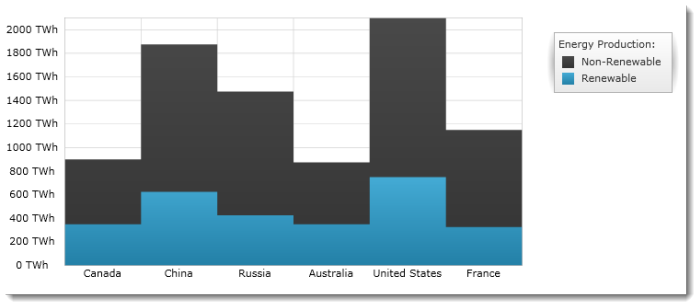

////

|metadata|
{
    "name": "igchartview-step-area-series",
    "controlName": ["IGChartView"],
    "tags": ["Charting","How Do I"],
    "guid": "7a6c2000-a441-47db-8c43-2e81690bc083",  
    "buildFlags": [],
    "createdOn": "2012-05-17T13:58:43.1116579Z"
}
|metadata|
////

= Step Area Series

== Topic Overview

=== Purpose

This topic provides a conceptual overview of the Step Area series of the  _IGChartView_™ control and uses a code example to demonstrate how to add it to the IGChartView.

=== In this topic

This topic contains the following sections:

* <<_Ref324841248,Introduction>>

** <<_Ref328073516,Step Area series summary>>
** <<_Ref327344865,Data requirements>>

* <<_Ref328073541,Adding a Step Area Series to the  _IGChartView_   – Code Example>>

** <<_Ref327344874,Description>>
** <<_Ref328073548,Prerequisites>>
** <<_Ref327344881,Code>>

* <<_Ref331071870,Related Content>>

[[_Ref324841248]]
== Introduction

[[_Ref327344861]]

=== Step Area series summary

Step Area series belongs to a group of category series that uses a collection of points, connected by continuous vertical and horizontal lines and fills in the area below the lines. Values are represented on the y-axis ( _IGNumericYAxis_  ) and categories are displayed on the x-axis (IGCategoryXAxis or  _IGCategoryDateTimeXAxis_  ). Step Area series emphasizes the amount of change over time or compares multiple items.

The step area series is identical to the step line series in all aspects except that when rendered it fills in the area below the step.

[[_Ref327344865]]

=== Data requirements

While the  _IGChartView_   control allows easy binding to your own data model, make sure to supply the appropriate amounts and types of data required by the series. If the data does not meet the minimum requirements, based on the type of series that you are using, the  _IGChartView_   will appear blank.

The following is a list of data requirements for the area series type:

*  *Required*  – the data model must contain at least one numeric field for rendering the data.
*  *Optional*  – the data model may contain an optional string or  _NSDate_   field for labels.

[[_Ref324842387]]
[[_Ref328073541]]
[[_Ref324841253]]
== Adding a Step Area Series to the  _IGChartView_   – Code Example

[[_Ref327344874]]

=== Description

The following code uses the link:igchartview-data-source-helpers.html[IGCategorySeriesDataSourceHelper] to supply randomly generated data to an area series that first gets added to the  _IGChartView_   instance, and then the  _IGChartView_   is added as a sub-view of the current  _UIView_  .

[[_Ref328073548]]

=== Prerequisites

This code example requires the inclusion of the  _IGChartView_   framework, detail about how to add this framework can be found in the link:igchartview-adding-the-chart-framework-file.html[Adding the Chart Framework File] topic.

[[_Ref327344881]]

=== Code

*In Objective-C:*

[source,csharp]
----
 NSMutableArray data = [[NSMutableArray alloc] init];
    for (int i = 0; i < 25; i++)
    {
        double value = arc4random() % 100;
        [data addObject:[[NSNumber alloc] initWithDouble:value]];
    }
    IGCategorySeriesDataSourceHelper *source = [[IGCategorySeriesDataSourceHelper alloc] init];
    source.values = data;
    IGChartView *infraChart = [[IGChartView alloc] initWithFrame:self.view.frame];
    [infraChart setAutoresizingMask:UIViewAutoresizingFlexibleWidth|UIViewAutoresizingFlexibleHeight];
    IGCategoryXAxis *xAxis = [[IGCategoryXAxis alloc] initWithKey:@"xAxis"];
    IGNumericYAxis *yAxis = [[IGNumericYAxis alloc] initWithKey:@"yAxis"];
    [infraChart addAxis:xAxis];
    [infraChart addAxis:yAxis];
    IGStepAreaSeries *stepAreaSeries = [[IGStepAreaSeries alloc] initWithKey:@"stepAreaSeries"];
    stepAreaSeries.xAxis = xAxis;
    stepAreaSeries.yAxis = yAxis;
    stepAreaSeries.dataSource = source;
    [infraChart addSeries:stepAreaSeries];
    [self.view addSubview:infraChart];
----

*In C#:*

[source,csharp]
----
List<NSObject> data = new List<NSObject>();
   Random r = new Random();
   for(int i = 0;i <25; i++)
   {
      double val = r.Next() % 100; 
      data.Add(new NSNumber(val));
   }
 IGCategoryDateSeriesDataSourceHelper source = new IGCategoryDateSeriesDataSourceHelper();
   source.Values = data.ToArray();
IGChartView chart = new IGChartView(this.View.Frame);
   chart.AutoresizingMask = UIViewAutoresizing.FlexibleHeight | UIViewAutoresizing.FlexibleWidth;
  this.View.AddSubview(chart);
 IGCategoryXAxis xAxis = new IGCategoryXAxis("xAxis");
   IGNumericYAxis yAxis = new IGNumericYAxis("yAxis");
   chart.AddAxis(xAxis);
   chart.AddAxis(yAxis);
IGStepAreaSeries series= new IGStepAreaSeries ("series");
   series.XAxis = xAxis;
   series.YAxis = yAxis;
   series.DataSource = source;
   chart.AddSeries(columnSeries);
----

[[_Ref331071870]]
== Related Content

=== Topics

The following topics provide additional information related to this topic.

[options="header", cols="a,a"]
|====
|Topic|Purpose

| link:igchartview-category-series.html[Category Series]
|This is collection of topics explain the various types of Category series supported by the _IGChartView_ control.

|====