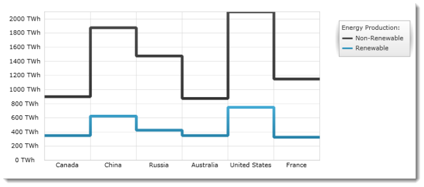

////

|metadata|
{
    "name": "igchartview-step-line-series",
    "controlName": ["IGChartView"],
    "tags": ["Charting","How Do I"],
    "guid": "2e33c623-6a76-4b1b-9a09-aabd7ce3d329",  
    "buildFlags": [],
    "createdOn": "2012-05-17T13:59:05.9919457Z"
}
|metadata|
////

= Step Line Series

== Topic Overview

=== Purpose

This topic provides a conceptual overview of the Step Line series in the  _IGChartView_™ control and uses a code example to demonstrate how to add this series to the chart view.

=== In this topic

This topic contains the following sections:

* <<_Ref324841248,Introduction>>

** <<_Ref328069519,Step Line series summary>>
** <<_Ref327345162,Data requirements>>

* <<_Ref328069529,Adding a Step Line Series to the  _IGChartView —_   Code Example>>

** <<_Ref327345175,Description>>
** <<_Ref327345180,Prerequisites>>
** <<_Ref327345183,Code>>

* <<_Ref324841253,Related Content>>

[[_Ref324841248]]
== Introduction

[[_Ref327345157]]

=== Step Line series summary

Step line series belongs to a group of category series that uses a collection of points connected by continuous vertical and horizontal lines forming a step-like progression when rendered. Values are represented on the y-axis ( _IGNumericYAxis_  ) and categories are displayed on the x-axis ( _IGCategoryXAxis_   or  _IGCategoryDateTimeXAxis_  ). Step line series emphasizes the amount of change over time or compares multiple items. With the exception of not filling in the area beneath the graph trace, the step line series is identical to the step area series in every other aspect

[[_Ref327345162]]

=== Data requirements

While the  _IGChartView_   control allows easy binding to your own data model, make sure to supply the appropriate amounts and types of data required by the series. If the data does not meet the minimum requirements, based on the type of series that you are using, the  _IGChartView_   will appear blank.

The following is a list of data requirements for the step line series type:

*  *Required –*  the data model must contain at least one numeric field for rendering the data.
*  *Optional –*  the data model may contain an optional string or  _NSDate_   field for labels.

[[_Ref328069529]]
[[_Ref324842387]]
== Adding a Step Line Series to the  _IGChartView —_   Code Example

[[_Ref327345175]]

=== Description

The code below uses the link:igchartview-data-source-helpers.html[IGCategorySeriesDataSourceHelper] to supply randomly generated data to a step line series that first gets added to the  _IGChartView_   instance, and then the  _IGChartView_   is added as a subview of the current  _UIView_  .

[[_Ref327345180]]

=== Prerequisites

This code example requires the inclusion of the  _IGChartView_   framework, detail about how to add this framework can be found in the link:igchartview-adding-the-chart-framework-file.html[Adding the Chart Framework File] topic.

[[_Ref327345183]]

=== Code

*In Objective-C:*

[source,csharp]
----
 NSMutableArray data = [[NSMutableArray alloc] init];
    for (int i = 0; i < 25; i++)
    {
        double value = arc4random() % 100;
        [data addObject:[[NSNumber alloc] initWithDouble:value]];
    }
    IGCategorySeriesDataSourceHelper *source = [[IGCategorySeriesDataSourceHelper alloc] init];
    source.values = data;
    IGChartView *infraChart = [[IGChartView alloc] initWithFrame:self.view.frame];
    [infraChart setAutoresizingMask:UIViewAutoresizingFlexibleWidth|UIViewAutoresizingFlexibleHeight];
    IGCategoryXAxis *xAxis = [[IGCategoryXAxis alloc] initWithKey:@"xAxis"];
    IGNumericYAxis *yAxis = [[IGNumericYAxis alloc] initWithKey:@"yAxis"];
    [infraChart addAxis:xAxis];
    [infraChart addAxis:yAxis];
    IGStepLineSeries *stepLineSeries = [[IGStepLineSeries alloc] initWithKey:@"stepLineSeries"];
    stepLineSeries.xAxis = xAxis;
    stepLineSeries.yAxis = yAxis;
    stepLineSeries.dataSource = source;
    [infraChart addSeries:stepLineSeries];
    [self.view addSubview:infraChart];
----

*In C#:*

[source,csharp]
----
List<NSObject> data = new List<NSObject>();
   Random r = new Random();
   for(int i = 0;i <25; i++)
   {
      double val = r.Next() % 100; 
      data.Add(new NSNumber(val));
   }
 IGCategoryDateSeriesDataSourceHelper source = new IGCategoryDateSeriesDataSourceHelper();
   source.Values = data.ToArray();
IGChartView chart = new IGChartView(this.View.Frame);
   chart.AutoresizingMask = UIViewAutoresizing.FlexibleHeight | UIViewAutoresizing.FlexibleWidth;
  this.View.AddSubview(chart);
 IGCategoryXAxis xAxis = new IGCategoryXAxis("xAxis");
   IGNumericYAxis yAxis = new IGNumericYAxis("yAxis");
   chart.AddAxis(xAxis);
   chart.AddAxis(yAxis);
IGStepLineSeries series= new IGStepLineSeries ("series");
   series.XAxis = xAxis;
   series.YAxis = yAxis;
   series.DataSource = source;
   chart.AddSeries(columnSeries);
----

[[_Ref324841253]]
== Related Content

=== Topics

The following topics provide additional information related to this topic.

[options="header", cols="a,a"]
|====
|Topic|Purpose

| link:igchartview-category-series.html[Category Series]
|This is a group of topics explaining the various types of Category series supported by the _IGChartView_ control.

|====