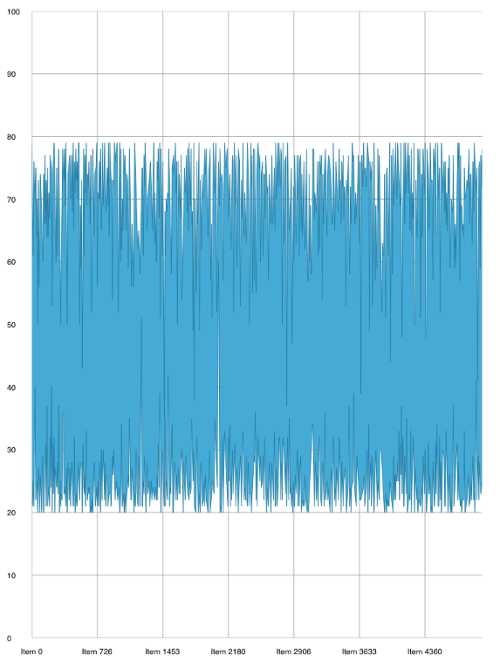

////
|metadata|
{
    "name": "igchartview-using-asynchronous-category-data-source",
    "tags": ["Data Binding","Getting Started","How Do I","Events"],
    "controlName": ["IGChartView"],
    "guid": "a2152b62-c1f7-453e-8ac9-2edfdc35a2a2",  
    "buildFlags": [],
    "createdOn": "2014-03-18T17:34:41.9454356Z"
}
|metadata|
////

= Using Asynchronous Category Data Source

== Topic Overview

==== Purpose

This topic provides an overview of using the asynchronous category data source on the _IGChartView_™ control and demonstrates their use with a code example.

==== In this topic

This topic contains the following sections:

* <<Ref324841248,**Introduction**>> 
* <<Ref255193732, **Using the Asynchronous Category Data Source – Code Example**>> 
 ** <<_Ref327344209,Description>>
 ** <<_Ref252521837,Preview>> 
 ** <<_Ref327523606,Prerequisites>>
 ** <<_Ref327344217,Code>>
* <<_Ref215823716, **Related Content**>>

[[Ref324841248]]
== Introduction

==== Asynchronous data source summary

The _IGAsyncCategoryDataSourceHelper_ loads a chunk of data into the _IGChartView_ instead of loading all of the data into memory adding a new chunk of data as needed and when the chart zooms in or out, or when the chart pans past a certain threshold.

While loading a new chunk of data, the control displays a _UIActivityIndicator_. Overriding the `viewForAsyncDataSourceLoadIndicator:` method can provide a custom view. To add any initializations or clean up on the custom activity view, override the `beginAsyncDataSourceRequest:` or `endAsyncDataSourceRequest:` methods.

Currently, the following chart types support _IGAsyncCategoryDataSourceHelper_.

* _IGAreaSeries_
* _IGColumnSeries_
* _IGLineSeries_
* _IGSplineAreaSeries_
* _IGSplineSeries_
* _IGStepAreaSeries_
* _IGStepLineSeries_
* _IGWaterfallSeries_

To use the _IGAsyncCategoryDataSourceHelper_, adoption of the _IGAsyncCategoryDataSource_ protocol is required and requires that the following two methods must be implemented.

* `-(NSInteger)numberOfPointsInAsyncDataSourceHelper: (IGAsyncCategoryDataSourceHelper&gt;*)dataSourceHelper series:(IGSeries*)series`
* `-(NSArray*)provideValuesAtStartIndex:(NSInteger)startIndex endIndex:(NSInteger)endIndex forAsyncDataSourceHelper:(IGAsyncCategoryDataSourceHelper*)dataSourceHelper series:(IGSeries*)series`

These methods specify the number of points total in the data source and when requested the data for a specific range.

[[Ref255193732]]
== Using the Asynchronous Category Data Source – Code Example

[[_Ref327344209]]
==== Description

The code example below creates an instance of the _IGChartView_ that uses the _IGAsyncCategoryDataSourceHelper_ to load 5000 points as needed into a line series.

[[_Ref252521837]]
==== Preview

[[_Ref327523606]]
==== Prerequisites

This code example requires the inclusion of the _IGChart_ framework; details about adding this framework are available in the link:igchartview-adding-the-chart-framework-file.html[Adding the Chart Framework File] topic.

[[_Ref327344217]]
==== Code

**In Objective-C:**

[source,csharp]
----
@interface DataItem : NSObject
@property (nonatomic, copy) NSString *label;
@property (nonatomic, assign) CGFloat value;
@end
@implementation DataItem
@end
@interface igViewController () <IGAsyncCategoryDataSource>
{
    IGChartView *_chart;
    NSMutableArray *_data;
    IGLineSeries *_series;
    IGAsyncCategoryDataSourceHelper *_source;
}
@end
@implementation igViewController
- (void)viewDidLoad
{
    [super viewDidLoad];
    self.view.backgroundColor = [UIColor whiteColor];
    [self generateData:5000];
    _source = [[IGAsyncCategoryDataSourceHelper alloc]initWithValuePath:@"value" andLabelPath:@"label"];
    _source.delegate = self;
    _chart = [[IGChartView alloc]initWithFrame:CGRectInset(self.view.bounds, 10, 10)];
    _chart.zoomDisplayType = IGChartZoomHorizontal;
    _chart.theme = [IGChartDefaultThemes IGTheme];
    [self.view addSubview:_chart];
    _series = (IGLineSeries *)[_chart addSeriesForType:[IGLineSeries class] usingKey:@"series" withDataSource:_source firstAxisKey:@"xAxis" secondAxisKey:@"yAxis"];
    _series.yAxis.minimum = 0;
    _series.yAxis.maximum = 100;
    _series.yAxis.extent = 40;
    _series.xAxis.extent = 40;
}
- (void)generateData:(NSInteger)totalItems
{
    _data = [[NSMutableArray alloc]init];
    for (int i = 0; i < totalItems; i++)
    {
        DataItem *item = [[DataItem alloc]init];
        item.value = arc4random() % 80;
        if (item.value <= 20)
            item.value += 20;
        item.label = [NSString stringWithFormat:@"Item %d", i];
        [_data addObject:item];
    }
}
- (NSInteger)numberOfPointsInAsyncDataSourceHelper:(IGAsyncCategoryDataSourceHelper *)dataSourceHelper series:(IGSeries *)series
{
    return 5000;
}
- (NSArray *)provideValuesAtStartIndex:(NSInteger)startIndex endIndex:(NSInteger)endIndex forAsyncDataSourceHelper:(IGAsyncCategoryDataSourceHelper *)dataSourceHelper series:(IGSeries *)series
{
    NSRange range = NSMakeRange(startIndex, endIndex - startIndex);
    return [_data subarrayWithRange:range];
}
@end
----

**In C#:**

[source,csharp]
----
public class DataItem : NSObject
{
      [Export("Label")]
      public String Label { get; set; }
      [Export("Value")]
      public float Value { get; set; }
}
public class AsyncDataSource : IGAsyncCategoryDataSource
{
      List<NSObject> _data;
      public AsyncDataSource(List<NSObject> data)
      {
            _data = data;
      }
      public override int NumberOfPoints (IGAsyncCategoryDataSourceHelper dataSourceHelper, IGSeries series)
      {
            return 5000;
      }
      public override NSObject[] ProvideValues (int startIndex, int endIndex, IGAsyncCategoryDataSourceHelper dataSourceHelper, IGSeries series)
      {
            List<NSObject> values = _data.GetRange (startIndex, endIndex - startIndex);
            return values.ToArray ();
      }
}
public partial class ChartAsyncDataSourceHelper_CSViewController : UIViewController
{
      IGChartView _chart;
      List<NSObject> _data;
      IGLineSeries _series;
      IGAsyncCategoryDataSourceHelper _source;
      public ChartAsyncDataSourceHelper_CSViewController ()
      {
      }
      public override void ViewDidLoad ()
      {
            base.ViewDidLoad ();
            this.View.BackgroundColor = UIColor.White;
            GenerateData (5000);
            _source = new IGAsyncCategoryDataSourceHelper ("Value", "Label");
            _source.Delegate = new AsyncDataSource(_data);
            _chart = new IGChartView();
            RectangleF chartRect = this.View.Bounds;
            chartRect.Inflate(-10, -10);
            _chart.Frame = chartRect;
            _chart.ZoomDisplayType = IGChartZoom.IGChartZoomHorizontal;
            _chart.Theme = IGChartDefaultThemes.IGTheme();
            this.View.Add (_chart);
            _series = _chart.AddSeries (new Class ("IGLineSeries"), "series", _source, "xAxis", "yAxis") as IGLineSeries;
            _series.YAxis.Minimum = 0;
            _series.YAxis.Maximum = 100;
            _series.YAxis.Extent = 40;
            _series.XAxis.Extent = 40;
      }
      public void GenerateData(int TotalItems)
      {
            _data = new List<NSObject>();
            for (int i = 0; i < TotalItems; i++)
            {
                  DataItem item = new DataItem();
                  item.Value = new Random (i * DateTime.Now.Millisecond).Next (20, 80);
                  item.Label = String.Format ("Item {0}", i);
                  _data.Add (item);
            }
      }
}
----

[[_Ref215823716]]
== Related Content

The following topic provides additional information related to this topic.

[options="header", cols="a,a"]
|====
|Topic|Purpose

|link:igchartview.html[IGChartView]
|The topics in this group cover enabling, configuring, and using the _IGChartView_ control’s supported features.
