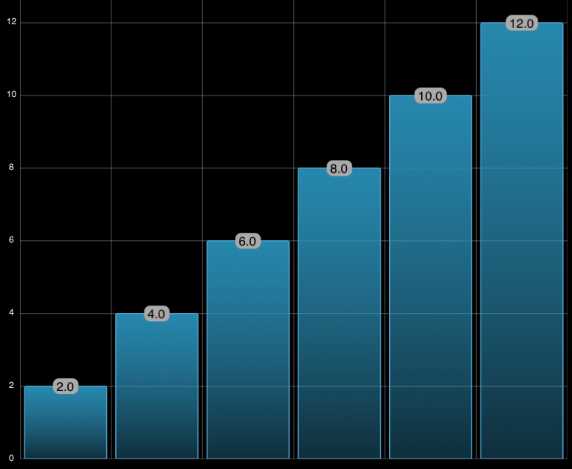

////

|metadata|
{
    "name": "igchartview-using-custom-markers",
    "tags": ["Charting","Getting Started","How Do I","Styling"],
    "controlName": ["IGChartView"],
    "guid": "08d3b275-279e-4c3c-9446-a94281dbaf8d",  
    "buildFlags": [],
    "createdOn": "2013-08-26T17:15:42.3545264Z"
}
|metadata|
////

= Using Custom Markers

== Topic Overview

=== Purpose

This topic provides an introductory overview of using custom markers on the  _IGChartView_™ control and provides a code example demonstrating its configuration.

=== In this topic

This topic contains the following sections:

* <<_Ref324841248, Introduction >>
* <<_Ref327936206, Configuring Custom Markers – Code Example >>

** <<_Ref327344209,Description>>
** <<_Ref327523606,Prerequisites>>
** <<_Ref231532531,Preview>>
** <<_Ref327344217,Code>>

* <<_Ref215823716, Related Content >>

[[_Ref324841248]]
== Introduction

[[_Ref215796828]]

=== Custom markers summary

The use of custom markers allows you to insert a  _UIView_   in place of a marker on a data point. To enable custom markers, adopt the  _IGChartViewDelegate_   protocol, and handle the `chartView:viewForMarkerInSeries:withItem:index:originalSourceItem:displayOptions:` method. Custom markers can display as an image of a  _UIView_   or a  _UIView_   for greater functionality. By default the custom marker will display as an image of a  _UIView_   , to display the marker as an interactive  _UIView_   set the `displayAsImage` property found in the `displayOptions` parameter to `NO`.

The `displayOptions` parameter contains two other properties for customizing the display of custom marker, `showOriginalMarker` and `bringOriginalMarkerToFront`. The `showOriginalMarker` property will place the original marker shape before displaying the custom view. The marker shape will only be seen if the view is not fully opaque or if the view is offset enough not to obstruct the marker. The `bringOriginalMarkerToFront` property makes the marker shape top-most, so the custom view can be fully opaque and the marker shape will still be visible.

[[_Ref327936206]]
[[_Ref324841253]]
== Configuring Custom Markers – Code Example

[[_Ref327344209]]

=== Description

The code example demonstrates how the  _IGChartViewDelegate_   handles the ``chartView:viewForMarkerInSeries:withItem:index:originalSourceItem:displayOptions:`` delegate method. The method returns a rounded  _UILabel_   containing the value of the category point. The chart using custom markers illustrated in the preview is a column chart using the `IGThemeDark` gradient theme.

[[_Ref327523606]]

=== Prerequisites

This code example requires the inclusion of the  __Chart__  framework; details about how to add this framework are available in the link:igchartview-adding-the-chart-framework-file.html[Adding the Chart Framework File] topic.

[[_Ref231532531]]

=== Preview

[[_Ref327344217]]

=== Code

*In Objective-C:*

[source,csharp]
----
- (UIView *)chartView:(IGChartView *)chartView viewForMarkerInSeries:(IGSeries *)series withItem:(NSObject *)item index:(NSInteger)index originalSourceItem:(NSObject *)originalSourceItem displayOptions:(IGMarkerDisplayOptions * )options
{
    UILabel *label = [[UILabel alloc] init];
    IGCategoryPoint *pt = (IGCategoryPoint * )item;
    if (pt == nil) return nil;
    label.backgroundColor = [UIColor lightGrayColor];
    label.text = [NSString stringWithFormat:@" %.1f ", pt.value];
    label.layer.cornerRadius = 8.0;
    [label sizeToFit];
    return label;
}
----

*In C#:*

[source,csharp]
----
public class ChartDelegate : IGChartViewDelegate
{
      public override UIView ResolveMarkerView (IGChartView chartView, IGSeries series, NSObject item, int index, NSObject originalSourceItem, IGMarkerDisplayOptions options)
      {
            UILabel label = new UILabel ();
            IGCategoryPoint pt = item as IGCategoryPoint;
            if (pt == null) return null;
            label.BackgroundColor = UIColor.LightGray;
            label.Text = String.Format (" {0:0.0} ", pt.Value);
            label.Layer.CornerRadius = 8.0f;
            label.SizeToFit ();
            return label;
      }
}
----

[[_Ref215823716]]
== Related Content

=== Topics

The following topic provides additional information related to this topic.

[options="header", cols="a,a"]
|====
|Topic|Purpose

| link:igchartview.html[IGChartView]
|The topics in this group cover enabling, configuring, and using the _IGChartView_ control’s supported features.

|====