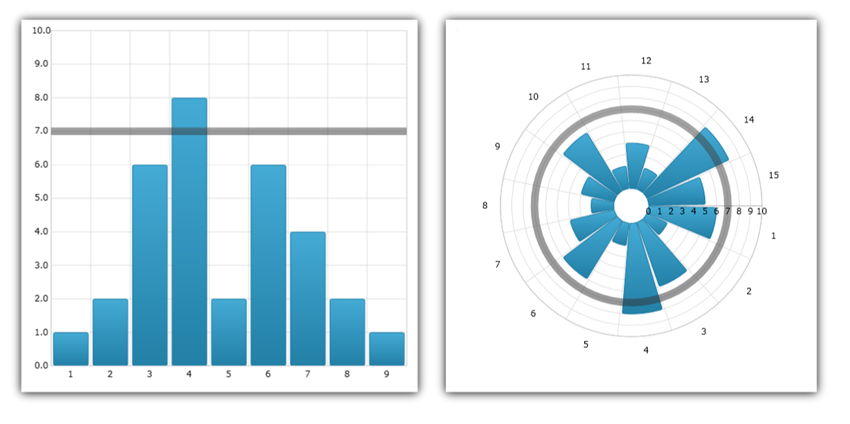

////

|metadata|
{
    "name": "igchartview-value-overlay",
    "controlName": ["IGChartView"],
    "tags": ["Charting","How Do I"],
    "guid": "d2710c6c-a670-48e0-8e91-3b9efa9232b2",  
    "buildFlags": [],
    "createdOn": "2013-02-06T14:38:49.1170542Z"
}
|metadata|
////

= Value Overlay

== Topic Overview

=== Purpose

This topic is a conceptual overview of the  _IGChartView_™ control’s Value Overlay and provides a code example demonstrating how to add it to the chart view.

=== In this topic

This topic contains the following sections:

* <<_Ref324841248, Introduction >>
* <<_Ref327936206,Adding a Value Overlay to the IGChartView – Code Example>>

** <<_Ref327344209,Description>>
** <<_Ref327523606,Prerequisites>>
** <<_Ref327344217,Code>>

* <<_Ref215823716, Related Content >>

[[_Ref324841248]]
== Introduction

[[_Ref215796828]]

=== Value Overlay summary

A Value Overlay uses the `value` property to bind a numeric value to display as a line superimposed over other types of series in order to highlight important values such as a data set’s mean, median, mode  _etc_ …. The Value Overlay uses either the horizontal or the vertical axis, as a reference, when bound to an  _IGNumericXAxis_   and  _IGNumericYAxis_   respectively, as a line segment emanating from the center of the chart when bound to an  _IGNumericAngleAxis,_   or a circle when bound to  _IGNumericRadiusAxis_  .

The Value Overlay inherits its appearance properties from the  _IGSeries_   base class, so `brush`, `thickness`, and `dashArray` are available and work the same way as they do with other types of series.

[[_Ref324842387]]
[[_Ref327936206]]
[[_Ref324841253]]
== Adding a Value Overlay to the  _IGChartView_  – Code Example

[[_Ref327344209]]

=== Description

The code below uses the link:igchartview-data-source-helpers.html[IGCategorySeriesDataSourceHelper] to supply randomly generated data to a Spline Area series by first adding to the  _IGChartView_   instance, next added as a Value Overlay with the value property set to 17.5 with a thickness of 15.0, and then finally added to the  _IGChartView_   as a subview of the current  _UIView_  .

[[_Ref327523606]]

=== Prerequisites

This code example requires the inclusion of the  _IGChartView_   framework, detail about how to add this framework are available in the link:igchartview-adding-the-chart-framework-file.html[Adding the Chart Framework File] topic.

[[_Ref327344217]]

=== Code

*In C#:*

[source,csharp]
----
List<NSObject> values = new List<NSObject>();
for (int i = 0; i < 25; i++) {
      values.Add(new NSNumber((new Random(i).Next() % 100)));
}
IGCategorySeriesDataSourceHelper source = new IGCategorySeriesDataSourceHelper();
source.Values = values.ToArray();
IGChartView infraChart = new IGChartView(this.View.Frame);
infraChart = new IGChartView();
infraChart.Frame = new RectangleF(0, 0, this.View.Frame.Size.Width, this.View.Frame.Size.Height);
infraChart.Frame = RectangleF.Inflate(infraChart.Frame, -10.0f, -10.0f);
infraChart.AutoresizingMask = UIViewAutoresizing.FlexibleHeight | UIViewAutoresizing.FlexibleWidth;
IGSplineAreaSeries splineAreaSeries = (IGSplineAreaSeries) infraChart.AddSeries(new MonoTouch.ObjCRuntime.Class(typeof(IGSplineAreaSeries)), "splineAreaSeries", source, "xAxis", "yAxis");
((IGCategoryXAxis) splineAreaSeries.XAxis).LabelOrientationAngle = 45;
splineAreaSeries.XAxis.Extent = 40;
IGValueOverlay valueOverlay = new IGValueOverlay("Value Overlay");
valueOverlay.Axis = splineAreaSeries.YAxis;
valueOverlay.Value = 17.5f;
valueOverlay.Thickness = 15.0f;
valueOverlay.Brush = new IGBrush(1.0f, 0.0f, 0.0f, 0.3f);
infraChart.AddSeries(valueOverlay);
(this.View).AddSubview(infraChart);
----

*In Objective-C:*

[source,csharp]
----
 NSMutableArray *values = [[NSMutableArray alloc] init];    for (int i = 0; i < 25; i++)     {        [values addObject:[[NSNumber alloc] initWithDouble:(arc4random() % 100)]];    }
    IGCategorySeriesDataSourceHelper *source = [[IGCategorySeriesDataSourceHelper alloc] init];    source.values = values;
    IGChartView *infraChart = [[IGChartView alloc] initWithFrame:self.view.frame];
    infraChart = [[IGChartView alloc] init];
    infraChart.frame = CGRectMake(0, 0, self.view.frame.size.width, self.view.frame.size.height);
    infraChart.frame = CGRectInset(infraChart.frame, 10, 10);
    infraChart.autoresizingMask = UIViewAutoresizingFlexibleHeight|UIViewAutoresizingFlexibleWidth;
    IGSplineAreaSeries *splineAreaSeries = (IGSplineAreaSeries * )[infraChart addSeriesForType:[IGSplineAreaSeries class] usingKey:@"splineAreaSeries" withDataSource:source firstAxisKey:@"xAxis" secondAxisKey:@"yAxis"];
    ((IGCategoryXAxis *)splineAreaSeries.xAxis).labelOrientationAngle = 45;
    splineAreaSeries.xAxis.extent = 40;
    IGValueOverlay *valueOverlay = [[IGValueOverlay alloc] initWithKey:@"Value Overlay"];
    valueOverlay.axis = splineAreaSeries.yAxis;
    valueOverlay.value = 17.5;
    valueOverlay.thickness = 15.0;
    valueOverlay.brush = [[IGBrush alloc] initWithR:1.0 andG:0.0 andB:0.0 andA:0.3];
    [infraChart addSeries:valueOverlay];
    [self.view addSubview:infraChart];
----

[[_Ref215823716]]
== Related Content

=== Topics

The following topics provide additional information related to this topic.

[options="header", cols="a,a"]
|====
|Topic|Purpose

| link:igchartview-chart-series.html[Chart Series]
|This collection of topics explains each of the individual charts supported by the _IGChartView_ control.

|====