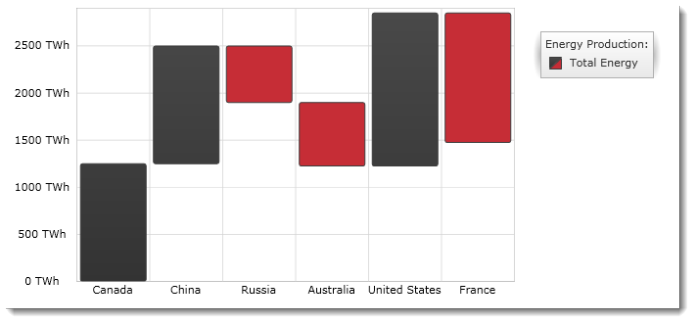

////

|metadata|
{
    "name": "igchartview-waterfall-series",
    "controlName": ["IGChartView"],
    "tags": ["Charting","How Do I"],
    "guid": "91227473-9272-4883-832b-7310d66a1c7e",  
    "buildFlags": [],
    "createdOn": "2012-05-17T14:00:42.7276183Z"
}
|metadata|
////

= Waterfall Series

== Topic Overview

=== Purpose

This topic provides a conceptual overview of the Waterfall series of the  _IGChartView_™ control and uses a code example to demonstrate how to add it to the chart view.

=== In this topic

This topic contains the following sections:

* <<_Ref324841248, Introduction >>

** <<_Ref328664055,Waterfall series summary>>
** <<_Ref327345544,Data requirements>>

* <<_Ref328664104, Adding a Waterfall Series to the  _IGChartView_   – Code Example >>

** <<_Ref327345551,Description>>
** <<_Ref328666251,Prerequisites>>
** <<_Ref327345559,Code>>

* <<_Ref324841253, Related Content >>

[[_Ref324841248]]
== Introduction

[[_Ref327345540]]

=== Waterfall series summary

Waterfall series belongs to a group of category series and uses a collection of vertical columns that show the difference between consecutive data points when rendered. The columns are color coded to help distinguish between positive and negative changes in value. Values are represented on the y-axis ( _IGNumericYAxis_  ) and categories are displayed on the x-axis ( _IGCategoryXAxis_  ).

The waterfall series is similar in appearance to the range column series, but it requires only one numeric data column rather than two columns necessary for the range column series for each data point.

[[_Ref327345544]]

=== Data requirements

While the  _IGChartView_   control allows easy binding to your own data model, make sure to supply the appropriate amounts and types of data required by the series. If the data does not meet the minimum requirements, based on the type of series that you are using, the  _IGChartView_   will appear blank.

The following is a list of data requirements for the waterfall series type:

*  *Required –*  the data model must contain at least one numeric field for rendering the data.
*  *Optional –*  the data model may contain an optional string or  _NSDate_   field for labels.

[[_Ref324842387]]
[[_Ref328664104]]
== Adding a Waterfall Series to the  _IGChartView_   – Code Example

[[_Ref327345551]]

=== Description

The code below uses the link:igchartview-data-source-helpers.html[IGCategorySeriesDataSourceHelper] to supply randomly generated data to a waterfall series that first gets added to the  _IGChartView_   instance, and then the  _IGChartView_   is added as a subview of the current  _UIView_  .

[[_Ref328666251]]

=== Prerequisites

This code example requires the inclusion of the  _IGChartView_   framework. For information about how to add this framework, see the link:igchartview-adding-the-chart-framework-file.html[Adding the Chart Framework File] topic.

[[_Ref327345559]]

=== Code

*In Objective-C:*

[source,csharp]
----
 NSMutableArray data = [[NSMutableArray alloc] init];
    for (int i = 0; i < 25; i++)
    {
        double value = arc4random() % 100;
        [data addObject:[[NSNumber alloc] initWithDouble:value]];
    }
    IGCategorySeriesDataSourceHelper *source = [[IGCategorySeriesDataSourceHelper alloc] init];
    source.values = data;
    IGChartView *infraChart = [[IGChartView alloc] initWithFrame:self.view.frame];
    [infraChart setAutoresizingMask:UIViewAutoresizingFlexibleWidth|UIViewAutoresizingFlexibleHeight];
    IGCategoryXAxis *xAxis = [[IGCategoryXAxis alloc] initWithKey:@"xAxis"];
    IGNumericYAxis *yAxis = [[IGNumericYAxis alloc] initWithKey:@"yAxis"];
    [infraChart addAxis:xAxis];
    [infraChart addAxis:yAxis];
    IGWaterfallSeries *waterfallSeries = [[IGWaterfallSeries alloc] initWithKey:@"waterfallSeries"];
    waterfallSeries.xAxis = xAxis;
    waterfallSeries.yAxis = yAxis;
    waterfallSeries.dataSource = source;
    [infraChart addSeries:waterfallSeries];
    [self.view addSubview:infraChart];
----

*In C#:*

[source,csharp]
----
List<NSObject> data = new List<NSObject>();
   Random r = new Random();
   for(int i = 0;i <25; i++)
   {
      double val = r.Next() % 100; 
      data.Add(new NSNumber(val));
   }
 IGCategoryDateSeriesDataSourceHelper source = new IGCategoryDateSeriesDataSourceHelper();
   source.Values = data.ToArray();
IGChartView chart = new IGChartView(this.View.Frame);
   chart.AutoresizingMask = UIViewAutoresizing.FlexibleHeight | UIViewAutoresizing.FlexibleWidth;
  this.View.AddSubview(chart);
 IGCategoryXAxis xAxis = new IGCategoryXAxis("xAxis");
   IGNumericYAxis yAxis = new IGNumericYAxis("yAxis");
   chart.AddAxis(xAxis);
   chart.AddAxis(yAxis);
IGWaterfallSeries series= new IGWaterfallSeries ("series");
   series.XAxis = xAxis;
   series.YAxis = yAxis;
   series.DataSource = source;
   chart.AddSeries(columnSeries);
----

[[_Ref324841253]]
== Related Content

=== Topics

The following topics provide additional information related to this topic.

[options="header", cols="a,a"]
|====
|Topic|Purpose

|[[_Hlk328667155]] 

link:igchartview-category-series.html[Category Series]
|This is a group of topics explaining the various types of Category series supported by the _IGChartView_ control.

|====