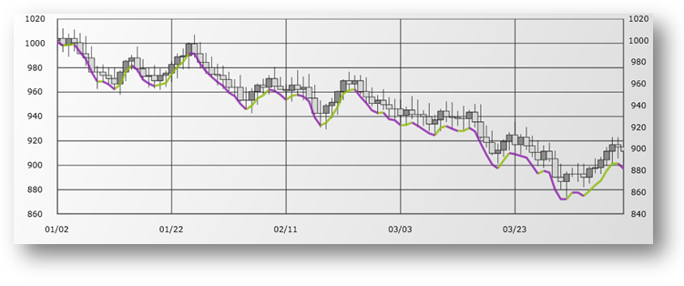

////

|metadata|
{
    "name": "igchartview-weighted-close-indicator",
    "controlName": ["IGChartView"],
    "tags": ["Charting","How Do I"],
    "guid": "84b84a48-3ff7-43e5-9bd6-5228591990c5",  
    "buildFlags": [],
    "createdOn": "2013-02-08T16:05:02.9713168Z"
}
|metadata|
////

= Weighted Close Indicator

== Topic Overview

=== Purpose

This topic provides a conceptual overview of the  _IGChartView_™ control’s Weighted Close indicator and demonstrates how to add it to the chart view using a code example.

=== In this topic

This topic contains the following sections:

* <<_Ref324841248, Introduction >>

** <<_Ref326220605,Weighted Close indicator summary>>
** <<_Ref326220610,Data requirements>>

* <<_Ref327935154,Adding a Weighted Close Indicator to the IGChartView  _–_   Code Example>>

** <<_Ref326220621,Description>>
** <<_Ref327935193,Prerequisites>>
** <<_Ref326220625,Code>>

* <<_Ref324841253, Related Content >>

[[_Ref324841248]]
== Introduction

[[_Ref326220605]]

=== Weighted Close indicator summary

The Weighted Close indicator is a financial indicator that is similar to the link:igchartview-typical-price-indicator.html[Typical Price Indicator] in that it represents an average of the high, low, and closing price for a day. However, with the Weighted Close indicator, places greater emphasis on the closing price and includes it twice when calculating the arithmetic average.

[[_Ref326220610]]

=== Data requirements

While the  _IGChartView_   control allows easy binding to your own data model, make sure to supply the appropriate amounts and types of data required by the series. If the data does not meet the minimum requirements, based on the type of series that you are using, the  _IGChartView_   will appear to be blank.

*Required –*  the data model must contain a numeric field, for high, low, and close, for rendering data.

[[_Ref324842387]]
[[_Ref327935154]]
== Adding a Weighted Close Indicator to the  _IGChartView_   – Code Example

[[_Ref326220621]]

=== Description

The following code uses the link:igchartview-data-source-helpers.html[IGOHLCSeriesDataSourceHelper] to supply randomly generated data to a financial price series by first adding to the IGChartView instance, then next adding the financial indicator to the  _IGChartView_   instance as a series, and then finally adding the  _IGChartView_   as a subview of the current  _UIView_  .

[[_Ref327935193]]

=== Prerequisites

This code example requires the inclusion of the  _IGChartView_   framework, detail about how to add this framework can be found in the link:igchartview-adding-the-chart-framework-file.html[Adding the Chart Framework File] topic.

[[_Ref326220625]]

=== Code

*In C#:*

[source,csharp]
----
List<NSObject> open = new List<NSObject>();
for (int i = 0; i < 25; i++) {
      open.Add(new NSNumber((new Random((int)DateTime.Now.Ticks).Next(100))));
}
List<NSObject> high = new List<NSObject>();
for (int i = 0; i < 25; i++) {
      high.Add(new NSNumber((new Random((int)DateTime.Now.Ticks).Next(130))));
}
List<NSObject> low = new List<NSObject>();
for (int i = 0; i < 25; i++) {
      low.Add(new NSNumber((new Random((int)DateTime.Now.Ticks).Next(100))));
}
List<NSObject> close = new List<NSObject>();
for (int i = 0; i < 25; i++) {
      close.Add(new NSNumber((new Random((int)DateTime.Now.Ticks).Next(110))));
}
List<NSObject> volume = new List<NSObject>();
for (int i = 0; i < 25; i++) {
      volume.Add(new NSNumber((new Random((int)DateTime.Now.Ticks).Next(1100000))));
}
IGOHLCSeriesDataSourceHelper source = new IGOHLCSeriesDataSourceHelper();
source.OpenValues = open.ToArray();
source.HighValues = high.ToArray();
source.LowValues = low.ToArray();
source.CloseValues = close.ToArray();
source.VolumeValues = volume.ToArray();
IGChartView infraChart = new IGChartView(this.View.Frame);
infraChart.AutoresizingMask = UIViewAutoresizing.FlexibleWidth | UIViewAutoresizing.FlexibleHeight;
IGCategoryXAxis xAxis = new IGCategoryXAxis("xAxis");
IGNumericYAxis yAxis = new IGNumericYAxis("yAxis");
infraChart.AddAxis(xAxis);
infraChart.AddAxis(yAxis);
IGFinancialPriceSeries financialPriceSeries = new IGFinancialPriceSeries("financialPriceSeries");
financialPriceSeries.XAxis = xAxis;
financialPriceSeries.YAxis = yAxis;
financialPriceSeries.DataSource = source;
financialPriceSeries.DisplayType = IGPriceDisplayType.IGPriceDisplayTypeCandlestick;
IGWeightedCloseIndicator financialIndicator = new IGWeightedCloseIndicator("financialIndicator");
financialIndicator.XAxis = xAxis;
financialIndicator.YAxis = yAxis;
financialIndicator.DataSource = source;
financialIndicator.Thickness = 3.0f;
infraChart.AddSeries(financialPriceSeries);
infraChart.AddSeries(financialIndicator);
(this.View).AddSubview(infraChart);
----

*In Objective-C:*

[source,csharp]
----
 NSMutableArray *open = [[NSMutableArray alloc] init];
    for (int i = 0; i < 25; i++) {
        [open addObject:[[NSNumber alloc] initWithDouble:(arc4random() % 100)]];
    }
    NSMutableArray *high = [[NSMutableArray alloc] init];
    for (int i = 0; i < 25; i++) {
        [high addObject:[[NSNumber alloc] initWithDouble:(arc4random() % 100 + 30)]];
    }
    NSMutableArray *low = [[NSMutableArray alloc] init];
    for (int i = 0; i < 25; i++) {
        [low addObject:[[NSNumber alloc] initWithDouble:(arc4random() % 100)]];
    }
    NSMutableArray *close = [[NSMutableArray alloc] init];
    for (int i = 0; i < 25; i++) {
        [close addObject:[[NSNumber alloc] initWithDouble:(arc4random() % 100 + 10)]];
    }
    NSMutableArray *volume = [[NSMutableArray alloc] init];
    for (int i = 0; i < 25; i++)
    {
        [volume addObject:[[NSNumber alloc] initWithDouble:(arc4random() % 1000000 + 100000)]];
    }
    IGOHLCSeriesDataSourceHelper *source = [[IGOHLCSeriesDataSourceHelper alloc] init];
    source.openValues = open;
    source.highValues = high;
    source.lowValues = low;
    source.closeValues = close;
    source.volumeValues = volume;
    IGChartView *infraChart = [[IGChartView alloc] initWithFrame:self.view.frame];
    [infraChart setAutoresizingMask:UIViewAutoresizingFlexibleWidth|UIViewAutoresizingFlexibleHeight];
    IGCategoryXAxis *xAxis = [[IGCategoryXAxis alloc] initWithKey:@"xAxis"];
    IGNumericYAxis *yAxis = [[IGNumericYAxis alloc] initWithKey:@"yAxis"];
    [infraChart addAxis:xAxis];
    [infraChart addAxis:yAxis];
    IGFinancialPriceSeries *financialPriceSeries = [[IGFinancialPriceSeries alloc] initWithKey:@"financialPriceSeries"];
    financialPriceSeries.xAxis = xAxis;
    financialPriceSeries.yAxis = yAxis;
    financialPriceSeries.dataSource = source;
    financialPriceSeries.displayType = IGPriceDisplayTypeCandlestick;
    IGWeightedCloseIndicator *financialIndicator = [[IGWeightedCloseIndicator alloc] initWithKey:@"financialIndicator"];
    financialIndicator.xAxis = xAxis;
    financialIndicator.yAxis = yAxis;
    financialIndicator.dataSource = source;
    financialIndicator.thickness = 3.0f;
    [infraChart addSeries:financialPriceSeries];
    [infraChart addSeries:financialIndicator];
    [self.view addSubview:infraChart];
----

[[_Ref324841253]]
== Related Content

=== Topics

The following topics provide additional information related to this topic.

[options="header", cols="a,a"]
|====
|Topic|Purpose

| link:igchartview-chart-series.html[Chart Series]
|This collection of topics explains each of the individual charts supported by the _IGChartView_ control.

|====