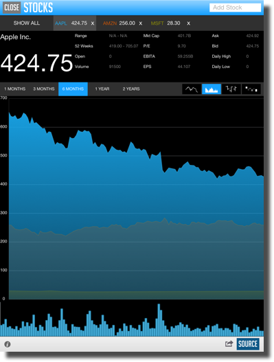

////

|metadata|
{
    "name": "igchartview",
    "controlName": ["IGChartView"],
    "tags": ["Charting","Getting Started"],
    "guid": "10a290bd-efc5-4802-9a77-b2a58dc51137",  
    "buildFlags": [],
    "createdOn": "2012-04-25T13:22:39.777881Z"
}
|metadata|
////

= IGChartView

This section gives you an overview of the use of the IGChartView control. It contains information ranging from what the control does to the step-by-step procedures on how to accomplish common tasks using the control. Click the links below to access important information about the IGChartView control.

== About IGChartView

A chart view is a data visualization control that creates a graphical representation of the user’s data. This control is designed to display high amounts of data and can handle constant data updates.

A chart view consists of two or more  _IGAxis_   objects and one or more  _IGSeries_   objects. The type of axes will depend on which series are used in the chart view. Each  _IGSeries_   object has a detailed description about axes requirements. The chart view supports an unlimited number of axes and an unlimited number of series. A typical chart view may include an  _IGCategoryXAxis_  , an  _IGNumericYAxis_   and a series such as  _IGColumnSeries_  .

== link:igchartview-adding-the-chart-framework-file.html[Adding the Chart Framework File]

This topic demonstrates how to add the chart framework file to a project.

== link:igchartview-adding-igchartview-uiview.html[Adding the IGChartView to a UIView]

This topic provides basic information about creating an instance of the IGChartView and displaying a chart to help you get up and running with this control.

== link:igchartview-motion-framework.html[Animating Charts using the Motion Framework]

This topic provides a conceptual overview of the Motion Framework used in the  _IGChartView_   control.

== link:igchartview-axes.html[Axes]

This topic explains the types of axes supported on the  _IGChartView_   control.

== link:igchartview-brushes.html[Brushes]

This topic provides a conceptual overview of the  _IGBrush_   support in the  _IGChartView_   control and uses code examples to explain how to set properties requiring this object type.

== link:igchartview-chart-series.html[Chart Series]

This collection of topics explains each of the individual charts supported by the  _IGChartView_   control.

== link:igchartview-configuring-igchartview.html[Configuring IGChartView]

The topics in this group cover enabling, configuring and using the  _IGChartView_   control’s supported features.

== link:igchartview-data-source-helpers.html[Data Source Helpers]

This topic provides a conceptual overview of the data source helpers used in the  _IGChartView_   control.

== link:igchartview-legends.html[Legends]

This topic provides a conceptual overview about legends in the  _IGChartView_   control.

== link:igchartview-markers.html[Markers]

This topic provides a conceptual overview of the chart marker shapes used in the  _IGChartView_   control.

== link:igchartview-themes.html[Themes]

This topic provides a conceptual overview of the supported themes available in the  _IGChartView_   control.