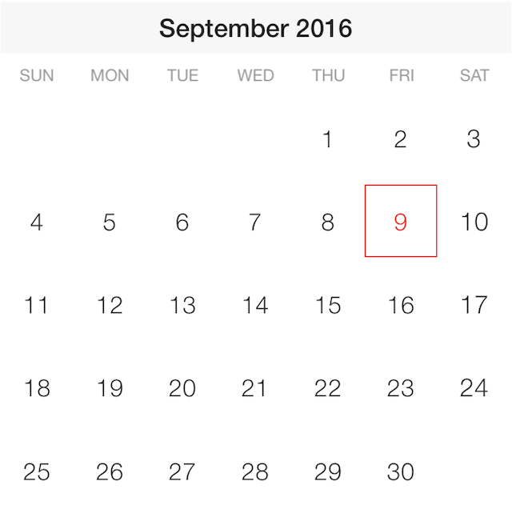

= IGCompactCalendarView

This section gives you an overview of the use of the  _IGCompactCalendarView_™ control. It contains information ranging from what the control does to the step-by-step procedures on how to accomplish common tasks using the control.

Click the links below to access important information about the  _IGCompactCalendarView_   control.

== About IGCompactCalendarView

The _IGCompactCalendarView_ is a view that displays a month in a compact format. Unlike the _IGCalendarView_ you cannot navigate to different views. Instead, the control allows you to quickly look through a calendar and see what days you have appointments.

== link:iggridview-adding-the-ig-framework-file.html[Adding the IG Framework File]

This topic demonstrates how to add the IG framework file to a project.

== link:igcompactcalendarview-adding-compact-calendar-view.html[Adding the Compact Calendar to a View]

This topic provides basic information about creating an instance of the _IGCompactCalendarView_ to help you get up and running with this control.

== link:igcompactcalendarview-adding-meetings-compact-calendar.html[Adding Meetings to the Compact Calendar]

This topics explains and demonstrates the adding of meetings to the _IGCompactCalendarView_ control.

== link:igcompactcalendarview-themes.html[Themes]

This topic provides an introductory overview of the supported themes available and how to create your own theme for the _IGCompactCalendarView_ control.