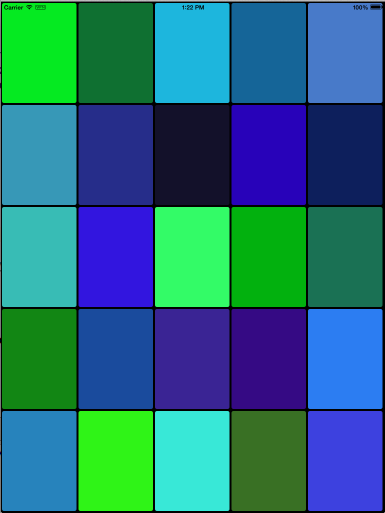

////

|metadata|
{
    "name": "igflowlayoutview-adding-igflowlayoutview-to-a-view",
    "tags": ["Getting Started","How Do I"],
    "controlName": ["IGFlowLayoutView"],
    "guid": "ef1c0837-1ce2-4dd2-85f9-8699f05ed6fc",  
    "buildFlags": [],
    "createdOn": "2014-03-18T12:05:39.0832084Z"
}
|metadata|
////

= Adding Flow Layout to a View

== Topic Overview

=== Purpose

This topic explains, with a code example how to make a simple instance of the  _IGFlowLayoutView_™ control and show it on a view.

=== Required background

The following table lists the prerequisite topic required to understanding this topic.

[options="header", cols="a,a"]
|====
|Topic|Purpose

| link:iggridview-adding-the-ig-framework-file.html[Adding the IG Framework File]
|This topic explains how to add the IG framework file to a project.

|====

=== In this topic

This topic contains the following sections:

* <<_Ref328621638, Displaying the IGFlowLayoutView – Code Example >>

** <<_Ref323199287,Description>>
** <<_Ref357071611,Preview>>
** <<_Ref323199293,Code>>
** <<_Ref255043153,Code: Complete listing>>

* <<_Ref323199323, Related Content >>

[[_Ref323199279]]
[[_Ref328621638]]
[[_Ref323111244]]
== Displaying the  _IGFlowLayoutView_   – Code Example

[[_Ref323199287]]

=== Description

This code example illustrates how to create a 5x5 IGFlowLayoutView with the item size of 1x1. When scrolling the IGFlowLayoutView, the background color of each item blends into a new random color.

[[_Ref357071611]]

=== Preview

[[_Ref323199293]]

=== Code

To start, create an instance of the IGFlowLayoutView that has a black background.

*In Objective-C:*

[source,csharp]
----
IGFlowLayoutView *flowLayoutView = [[IGFlowLayoutView alloc] initWithFrame:self.view.bounds];
flowLayoutView.autoresizingMask = UIViewAutoresizingFlexibleHeight|UIViewAutoresizingFlexibleWidth;
flowLayoutView.backgroundColor = [UIColor blackColor];
----

*In C#:*

[source,csharp]
----
IGFlowLayoutView flowLayoutView = new IGFlowLayoutView ();
flowLayoutView.Frame = this.View.Bounds;
flowLayoutView.AutoresizingMask = UIViewAutoresizing.FlexibleHeight|UIViewAutoresizing.FlexibleWidth;
flowLayoutView.BackgroundColor = UIColor.Black;
----

Next, set the `dataSource` property of the  _IGFlowLayoutView_   to `self` or an instance of a class that inherits from  _IGFlowLayoutDataSource_  .

*In Objective-C:*

[source,csharp]
----
flowLayoutView.dataSource = self;
----

*In C#:*

[source,csharp]
----
flowLayoutView.DataSource = new FlowLayoutDataSource ();
----

Add the  _IGFlowLayoutView_   to a view and call the `updateData` method to populate the  _IGFlowLayoutView_   with data.

*In Objective-C:*

[source,csharp]
----
[self.view addSubview:flowLayoutView];
[flowLayoutView updateData];
----

*In C#:*

[source,csharp]
----
this.View.Add (flowLayoutView);
flowLayoutView.UpdateData ();
----

*Setting up the Data Source*

The  _IGFlowLayoutDataSource_   protocol requires the implementation of 4 methods. This portion of the getting started topic walks you through how to setup these 4 methods. To learn more about using the  _IGFlowLayoutDataSource_   protocol, visit the link:igflowlayoutview-data-source.html[Data Source].

To start, define the number of blocks in the  _IGFlowLayoutView_   viewport.

*In Objective-C:*

[source,csharp]
----
- (CGSize)numberOfBlocksInViewport:(IGFlowLayoutView *)flowLayoutView
{
    CGSize result = CGSizeMake(5, 5);
    return result;
}
----

*In C#:*

[source,csharp]
----
public override SizeF NumberOfBlocksInViewport (IGFlowLayoutView flowLayoutView)
{
      SizeF result = new SizeF(5, 5);
      return result;
}
----

Then, return the number of items in the  _IGFlowLayoutView_  .

*In Objective-C:*

[source,csharp]
----
- (NSInteger)numberOfItemsInFlowLayoutView:(IGFlowLayoutView *)flowLayoutView
{
    return 250;
}
----

*In C#:*

[source,csharp]
----
public override int NumberOfItems (IGFlowLayoutView flowLayoutView)
{
      return 250;
}
----

Next, return the size of the item at a specific index.

*In Objective-C:*

[source,csharp]
----
- (CGSize)flowLayoutView:(IGFlowLayoutView *)flowLayoutView sizeForItemAtIndex:(NSInteger)index1
{
    CGSize result = CGSizeMake(1, 1);
    return result;
}
----

*In C#:*

[source,csharp]
----
public override SizeF SizeForItem (IGFlowLayoutView flowLayoutView, int index)
{
      SizeF result = new SizeF(1, 1);
      return result;
}
----

Finally, create the cell for a given index.

*In Objective-C:*

[source,csharp]
----
- (IGFlowLayoutViewCell *)flowLayoutView:(IGFlowLayoutView * )flowLayoutView cellAtIndex:(NSInteger)index1
{
    IGFlowLayoutViewCell *cell = [flowLayoutView dequeueReusableCellWithIdentifier:@"CELL"];
    if (!cell)
    {
        cell = [[IGFlowLayoutViewCell alloc] initWithReuseIdentifier:@"CELL"];
        cell.contentInset = UIEdgeInsetsMake(2, 2, 2, 2);
        UIView *innerView = [[UIView alloc] init];
        innerView.layer.cornerRadius = 4.0;
        cell.contentView = innerView;
    }
    CGFloat red = arc4random_uniform(75)/255.0;
    CGFloat green = arc4random_uniform(255)/255.0;
    CGFloat blue = arc4random_uniform(255)/255.0;
    [UIView animateWithDuration:1.25 delay:0 options:UIViewAnimationOptionAllowUserInteraction
                     animations:^
                     {
                         cell.contentView.backgroundColor = [UIColor colorWithRed:red
                                                                            green:green
                                                                             blue:blue
                                                                            alpha:1.0];
                     } completion:nil
    ];
    return cell;
}
----

*In C#:*

[source,csharp]
----
public override IGFlowLayoutViewCell CreateCell (IGFlowLayoutView flowLayoutView, int index)
{
      IGFlowLayoutViewCell cell = flowLayoutView.DequeueReusableCell ("CELL") as IGFlowLayoutViewCell;
      if (cell == null)
      {
            cell = new IGFlowLayoutViewCell ("CELL");
            cell.ContentInset = new UIEdgeInsets (2, 2, 2, 2);
            UIView innerView = new UIView ();
            innerView.Layer.CornerRadius = 4.0f;
            cell.ContentView = innerView;
      }
      Random rnd = new Random (DateTime.Now.Millisecond);
      float red = rnd.Next(75)/255.0f;
      float green = rnd.Next(255)/255.0f;
      float blue = rnd.Next(255)/255.0f;
      UIView.Animate(1.25f, 0.0f, UIViewAnimationOptions.AllowUserInteraction, () => {
            cell.ContentView.BackgroundColor = UIColor.FromRGBA(red, green, blue, 1.0f);
      }, null);
      return cell;
}
----

[[_Ref255043153]]

=== Code: Complete listing

*In Objective-C:*

[source,csharp]
----
@interface igViewController () <IGFlowLayoutViewDataSource>
@end
@implementation igViewController
- (void)viewDidLoad
{
    [super viewDidLoad];
    IGFlowLayoutView *flowLayoutView = [[IGFlowLayoutView alloc] initWithFrame:self.view.bounds];
    flowLayoutView.autoresizingMask = UIViewAutoresizingFlexibleHeight|UIViewAutoresizingFlexibleWidth;
    flowLayoutView.backgroundColor = [UIColor blackColor];
    flowLayoutView.dataSource = self;
    [self.view addSubview:flowLayoutView];
    [flowLayoutView updateData];
}
- (CGSize)numberOfBlocksInViewport:(IGFlowLayoutView *)flowLayoutView
{
    CGSize result = CGSizeMake(5, 5);
    return result;
}
- (NSInteger)numberOfItemsInFlowLayoutView:(IGFlowLayoutView *)flowLayoutView
{
    return 250;
}
- (CGSize)flowLayoutView:(IGFlowLayoutView *)flowLayoutView sizeForItemAtIndex:(NSInteger)index1
{
    CGSize result = CGSizeMake(1, 1);
    return result;
}
- (IGFlowLayoutViewCell *)flowLayoutView:(IGFlowLayoutView * )flowLayoutView cellAtIndex:(NSInteger)index1
{
    IGFlowLayoutViewCell *cell = [flowLayoutView dequeueReusableCellWithIdentifier:@"CELL"];
    if (!cell)
    {
        cell = [[IGFlowLayoutViewCell alloc] initWithReuseIdentifier:@"CELL"];
        cell.contentInset = UIEdgeInsetsMake(2, 2, 2, 2);
        UIView *innerView = [[UIView alloc] init];
        innerView.layer.cornerRadius = 4.0;
        cell.contentView = innerView;
    }
    CGFloat red = arc4random_uniform(75)/255.0;
    CGFloat green = arc4random_uniform(255)/255.0;
    CGFloat blue = arc4random_uniform(255)/255.0;
    [UIView animateWithDuration:1.25 delay:0 options:UIViewAnimationOptionAllowUserInteraction
                     animations:^
                     {
                         cell.contentView.backgroundColor = [UIColor colorWithRed:red
                                                                            green:green
                                                                             blue:blue
                                                                            alpha:1.0];
                     } completion:nil
    ];
    return cell;
}
@end
----

*In C#:*

[source,csharp]
----
public class FlowLayoutDataSource : IGFlowLayoutViewDataSource
{
      public override SizeF NumberOfBlocksInViewport (IGFlowLayoutView flowLayoutView)
      {
            SizeF result = new SizeF(5, 5);
            return result;
      }
      public override int NumberOfItems (IGFlowLayoutView flowLayoutView)
      {
            return 250;
      }
      public override SizeF SizeForItem (IGFlowLayoutView flowLayoutView, int index)
      {
            SizeF result = new SizeF(1, 1);
            return result;
      }
      public override IGFlowLayoutViewCell CreateCell (IGFlowLayoutView flowLayoutView, int index)
      {
            IGFlowLayoutViewCell cell = flowLayoutView.DequeueReusableCell ("CELL") as IGFlowLayoutViewCell;
            if (cell == null)
            {
                  cell = new IGFlowLayoutViewCell ("CELL");
                  cell.ContentInset = new UIEdgeInsets (2, 2, 2, 2);
                  UIView innerView = new UIView ();
                  innerView.Layer.CornerRadius = 4.0f;
                  cell.ContentView = innerView;
            }
            Random rnd = new Random (DateTime.Now.Millisecond);
            float red = rnd.Next(75)/255.0f;
            float green = rnd.Next(255)/255.0f;
            float blue = rnd.Next(255)/255.0f;
            UIView.Animate(1.25f, 0.0f, UIViewAnimationOptions.AllowUserInteraction, () => {
                  cell.ContentView.BackgroundColor = UIColor.FromRGBA(red, green, blue, 1.0f);
            }, null);
            return cell;
      }
}
public partial class FlowLayoutGettingStarted_CSViewController : UIViewController
{
      public FlowLayoutGettingStarted_CSViewController ()
      {
      }
      public override void ViewDidLoad ()
      {
            base.ViewDidLoad ();
            IGFlowLayoutView flowLayoutView = new IGFlowLayoutView ();
            flowLayoutView.Frame = this.View.Bounds;
            flowLayoutView.AutoresizingMask = UIViewAutoresizing.FlexibleHeight|UIViewAutoresizing.FlexibleWidth;
            flowLayoutView.BackgroundColor = UIColor.Black;
            flowLayoutView.DataSource = new FlowLayoutDataSource ();
            this.View.Add (flowLayoutView);
            flowLayoutView.UpdateData ();
      }
}
----

[[_Ref323199323]]
== Related Content

=== Topics

The following topic provides additional information related to this topic.

[options="header", cols="a,a"]
|====
|Topic|Purpose

| link:igflowlayoutview.html[IGFlowLayoutView]
|This topic provides a conceptual overview of the _IGFlowLayoutView_ control and its key features.

|====