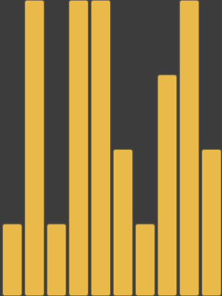

////

|metadata|
{
    "name": "igflowlayoutview-inserting-deleting-updating-items",
    "tags": ["Editing","How Do I","Getting Started"],
    "controlName": ["IGFlowLayoutView"],
    "guid": "a4ca2c5a-3612-4df6-9001-b6347d2d7282",  
    "buildFlags": [],
    "createdOn": "2014-03-18T12:31:57.208472Z"
}
|metadata|
////

= Inserting Deleting and Updating Items

== Topic Overview

=== Purpose

This topic provides a conceptual overview of inserting, deleting and updating items on the  _IGFlowLayoutView_™ control and demonstrates their operation with a code example.

=== In this topic

This topic contains the following sections:

* <<_Ref324841248, Introduction >>
* <<_Ref255193732, Updating an Item on the   IGFlowLayoutView   – Code Example >>

** <<_Ref327344209,Description>>
** <<_Ref252521837,Preview>>
** <<_Ref327523606,Prerequisites>>
** <<_Ref327344217,Code>>

* <<_Ref215823716, Related Content >>

[[_Ref324841248]]
== Introduction

=== Inserting, deleting and updating summary

The  _IGFlowLayoutView_   is capable of animating the manipulation of the displayed items. When manipulating your data, the  _IGFlowLayoutView_   will need to be notified whenever there are changes to the backend data to reflect the changes on the displayed items. The  _IGFlowLayoutView_   provides three methods for being informed of when these changes occur:

* `- (void)insertItemAtIndex:(NSInteger)index`
* `- (void)removeItemAtIndex:(NSInteger)index`
* `- (void)updateItemAtIndex:(NSInteger)index`

.Note:
[NOTE]
====
Calling `updateItemAtIndex:` tells the  _IGFlowLayoutView_   that the item was resized and calls the  _IGFlowLayoutDataSource_   `flowLayoutView:sizeForItemAtIndex:` method requesting the new size.
====

To animate these changes, set the `transitionDuration` property to the amount of time the animation will require prior to calling one of the previously mentioned methods.

[[_Ref255193732]]
[[_Ref324841253]]
== Updating an Item on the  _IGFlowLayoutView_  – Code Example

[[_Ref327344209]]

=== Description

The code example below creates an instance of the  _IGFlowLayoutView_   containing 10 items. With the passing of each second the timer ticks, each of the 10 items update, incrementally shifting the image to its new location just to the right of its previous position, creating a histogram effect in the view.

[[_Ref252521837]]

=== Preview

[[_Ref327523606]]

=== Prerequisites

This code example requires the inclusion of the  __IG__  framework; details about how to add this framework are available in the link:iggridview-adding-the-ig-framework-file.html[Adding the IG Framework File] topic.

[[_Ref327344217]]

=== Code

*In Objective-C:*

[source,csharp]
----
@interface igViewController () <IGFlowLayoutViewDataSource>
{
    IGFlowLayoutView *_flowLayoutView;
    NSInteger _totalItems;
}
@end
@implementation igViewController
- (void)viewDidLoad
{
    [super viewDidLoad];
    _totalItems = 10;
    _flowLayoutView = [[IGFlowLayoutView alloc] initWithFrame:self.view.bounds];
    _flowLayoutView.autoresizingMask = UIViewAutoresizingFlexibleHeight|UIViewAutoresizingFlexibleWidth;
    _flowLayoutView.backgroundColor = [UIColor colorWithWhite:0.3 alpha:1.0];
    _flowLayoutView.transitionDuration = 0.75;
    _flowLayoutView.dataSource = self;
    _flowLayoutView.transform = CGAffineTransformMakeRotation(M_PI);
    [self.view addSubview:_flowLayoutView];
    [_flowLayoutView updateData];
    [NSTimer scheduledTimerWithTimeInterval:1.0 target:self selector:@selector(timerTick) userInfo:nil repeats:YES];
}
- (CGSize)numberOfBlocksInViewport:(IGFlowLayoutView *)flowLayoutView
{
    CGSize result = CGSizeMake(_totalItems, 4);
    return result;
}
- (NSInteger)numberOfItemsInFlowLayoutView:(IGFlowLayoutView *)flowLayoutView
{
    return _totalItems;
}
- (CGSize)flowLayoutView:(IGFlowLayoutView *)flowLayoutView sizeForItemAtIndex:(NSInteger)index1
{
    CGSize result;
    IGFlowLayoutViewCell *cell = [_flowLayoutView cellAtIndex:index1];
    if (!cell)
        result = CGSizeMake(1, 1);
    else
        result = CGSizeMake(1, cell.tag);
    return result;
}
- (IGFlowLayoutViewCell *)flowLayoutView:(IGFlowLayoutView * )flowLayoutView cellAtIndex:(NSInteger)index1
{
    IGFlowLayoutViewCell *cell = [flowLayoutView dequeueReusableCellWithIdentifier:@"CELL"];
    if (!cell)
    {
        cell = [[IGFlowLayoutViewCell alloc] initWithReuseIdentifier:@"CELL"];
        cell.contentInset = UIEdgeInsetsMake(3, 3, 3, 3);
        cell.tag = 0;
        UIView *innerView = [[UIView alloc] init];
        innerView.layer.backgroundColor = [UIColor colorWithRed:238/255.0f green:197/255.0f blue:91/255.0f alpha:1.0f].CGColor;
        innerView.layer.cornerRadius = 10.0;
        innerView.layer.borderWidth = 3.0;
        innerView.layer.borderColor = [UIColor colorWithWhite:0.3 alpha:0.75].CGColor;
        cell.contentView = innerView;
    }
    return cell;
}
- (void)timerTick
{
    NSMutableArray *levels = [[NSMutableArray alloc] init];
    for (int k = 0; k < _totalItems; k++)
    {
        [levels addObject:[NSNumber numberWithInt:arc4random_uniform(4) + 1]];
    }
    for (NSUInteger j = 0; j < _totalItems; j++)
    {
        NSInteger levelForColumn = [[levels objectAtIndex:j] intValue];
        IGFlowLayoutViewCell *cell = [_flowLayoutView cellAtIndex:j];
        cell.tag = levelForColumn;
        [_flowLayoutView updateItemAtIndex:j];
    }
}
@end
----

*In C#:*

[source,csharp]
----
public class FlowLayoutDataSource : IGFlowLayoutViewDataSource
{
      int _totalItems;
      public FlowLayoutDataSource(int TotalItems)
      {
            _totalItems = TotalItems;
      }
      public override SizeF NumberOfBlocksInViewport (IGFlowLayoutView flowLayoutView)
      {
            SizeF result = new SizeF(_totalItems, 4);
            return result;
      }
      public override int NumberOfItems (IGFlowLayoutView flowLayoutView)
      {
            return _totalItems;
      }
      public override SizeF SizeForItem (IGFlowLayoutView flowLayoutView, int index)
      {
            SizeF result;
            IGFlowLayoutViewCell cell = flowLayoutView.CellAtIndex (index);
            if (cell == null)
                  result = new SizeF (1, 1);
            else
                  result = new SizeF(1, cell.Tag);
            return result;
      }
      public override IGFlowLayoutViewCell CreateCell (IGFlowLayoutView flowLayoutView, int index)
      {
            IGFlowLayoutViewCell cell = flowLayoutView.DequeueReusableCell ("CELL") as IGFlowLayoutViewCell;
            if (cell == null)
            {
                  cell = new IGFlowLayoutViewCell ("CELL");
                  cell.ContentInset = new UIEdgeInsets (3, 3, 3, 3);
                  UIView innerView = new UIView ();
                  innerView.Layer.BackgroundColor = UIColor.FromRGBA (238 / 255.0f, 197 / 255.0f, 91 / 255.0f, 1.0f).CGColor;
                  innerView.Layer.CornerRadius = 10.0f;
                  innerView.Layer.BorderWidth = 3.0f;
                  innerView.Layer.BorderColor = UIColor.FromWhiteAlpha (0.3f, 0.75f).CGColor;
                  cell.ContentView = innerView;
            }
            return cell;
      }
}
public partial class FlowLayoutUpdateItem_CSViewController : UIViewController
{
      IGFlowLayoutView _flowLayoutView;
      int _totalItems;
      public FlowLayoutUpdateItem_CSViewController ()
      {
      }
      public override void ViewDidLoad ()
      {
            base.ViewDidLoad ();
            _totalItems = 10;
            _flowLayoutView = new IGFlowLayoutView ();
            _flowLayoutView.Frame = this.View.Bounds;
            _flowLayoutView.AutoresizingMask = UIViewAutoresizing.FlexibleHeight|UIViewAutoresizing.FlexibleWidth;
            _flowLayoutView.BackgroundColor = UIColor.FromWhiteAlpha (0.3f, 0.75f);
            _flowLayoutView.TransitionDuration = 0.75f;
            _flowLayoutView.DataSource = new FlowLayoutDataSource(_totalItems);
            _flowLayoutView.Transform = CGAffineTransform.MakeRotation((float)Math.PI);
            this.View.Add (_flowLayoutView);
            _flowLayoutView.UpdateData ();
            NSTimer.CreateRepeatingScheduledTimer (1.0f, () => {
                  Random rnd = new Random();
                  List<int> levels = new List<int>();
                  for (int k = 0; k < _totalItems; k++)
                  {
                        levels.Add(rnd.Next(4) + 1);
                  }
                  for (int j = 0; j < _totalItems; j++)
                  {
                        int levelForColumn = levels[j];
                        IGFlowLayoutViewCell cell = _flowLayoutView.CellAtIndex(j);
                        cell.Tag = levelForColumn;
                        _flowLayoutView.UpdateItemAtIndex(j);
                  }
            });
      }
}
----

[[_Ref215823716]]
== Related Content

=== Topics

The following topic provides additional information related to this topic.

[options="header", cols="a,a"]
|====
|Topic|Purpose

| link:igflowlayoutview.html[IGFlowLayoutView]
|The topics in this group cover enabling, configuring, and using the _IGFlowLayoutView_ control’s supported features.

|====