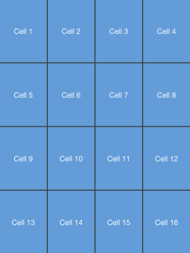

////

|metadata|
{
    "name": "igflowlayoutview-reordering-items",
    "tags": ["How Do I","Getting Started"],
    "controlName": ["IGFlowLayoutView"],
    "guid": "405fcab8-dc61-4bec-9a8f-8178087537a8",  
    "buildFlags": [],
    "createdOn": "2014-03-18T12:34:42.2829137Z"
}
|metadata|
////

= Reordering Items

== Topic Overview

=== Purpose

This topic provides a conceptual overview of reordering items on the  _IGFlowLayoutView_™ control and demonstrates their operation with a code example.

=== In this topic

This topic contains the following sections:

* <<_Ref324841248, Introduction >>
* <<_Ref255193732, Reordering an Item on the IGFlowLayoutView – Code Example >>

** <<_Ref327344209,Description>>
** <<_Ref252521837,Preview>>
** <<_Ref327523606,Prerequisites>>
** <<_Ref327344217,Code>>

* <<_Ref215823716, Related Content >>

[[_Ref324841248]]
== Introduction

=== Reordering items summary

The  _IGFlowLayoutView_   allows its items to be reordered through either user interaction or program design. Two conditions must first be met before you can reorder items:

[start=1]
. The  _IGFlowLayoutView_   must have the `editable` property set to `YES`
[start=2]
. The adopter of the  _IGFlowLayoutDataSource_   protocol must implement the following selector, `flowLayoutView:moveItemAtIndex:toIndex:`

To reorder the cell item within the UI, tap the cell to select it and then press and hold the cell until an outline appears; finally drag the cell item to a new location. If you drag a cell item to an edge and there is room to scroll, the  _IGFlowLayoutView_   will auto scroll.

_IGFlowLayoutView_   actively calls `flowLayoutView:moveItemAtIndex:toIndex:` during a reorder operation. During these calls, you can choose to return the new index or restrict the index and return one of your own.

In the event you do not require a cell item reordered the  _IGFlowLayoutDataSource_   protocol provides the `flowLayoutView:itemAtIndexDraggable:` method to return a `YES` or `NO` to determine if the item can be reordered.

[[_Ref255193732]]
[[_Ref324841253]]
== Reordering an Item on the  _IGFlowLayoutView_  – Code Example

[[_Ref327344209]]

=== Description

The code example below creates an instance of the  _IGFlowLayoutView_   containing 16 moveable items.

[[_Ref252521837]]

=== Preview

[[_Ref327523606]]

=== Prerequisites

This code example requires the inclusion of the  __IG__  framework; details about how to add this framework are available in the link:iggridview-adding-the-ig-framework-file.html[Adding the IG Framework File] topic.

[[_Ref327344217]]

=== Code

*In Objective-C:*

[source,csharp]
----
@interface igViewController () <IGFlowLayoutViewDataSource>
@end
@implementation igViewController
- (void)viewDidLoad
{
    [super viewDidLoad];
    IGFlowLayoutView *flowLayoutView = [[IGFlowLayoutView alloc] initWithFrame:self.view.bounds];
    flowLayoutView.autoresizingMask = UIViewAutoresizingFlexibleHeight|UIViewAutoresizingFlexibleWidth;
    flowLayoutView.backgroundColor = [UIColor colorWithWhite:0.3 alpha:1.0];
    flowLayoutView.dataSource = self;
    flowLayoutView.editable = YES;
    [self.view addSubview:flowLayoutView];
    [flowLayoutView updateData];
}
- (CGSize)numberOfBlocksInViewport:(IGFlowLayoutView *)flowLayoutView
{
    CGSize result = CGSizeMake(4, 4);
    return result;
}
- (NSInteger)numberOfItemsInFlowLayoutView:(IGFlowLayoutView *)flowLayoutView
{
    return 16;
}
- (CGSize)flowLayoutView:(IGFlowLayoutView *)flowLayoutView sizeForItemAtIndex:(NSInteger)index1
{
    return CGSizeMake(1, 1);
}
- (NSInteger)flowLayoutView:(IGFlowLayoutView *)flowLayoutView moveItemAtIndex:(NSInteger)index toIndex:(NSInteger)newIndex
{
    return newIndex;
}
- (IGFlowLayoutViewCell *)flowLayoutView:(IGFlowLayoutView * )flowLayoutView cellAtIndex:(NSInteger)index1
{
    IGFlowLayoutViewCell *cell = [flowLayoutView dequeueReusableCellWithIdentifier:@"CELL"];
    if (!cell)
    {
        cell = [[IGFlowLayoutViewCell alloc] initWithReuseIdentifier:@"CELL"];
        UILabel *innerView = [[UILabel alloc] init];
        innerView.backgroundColor = [UIColor colorWithRed:118/255.0f green:173/255.0f blue:223/255.0f alpha:1.0f];
        innerView.textColor = [UIColor whiteColor];
        innerView.font = [UIFont fontWithName:@"HelveticaNeue" size:30.0];
        innerView.textAlignment = NSTextAlignmentCenter;
        cell.contentView = innerView;
    }
    UILabel *innerView = [cell.subviews objectAtIndex:0];
    innerView.text = [NSString stringWithFormat:@"Cell %d", index1+1];
    return cell;
}
@end
----

*In C#:*

[source,csharp]
----
public class FlowLayoutDataSource : IGFlowLayoutViewDataSource
{
      public override SizeF NumberOfBlocksInViewport (IGFlowLayoutView flowLayoutView)
      {
            SizeF result = new SizeF(4, 4);
            return result;
      }
      public override int NumberOfItems (IGFlowLayoutView flowLayoutView)
      {
            return 16;
      }
      public override SizeF SizeForItem (IGFlowLayoutView flowLayoutView, int index)
      {
            return new SizeF (1, 1);
      }
      public override int MoveItem (IGFlowLayoutView flowLayoutView, int index, int newIndex)
      {
            return newIndex;
      }
      public override IGFlowLayoutViewCell CreateCell (IGFlowLayoutView flowLayoutView, int index)
      {
            IGFlowLayoutViewCell cell = flowLayoutView.DequeueReusableCell ("CELL") as IGFlowLayoutViewCell;
            if (cell == null)
            {
                  cell = new IGFlowLayoutViewCell ("CELL");
                  UILabel innerView = new UILabel ();
                  innerView.BackgroundColor = UIColor.FromRGBA (118 / 255.0f, 173 / 255.0f, 223 / 255.0f, 1.0f);
                  innerView.TextColor = UIColor.White;
                  innerView.Font = UIFont.FromName ("HelveticaNeue", 30.0f);
                  innerView.TextAlignment = UITextAlignment.Center;
                  cell.ContentView = innerView;
            }
               UILabel label = cell.Subviews[0] as UILabel;               label.Text = String.Format ("Cell {0}", index + 1);
            return cell;
      }
}
public partial class FlowLayoutReordering_CSViewController : UIViewController
{
      public FlowLayoutReordering_CSViewController ()
      {
      }
      public override void ViewDidLoad ()
      {
            base.ViewDidLoad ();
            IGFlowLayoutView flowLayoutView = new IGFlowLayoutView ();
            flowLayoutView.Frame = this.View.Bounds;
            flowLayoutView.AutoresizingMask = UIViewAutoresizing.FlexibleHeight|UIViewAutoresizing.FlexibleWidth;
            flowLayoutView.BackgroundColor = UIColor.FromWhiteAlpha (0.3f, 0.75f);
            flowLayoutView.DataSource = new FlowLayoutDataSource();
            flowLayoutView.Editable = true;
            this.View.Add (flowLayoutView);
            flowLayoutView.UpdateData ();
      }
}
----

[[_Ref215823716]]
== Related Content

=== Topics

The following topic provides additional information related to this topic.

[options="header", cols="a,a"]
|====
|Topic|Purpose

| link:igflowlayoutview.html[IGFlowLayoutView]
|The topics in this group cover enabling, configuring, and using the _IGFlowLayoutView_ control’s supported features.

|====