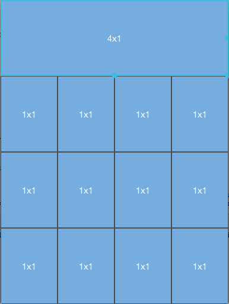

////

|metadata|
{
    "name": "igflowlayoutview-resizing-items",
    "tags": ["How Do I","Getting Started"],
    "controlName": ["IGFlowLayoutView"],
    "guid": "713d12de-7598-438f-9179-c0a9fc19fd17",  
    "buildFlags": [],
    "createdOn": "2014-03-18T12:37:30.4115302Z"
}
|metadata|
////

= Resizing Items

== Topic Overview

=== Purpose

This topic provides an overview of resizing items on the  _IGFlowLayoutView_™ control and demonstrates their use with a code example.

=== In this topic

This topic contains the following sections:

* <<_Ref324841248, Introduction >>
* <<_Ref255193732, Resizing an Item on the IGFlowLayoutView – Code Example >>

** <<_Ref327344209,Description>>
** <<_Ref252521837,Preview>>
** <<_Ref327523606,Prerequisites>>
** <<_Ref327344217,Code>>

* <<_Ref215823716, Related Content >>

[[_Ref324841248]]
== Introduction

=== Resizing items summary

The  _IGFlowLayoutView_   allows resizing of its items, provided a couple of conditions are first met.

[start=1]
. The  _IGFlowLayoutView_   must have the `editable` property set to `YES`
[start=2]
. The adopter of the  _IGFlowLayoutDataSource_   protocol must implement the following selector, `flowLayoutView:newSize:forItemAtIndex:`

.Note:
[NOTE]
====
After calling `flowLayoutView:newSize:forItemAtIndex:`, `flowLayoutView:sizeForItemAtIndex:` is called. Hard coded sizes are not ideal for this scenario; sizes for the items will need to be stored in an array.
====

To resize the cell item, tap the cell that is to be resized causing the drag handles to appear on the right, bottom and bottom right corner of the selected cell. Finally, drag one of the exposed drag handles..

During a resize operation the  _IGFlowLayoutView_   actively calls `flowLayoutView:newSize:forItemAtIndex:`. During these calls you can choose to return the new size or restrict the size returning one of your own. The returned size must use block sizes and not “point” sizes. For example, (2, 2) and not (100, 300).

In the event that you do not want a cell item resized the  _IGFlowLayoutDataSource_   protocol provides the `flowLayoutView:itemAtIndexResizable:` method to return a `YES` or `NO` to determine if the item can be resized.

[[_Ref255193732]]
[[_Ref324841253]]
== Resizing an Item on the  _IGFlowLayoutView_  – Code Example

[[_Ref327344209]]

=== Description

The code example below creates an instance of the  _IGFlowLayoutView_   that contains 16 resizable items.

[[_Ref252521837]]

=== Preview

[[_Ref327523606]]

=== Prerequisites

This code example requires the inclusion of the  __IG__  framework; details about how to add this framework are available in the link:iggridview-adding-the-ig-framework-file.html[Adding the IG Framework File] topic.

[[_Ref327344217]]

=== Code

*In Objective-C:*

[source,csharp]
----
@interface FlowLayoutItemSize : NSObject
@property (nonatomic, assign) CGSize size;
@end
@implementation FlowLayoutItemSize
@end
@interface igViewController () <IGFlowLayoutViewDataSource>
{
    NSMutableArray *_itemSizes;
}
@end
@implementation igViewController
- (void)viewDidLoad
{
    [super viewDidLoad];
    _itemSizes = [[NSMutableArray alloc] init];
    for (int j = 0; j < 16; j++)
    {
        [_itemSizes addObject:[NSValue valueWithCGSize:CGSizeMake(1, 1)]];
    }
    IGFlowLayoutView *flowLayoutView = [[IGFlowLayoutView alloc] initWithFrame:self.view.bounds];
    flowLayoutView.autoresizingMask = UIViewAutoresizingFlexibleHeight|UIViewAutoresizingFlexibleWidth;
    flowLayoutView.backgroundColor = [UIColor colorWithWhite:0.3 alpha:1.0];
    flowLayoutView.dataSource = self;
    flowLayoutView.editable = YES;
    [self.view addSubview:flowLayoutView];
    [flowLayoutView updateData];
}
- (CGSize)numberOfBlocksInViewport:(IGFlowLayoutView *)flowLayoutView
{
    CGSize result = CGSizeMake(4, 4);
    return result;
}
- (NSInteger)numberOfItemsInFlowLayoutView:(IGFlowLayoutView *)flowLayoutView
{
    return 16;
}
- (CGSize)flowLayoutView:(IGFlowLayoutView *)flowLayoutView sizeForItemAtIndex:(NSInteger)index1
{
    CGSize result = [[_itemSizes objectAtIndex:index1] CGSizeValue];
    IGFlowLayoutViewCell *cell = [flowLayoutView cellAtIndex:index1];
    if (cell)
    {
        UILabel *label = (UILabel * )cell.contentView;
        label.text = [NSString stringWithFormat:@"%.0fx%.0f", result.width, result.height];
    }
    return result;
}
- (CGSize)flowLayoutView:(IGFlowLayoutView *)flowLayoutView newSize:(CGSize)size forItemAtIndex:(NSInteger)index
{
    [_itemSizes replaceObjectAtIndex:index withObject:[NSValue valueWithCGSize:size]];
    return size;
}
- (IGFlowLayoutViewCell *)flowLayoutView:(IGFlowLayoutView * )flowLayoutView cellAtIndex:(NSInteger)index1
{
    IGFlowLayoutViewCell *cell = [flowLayoutView dequeueReusableCellWithIdentifier:@"CELL"];
    if (!cell)
    {
        cell = [[IGFlowLayoutViewCell alloc] initWithReuseIdentifier:@"CELL"];
        UILabel *innerView = [[UILabel alloc] init];
        innerView.backgroundColor = [UIColor colorWithRed:118/255.0f green:173/255.0f blue:223/255.0f alpha:1.0f];
        innerView.textColor = [UIColor whiteColor];
        innerView.font = [UIFont fontWithName:@"HelveticaNeue" size:30.0];
        innerView.textAlignment = NSTextAlignmentCenter;
        innerView.text = @"1x1";
        cell.contentView = innerView;
    }
    return cell;
}
@end
----

*In C#:*

[source,csharp]
----
public class FlowLayoutDataSource : IGFlowLayoutViewDataSource
{
      List<SizeF> _itemSizes = new List<SizeF> ();
      public FlowLayoutDataSource()
      {
            for (int i = 0; i < 16; i++) 
            {
                  _itemSizes.Add (new SizeF (1.0f, 1.0f));
            }
      }
      public override SizeF NumberOfBlocksInViewport (IGFlowLayoutView flowLayoutView)
      {
            SizeF result = new SizeF(4, 4);
            return result;
      }
      public override int NumberOfItems (IGFlowLayoutView flowLayoutView)
      {
            return 16;
      }
      public override SizeF SizeForItem (IGFlowLayoutView flowLayoutView, int index)
      {
            SizeF result = _itemSizes[index];
            IGFlowLayoutViewCell cell = flowLayoutView.CellAtIndex (index);
            if (cell != null) 
            {
                  UILabel label = cell.ContentView as UILabel;
                  label.Text = String.Format ("{0:#}x{1:#}", result.Width, result.Height);
            }
            return result;
      }
      public override SizeF NewSizeForItem (IGFlowLayoutView flowLayoutView, SizeF size, int index)
      {
            _itemSizes [index] = size;
            return size;
      }
      public override IGFlowLayoutViewCell CreateCell (IGFlowLayoutView flowLayoutView, int index)
      {
            IGFlowLayoutViewCell cell = flowLayoutView.DequeueReusableCell ("CELL") as IGFlowLayoutViewCell;
            if (cell == null)
            {
                  cell = new IGFlowLayoutViewCell ("CELL");
                  UILabel innerView = new UILabel ();
                  innerView.BackgroundColor = UIColor.FromRGBA (118 / 255.0f, 173 / 255.0f, 223 / 255.0f, 1.0f);
                  innerView.TextColor = UIColor.White;
                  innerView.Font = UIFont.FromName ("HelveticaNeue", 30.0f);
                  innerView.TextAlignment = UITextAlignment.Center;
                  innerView.Text = "1x1";
                  cell.ContentView = innerView;
            }
            return cell;
      }
}
public partial class FlowLayoutResizing_CSViewController : UIViewController
{
      public FlowLayoutResizing_CSViewController ()
      {
      }
      public override void ViewDidLoad ()
      {
            base.ViewDidLoad ();
            IGFlowLayoutView flowLayoutView = new IGFlowLayoutView ();
            flowLayoutView.Frame = this.View.Bounds;
            flowLayoutView.AutoresizingMask = UIViewAutoresizing.FlexibleHeight|UIViewAutoresizing.FlexibleWidth;
            flowLayoutView.BackgroundColor = UIColor.FromWhiteAlpha (0.3f, 0.75f);
            flowLayoutView.DataSource = new FlowLayoutDataSource();
            flowLayoutView.Editable = true;
            this.View.Add (flowLayoutView);
            flowLayoutView.UpdateData ();
      }
}
----

[[_Ref215823716]]
== Related Content

=== Topics

The following topic provides additional information related to this topic.

[options="header", cols="a,a"]
|====
|Topic|Purpose

| link:igflowlayoutview.html[IGFlowLayoutView]
|The topics in this group cover enabling, configuring, and using the _IGFlowLayoutView_ control’s supported features.

|====