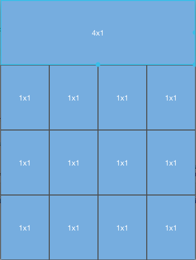

////

|metadata|
{
    "name": "igflowlayoutview",
    "tags": ["Getting Started"],
    "controlName": ["IGFlowLayoutView"],
    "guid": "b500b994-1c8e-4320-ad31-1f9fd337ece5",  
    "buildFlags": [],
    "createdOn": "2014-03-18T11:55:30.2793868Z"
}
|metadata|
////

= IGFlowLayoutView

This section gives you an overview of the use of the  _IGFlowLayoutView_   control. It contains information ranging from what the control does to the step-by-step procedures on how to accomplish common tasks using the control. Click the links below to access important information about the  _IGFlowLayoutView_   control.

== About IGFlowLayoutView

The  _IGFlowLayoutView_   allows users to scroll through a list of items horizontally or vertically. The item’s are provided to the view via the  _IGFlowViewDataSource_   protocol. All items are relatively sized instead of absolutely, which allows for dynamic layouts when the view is resized.

== link:iggridview-adding-the-ig-framework-file.html[Adding the IG Framework File]

This topic demonstrates how to add the IG framework file to a project.

== link:igflowlayoutview-adding-igflowlayoutview-to-a-view.html[Adding Flow Layout to a View]

This topic provides basic information about creating an instance of the  _IGFlowLayoutView_   to help you get up and running with this control.

== link:igflowlayoutview-configuring-igflowlayoutview.html[Configuring IGFlowLayoutView]

The topics in this group cover enabling configuring, and using the  _IGFlowLayoutView_   control’s supported features.

== link:igflowlayoutview-data-source.html[Data Source]

This topic provides an informational overview of supplying data to the  _IGFlowLayoutView_   control.

== link:igflowlayoutview-layouts.html[Layouts]

This topic provides a conceptual overview of layouts available with the  _IGFlowLayoutView_   control.