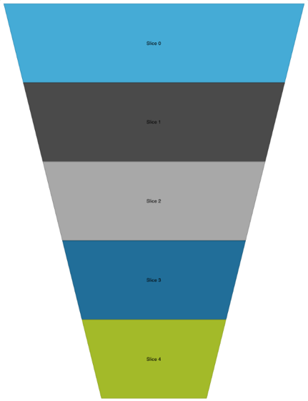

////

|metadata|
{
    "name": "igfunnelchartview-adding-funnel-chart-view",
    "tags": ["Getting Started","How Do I"],
    "controlName": ["IGFunnelChartView"],
    "guid": "ced9c9d3-73e0-4141-9c10-953e49bfff56",  
    "buildFlags": [],
    "createdOn": "2013-09-10T15:01:06.0610565Z"
}
|metadata|
////

= Adding the Funnel Chart to a View

== Topic Overview

=== Purpose

This topic uses a code example to demonstrate how to create and display a basic instance of the  _IGFunnelChartView_™ control on a view.

=== Required background

The following table lists the prerequisite topics required to understanding this topic.

[options="header", cols="a,a"]
|====
|Topic|Purpose

| link:igchartview-adding-the-chart-framework-file.html[Adding the Chart Framework File]
|This topic explains how to add the Chart framework file to a project.

|====

=== In this topic

This topic contains the following sections:

* <<_Ref328621638, Displaying an   IGFunnelChartView   – Code Example >>

** <<_Ref323199287,Description>>
** <<_Ref357071611,Preview>>
** <<_Ref323199293,Code>>

* <<_Ref323199323, Related Content >>

[[_Ref323199279]]
[[_Ref328621638]]
[[_Ref323111244]]
== Displaying an  _IGFunnelChartView_   – Code Example

[[_Ref323199287]]

=== Description

This code example demonstrates how to create a funnel chart consisting of five slices using a custom data object.

[[_Ref357071611]]

=== Preview

[[_Ref323199293]]

=== Code

To start, you will first need to create the data object to feed the funnel chart’s data source helper. This object contains a  _double_   `value` property and an  _NSString_   property for the `innerLabel` and `outerLabel`.

*In Objective-C:*

[source,csharp]
----
@interface FunnelData : NSObject
@property (nonatomic, assign) double value;
@property (nonatomic, retain) NSString *innerLabel;
@property (nonatomic, retain) NSString *outerLabel;
@end
@implementation FunnelData
@end
----

*In C#:*

[source,csharp]
----
public class FunnelData : NSObject
{
      [Export("Value")]
      public double Value { get; set; }
      [Export("InnerLabel")]
      public string InnerLabel { get; set; }
      [Export("OuterLabel")]
      public string OuterLabel { get; set; }
}
----

With the custom funnel data object complete, create a method to populate an array with our custom object.

*In Objective-C:*

[source,csharp]
----
-(NSMutableArray *)createFunnelData:(int)itemCount
{
    NSMutableArray *retValue = [[NSMutableArray alloc] init];
    for (int i = 0; i < itemCount; i++)
    {
        FunnelData *funnelData = [[FunnelData alloc] init];
        funnelData.innerLabel = [NSString stringWithFormat:@"Slice %d", i];
        funnelData.outerLabel = [NSString stringWithFormat:@"Slice %d", i];
        [retValue addObject:funnelData];
    }
    return retValue;
}
----

*In C#:*

[source,csharp]
----
public List<NSObject> CreateFunnelData(int itemCount)
{
      List<NSObject> retValue = new List<NSObject>();
      for (int i = 0; i < itemCount; i++)
      {
            FunnelData funnelData = new FunnelData();
            funnelData.InnerLabel = String.Format ("Slice {0}", i);
            funnelData.OuterLabel = String.Format ("Slice {0}", i);
            retValue.Add (funnelData);
      }
      return retValue;
}
----

Next, override the `viewDidLoad` method and set the view controller’s background color to white.

*In Objective-C:*

[source,csharp]
----
self.view.backgroundColor = [UIColor whiteColor];
----

*In C#:*

[source,csharp]
----
this.View.BackgroundColor = UIColor.White;
----

Next, assign the data created from the `createFunnelData` method to the  _IGFunnelChartViewDataSourceHelper_   instance.

*In Objective-C:*

[source,csharp]
----
NSMutableArray *data = [self createFunnelData:5];
IGFunnelChartViewDataSourceHelper *source = [[IGFunnelChartViewDataSourceHelper alloc] initWithData:data valuePath:@"value" innerLabelPath:@"innerLabel" outerLabelPath:@"outerLabel"];
----

*In C#:*

[source,csharp]
----
List<NSObject> data = CreateFunnelData (5);
IGFunnelChartViewDataSourceHelper source = new IGFunnelChartViewDataSourceHelper (data.ToArray(), "Value", "InnerLabel", "OuterLabel");
----

Now, instantiate the funnel chart, using the  _IGFunnelChartViewDataSourceHelper_   with the `dataSource` property, to display our data.

*In Objective-C:*

[source,csharp]
----
IGFunnelChartView *funnel = [[IGFunnelChartView alloc] init];
funnel.frame = CGRectInset(self.view.bounds, 10, 10);
funnel.autoresizingMask = UIViewAutoresizingFlexibleWidth|UIViewAutoresizingFlexibleHeight;
funnel.dataSource = source;
funnel.theme = [[IGFunnelChartIGTheme alloc] init];
----

*In C#:*

[source,csharp]
----
IGFunnelChartView funnel = new IGFunnelChartView();
funnel.Frame = this.View.Bounds;
funnel.Frame.Inflate(-10.0f, -10.0f);
funnel.AutoresizingMask = UIViewAutoresizing.FlexibleWidth|UIViewAutoresizing.FlexibleHeight;
funnel.DataSource = source;
funnel.Theme = new IGFunnelChartIGTheme();
----

Finally, add the funnel chart to the view.

*In Objective-C:*

[source,csharp]
----
 [self.view addSubview:funnel];
----

*In C#:*

[source,csharp]
----
this.View.Add(funnel);
----

[[_Ref323199323]]
== Related Content

=== Topics

The following topic provides additional information related to this topic.

[options="header", cols="a,a"]
|====
|Topic|Purpose

| link:igfunnelchartview.html[IGFunnelChartView]
|This topic provides a conceptual overview of the _IGFunnelChartView_ control and its key features.

|====