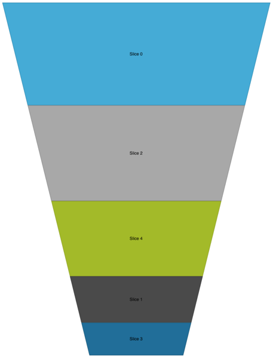

////

|metadata|
{
    "name": "igfunnelchartview-enabling-weighted-slices",
    "tags": ["Getting Started","How Do I"],
    "controlName": ["IGFunnelChartView"],
    "guid": "0f8a3a49-e5c0-4e81-98f4-b5953c6d913e",  
    "buildFlags": [],
    "createdOn": "2013-09-10T15:02:39.3183813Z"
}
|metadata|
////

= Enabling Weighted Slices

== Topic Overview

=== Purpose

This topic provides an introductory overview of enabling weighted slices on the  _IGFunnelChartView_   _™_   control and demonstrates its configuration using a code example.

=== In this topic

This topic contains the following sections:

* <<_Ref324841248, Introduction >>
* <<_Ref327936206, Weighted Slices on the IGFunnelChartView – Code Example >>

** <<_Ref327344209,Description>>
** <<_Ref327523606,Prerequisites>>
** <<_Ref327344217,Code>>

* <<_Ref215823716, Related Content >>

[[_Ref324841248]]
== Introduction

[[_Ref215796828]]

=== Weighted slices summary

By default, the  _IGFunnelChartView_   uses a uniform slice display, rendering all of the funnel slices with equal height, whereas weighted slices allow you to render your data using a slice whose height is proportionate to its value. To change from the uniform slice display to weighted slices, set the `funnelSliceDisplay` property to the `IGFunnelSliceDisplayWeighted` enumeration value.

The  _IGFunnelChartView_   using weighted slices is illustrated below.

[[_Ref324842387]]
[[_Ref327936206]]
[[_Ref324841253]]
== Weighted Slices on the  _IGFunnelChartView_  – Code Example

[[_Ref327344209]]

=== Description

The following code sets the `funnelSliceDisplay` property to `IGFunnelSliceDisplayWeighted` thereby enabling weighted slices on the  _IGFunnelChartView_  .

[[_Ref327523606]]

=== Prerequisites

This code example requires the inclusion of the  _Chart_   framework, detail about how to add this framework can be found in the link:igchartview-adding-the-chart-framework-file.html[Adding the Chart Framework File] topic.

[[_Ref327344217]]

=== Code

*In C#:*

[source,csharp]
----
IGFunnelChartView funnel = new IGFunnelChartView();
//Configure the funnel
funnel.FunnelSliceDisplay = IGFunnelSliceDisplay.Weighted;
this.View.Add(funnel);
----

*In Objective-C:*

[source,csharp]
----
IGFunnelChartView *funnel = [[IGFunnelChartView alloc] init];
//Configure the funnel
funnel.funnelSliceDisplay = IGFunnelSliceDisplayWeighted;
[self.view addSubview:funnel];
----

[[_Ref215823716]]
== Related Content

=== Topics

The following topic provides additional information related to this topic.

[options="header", cols="a,a"]
|====
|Topic|Purpose

| link:igfunnelchartview-configuring-igfunnelchartview.html[Configuring IGFunnelChartView]
|The topics in this group cover enabling, configuring, and using the _IGFunnelChartView_ control’s supported features.

|====