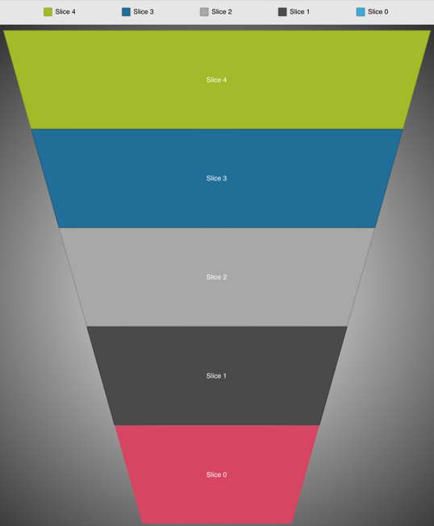

////

|metadata|
{
    "name": "igfunnelchartview-legend",
    "tags": ["Getting Started","How Do I"],
    "controlName": ["IGFunnelChartView"],
    "guid": "bd4aa321-47d3-4cd6-95dd-b66eaf546f1d",  
    "buildFlags": [],
    "createdOn": "2013-09-10T15:03:24.0928583Z"
}
|metadata|
////

= Legend

== Topic Overview

=== Purpose

This topic provides an introductory overview about legends in the  _IGFunnelChartView_™ control.

=== In this topic

This topic contains the following sections:

* <<_Ref324841248, Introduction >>

** <<_Ref215796828,Legend summary>>
** <<_Ref234980687,Legend preview>>

* <<_Ref327936206, Adding a Legend to a View – Code Example >>

** <<_Ref327344209,Description>>
** <<_Ref327523606,Prerequisites>>
** <<_Ref327344217,Code>>

* <<_Ref215823716, Related Content >>

[[_Ref324841248]]
== Introduction

[[_Ref215796828]]

=== Legend summary

The legend is a view displaying a series of legend items that identify the name of elements represented in the funnel chart. Denoted by a colored icon and a label each legend item represents a slice on the  _IGFunnelChartView_  . The icon uses the slice brush with the label being the inner label string. The legend can be positioned anywhere in the application’s view and does not have to be part of the  _IGFunnelChartView_  , but can link to funnel charts via the `legend` property on the  _IGFunnelChartView_  .

[[_Ref234980687]]

=== Legend preview

The image below presents an  _IGFunnelChartView_   rendered onto a view containing a legend above the chart. Each item’s icon in the legend corresponds to the slice of the same color.

[[_Ref327936206]]
[[_Ref324841253]]
== Adding a Legend to a View – Code Example

[[_Ref327344209]]

=== Description

The following code creates an  _IGLegend_   instance and assigns it to the legend property on the  _IGFunnelChartView_   before adding the legend to the subview. Setting the `legend` property on the chart renders a legend containing items for every series added to the  _IGFunnelChartView_  .

[[_Ref327523606]]

=== Prerequisites

This code example requires the inclusion of the  _Chart_   framework, detail about how to add this framework can be found in the link:igchartview-adding-the-chart-framework-file.html[Adding the Chart Framework File] topic.

[[_Ref327344217]]

=== Code

*In C#:*

[source,csharp]
----
IGLegend legend = new IGLegend(IGChartLegendType.IGChartLegendTypeItem);
legend.Frame = new RectangleF(0.0f, 0.0f, this.View.Frame.Size.Width, 45.0f);
legend.AutoresizingMask = UIViewAutoresizing.FlexibleWidth|UIViewAutoresizing.FlexibleBottomMargin;
legend.HorizontalAlignment = IGHorizontalAlign.IGHorizontalAlignStretch;
legend.VerticalAlignment = IGVerticalAlign.IGVerticalAlignCenter;
legend.Orientation = IGOrientation.IGOrientationHorizontal;
yourFunnelChart.Legend = legend;
this.View.Add (legend);
----

*In Objective-C:*

[source,csharp]
----
IGLegend *legend = [[IGLegend alloc] initWithLegendType:IGChartLegendTypeItem];
legend.frame = CGRectMake(0, 0, self.view.frame.size.width, 45);
legend.autoresizingMask = UIViewAutoresizingFlexibleWidth|UIViewAutoresizingFlexibleBottomMargin;
legend.horizontalAlignment = IGHorizontalAlignStretch;
legend.verticalAlignment = IGVerticalAlignCenter;
legend.orientation = IGOrientationHorizontal;
yourFunnelChart.legend = legend;
[self.view addSubview:legend];
----

[[_Ref215823716]]
== Related Content

=== Topics

The following topic provides additional information related to this topic.

[options="header", cols="a,a"]
|====
|Topic|Purpose

| link:igfunnelchartview.html[IGFunnelChartView]
|This topic serves as a gateway to the features and functionality of the _IGFunnelChartView_ control.

|====