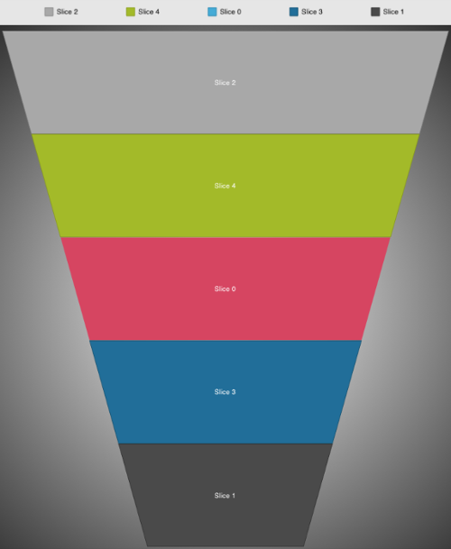

////

|metadata|
{
    "name": "igfunnelchartview",
    "tags": ["Getting Started"],
    "controlName": ["IGFunnelChartView"],
    "guid": "9d808b76-8ae2-4f69-9910-01138dc63a9c",  
    "buildFlags": [],
    "createdOn": "2013-09-10T14:59:22.1346649Z"
}
|metadata|
////

= IGFunnelChartView

This section gives you an overview of the use of the  _IGFunnelChartView_   control. It contains information ranging from what the control does to the step-by-step procedures on how to accomplish common tasks using the control. Click the links below to access important information about the  _IGFunnelChartView_   control.

== About IGFunnelChartView

The funnel chart view is a data visualization tool that displays funnel slices with progressively increasing or decreasing values. The shape of the funnel chart most often resembles an upside-down trapezoid. Funnel chart data is a collection of numeric values, and each slice represents one value. The funnel chart view supports multiple slice selection, tooltips, tap and long press gestures.

== link:igchartview-adding-the-chart-framework-file.html[Adding the Chart Framework File]

This topic demonstrates how to add the chart framework file to a project.

== link:igfunnelchartview-adding-funnel-chart-view.html[Adding the Funnel Chart to a View]

This topic provides basic information about creating an instance of the  _IGFunnelChartView_   to help you get up and running with this control.

== link:igfunnelchartview-configuring-igfunnelchartview.html[Configuring IGFunnelChartView]

The topics in this group cover enabling configuring, and using the  _IGFunnelChartView_   control’s supported features.

== link:igfunnelchartview-data-source-helper.html[Data Source Helper]

This topic provides an introductory overview of the data source helper in the  _IGFunnelChartView_   and demonstrates how to configure it using a code example.

== link:igfunnelchartview-legend.html[Legend]

This topic provides an introductory overview about legends in the  _IGFunnelChartView_   control.

== link:igfunnelchartview-themes.html[Themes]

This topic provides a conceptual overview of the supported themes available in the  _IGFunnelChartView_   control.