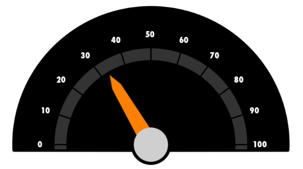

////

|metadata|
{
    "name": "iggaugeview-adding-iggaugeview-uiview",
    "controlName": ["IGGaugeView"],
    "tags": ["Charting","Getting Started","How Do I"],
    "guid": "12f46a3f-669f-44c9-b2dd-d0d81df180d6",  
    "buildFlags": [],
    "createdOn": "2013-02-13T14:28:25.196963Z"
}
|metadata|
////

= Adding the IGGaugeView to a UIView

== Topic Overview

=== Purpose

This topic provides basic information about creating an instance of the  _IGGaugeView™_   and displaying a gauge to help you get up and running with this control.

=== Required background

The following table lists the prerequisite topic required to understanding this topic.

[options="header", cols="a,a"]
|====
|Topic|Purpose

| link:igchartview-adding-the-chart-framework-file.html[Adding the Chart Framework File]
|This topic explains how to add the chart framework file to a project.

|====

=== In this topic

This topic contains the following sections:

* <<_Ref323111244, Code Examples >>
* <<_Ref328621638, Displaying a chart with IGGaugeView – Code Example >>

** <<_Ref323199287,Description>>
** <<_Ref323199293,Code>>
** <<_Ref323214731,Code: Complete Listing>>

* <<_Ref323199323, Related Content >>

[[_Ref323111244]]
== Code Examples

=== Code examples summary

The following table lists the code example included in this topic.

[options="header", cols="a,a"]
|====
|Example|Description

|<<_Ref323199279,Displaying a gauge with _IGGaugeView_ >>
|The starting point for using the _IGGaugeView_ is first to instantiate it and then add it to your view. The code in this example overrides the `viewDidLoad` method on a _UIViewController_ to create the instance of the _IGGaugeView_ .

|====

[[_Ref323199279]]
[[_Ref328621638]]
== Displaying a gauge with  _IGGaugeView_   – Code Example

[[_Ref323199287]]

=== Description

The  _IGGaugeView_  ’s power resides in its ability to display clean high performance circular gauges in the user interface using a minimal amount of code representing a range of values. In this code example, you will:

* Create an instance of the  _IGGaugeView_  
* Assign a value to the  _IGGaugeView_  
* Display and View the gauge

=== Preview

The following screen shot illustrates the  _IGGaugeView_   rendering of the result’s preview.

[[_Ref323199293]]

=== Code

Once initialized, the  _IGGaugeView_   sets both the `scaleStartAngle` and `scaleEndAngle` properties to determine the position and scale for rendering the gauge. With the rendering position angles set, the next step assigns a value to the `value` property for rendering the needle’s position.

*In C#:*

[source,csharp]
----
IGGaugeView gaugeView = new IGGaugeView();
gaugeView.Frame = new RectangleF(0, 0, this.View.Frame.Size.Width, this.View.Frame.Size.Height);
gaugeView.AutoresizingMask = UIViewAutoresizing.FlexibleHeight|UIViewAutoresizing.FlexibleWidth;
gaugeView.Theme = new IGGaugeThemeLight();
gaugeView.ScaleStartAngle = 180;
gaugeView.ScaleEndAngle = 0;
gaugeView.BackingShape = IGGaugeBackingShape.IGGaugeBackingShapeFitted;
gaugeView.BackingBrush = new IGBrush(UIColor.Black);
gaugeView.NeedleBrush = new IGBrush(UIColor.Orange);
gaugeView.Font = UIFont.FromName("Futura-CondensedExtraBold", 18.0f);
gaugeView.Value = 33;
----

*In Objective-C:*

[source,csharp]
----
 IGGaugeView *gaugeView = [[IGGaugeView alloc] init];
    gaugeView.frame = CGRectMake(0, 0, self.view.frame.size.width, self.view.frame.size.height);
    gaugeView.autoresizingMask = UIViewAutoresizingFlexibleHeight|UIViewAutoresizingFlexibleWidth;
    gaugeView.theme = [[IGGaugeThemeLight alloc] init];
    gaugeView.scaleStartAngle = 180;
    gaugeView.scaleEndAngle = 0;
    gaugeView.backingShape = IGGaugeBackingShapeFitted;
    gaugeView.backingBrush = [[IGBrush alloc] initWithColor:[UIColor blackColor]];
    gaugeView.needleBrush = [[IGBrush alloc] initWithColor:[UIColor orangeColor]];
    gaugeView.font = [UIFont fontWithName:@"Futura-CondensedExtraBold" size:18.0];
    gaugeView.value = 33;
----

The  _IGGaugeView_   is now configured and ready to add to the  _UIViewController_   as a subview.

*In C#:*

[source,csharp]
----
this.View.AddSubview(gaugeView);
----

*In Objective-C:*

[source,csharp]
----
 [self.view addSubview:gaugeView];
----

[[_Ref323214731]]

=== Code: Complete Listing

*In C#:*

[source,csharp]
----
public override void ViewDidLoad ()
{
      base.ViewDidLoad ();
      IGGaugeView gaugeView = new IGGaugeView();
      gaugeView.Frame = new RectangleF(0, 0, this.View.Frame.Size.Width, this.View.Frame.Size.Height);
      gaugeView.AutoresizingMask = UIViewAutoresizing.FlexibleHeight|UIViewAutoresizing.FlexibleWidth;
      gaugeView.Theme = new IGGaugeThemeLight();
      gaugeView.ScaleStartAngle = 180;
      gaugeView.ScaleEndAngle = 0;
      gaugeView.BackingShape = IGGaugeBackingShape.IGGaugeBackingShapeFitted;
      gaugeView.BackingBrush = new IGBrush(UIColor.Black);
      gaugeView.NeedleBrush = new IGBrush(UIColor.Orange);
      gaugeView.Font = UIFont.FromName("Futura-CondensedExtraBold", 18.0f);
      gaugeView.Value = 33;
      this.View.AddSubview(gaugeView);
}
----

*In Objective-C:*

[source,csharp]
----
- (void)viewDidLoad
{
    [super viewDidLoad];
    IGGaugeView *gaugeView = [[IGGaugeView alloc] init];
    gaugeView.frame = CGRectMake(0, 0, self.view.frame.size.width, self.view.frame.size.height);
    gaugeView.autoresizingMask = UIViewAutoresizingFlexibleHeight|UIViewAutoresizingFlexibleWidth;
    gaugeView.theme = [[IGGaugeThemeLight alloc] init];
    gaugeView.scaleStartAngle = 180;
    gaugeView.scaleEndAngle = 0;
    gaugeView.backingShape = IGGaugeBackingShapeFitted;
    gaugeView.backingBrush = [[IGBrush alloc] initWithColor:[UIColor blackColor]];
    gaugeView.needleBrush = [[IGBrush alloc] initWithColor:[UIColor orangeColor]];
    gaugeView.font = [UIFont fontWithName:@"Futura-CondensedExtraBold" size:18.0];
    gaugeView.value = 33;
    [self.view addSubview:gaugeView];
}
----

[[_Ref323199323]]
== Related Content

=== Topics

The following topic provides additional information related to this topic.

[options="header", cols="a,a"]
|====
|Topic|Purpose

| link:iggaugeview.html[IGGaugeView]
|This section serves as an introduction to the _IGGaugeView_ __control__ ’s key features and functions.

|====