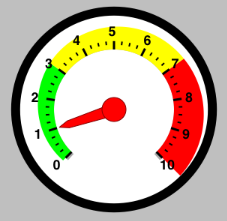

////

|metadata|
{
    "name": "iggaugeview-configuring-ranges",
    "controlName": ["IGGaugeView"],
    "tags": ["Charting","How Do I","Styling"],
    "guid": "b173054f-9f20-4ade-a682-82d78c5bffe6",  
    "buildFlags": [],
    "createdOn": "2013-02-13T14:31:37.1111525Z"
}
|metadata|
////

= Configuring Ranges

== Topic Overview

=== Purpose

This topic provides a conceptual overview of ranges with the  _IGGaugeView_™ control and demonstrates how to configure them using a code example.

=== In this topic

This topic contains the following sections:

* <<_Ref324841248, Introduction >>
* <<_Ref327936206,Configuring Ranges – Code Example>>

** <<_Ref327344209,Description>>
** <<_Ref327523606,Prerequisites>>
** <<_Ref223063339,Preview>>
** <<_Ref327344217,Code>>

* <<_Ref215823716, Related Content >>

[[_Ref324841248]]
== Introduction

[[_Ref215796828]]

=== Ranges summary

A range highlights a set of continuous values bound by a specified minimum and maximum value on a scale. To add a range to the  _IGGaugeView_  , create an  _IGGaugeRange_   object and assign values to the following properties:

* `Brush`
* `startValue`
* `endValue`

With the brush, start, and end values defined, the gauge range needs a width of the area to fill. The  _IGGaugeView_   has four properties.

* `innerStartExtent` - The distance from the center of the gauge (from 0 to 1) at which to start rendering the sweep’s inner range. Use values further from 0 than 1 to make the range extend beyond the normal radius of the gauge.
* `innerEndExtent` - The distance from the center of the gauge (from 0 to 1) at which to end rendering the sweep’s inner range. Use values further from 0 than 1 to make the range extend further than the normal radius of the gauge.
* `outerStartExtent` - The distance from the center of the gauge (from 0 to 1) at which to start rendering the sweep’s outer range. Use values further from zero than 1 to make this extend further than the normal radius of the gauge.
* `outerEndExtend` - The distance from the center of the gauge (from 0 to 1) at which to end rendering the sweep’s outer range. Use values further from zero than to make this extend further than the normal radius of the gauge.

Use the  _IGGaugeView_   control’s `addRange:` method to add the  _IGGaugeRange_   to the  _IGGaugeView_  .

[[_Ref327936206]]
[[_Ref324841253]]
== Configuring Ranges – Code Example

[[_Ref327344209]]

=== Description

The code below creates an instance of the  _IGGaugeView_   with a default range of 0 to 10, and a value of 1 and adds 3 ranges to the  _IGGaugeView_   represented by the colors green, yellow, and red.

[[_Ref327523606]]

=== Prerequisites

This code example requires the inclusion of the  _Chart_   framework, details about how to add this framework are available in the link:igchartview-adding-the-chart-framework-file.html[Adding the Chart Framework File] topic.

[[_Ref223063339]]

=== Preview

The following image previews the  _IGGaugeView_   as rendered using the following code snippet.

[[_Ref327344217]]

=== Code

*In C#:*

[source,csharp]
----
IGGaugeView _gauge;
public override void ViewDidLoad ()
{
      base.ViewDidLoad ();
      _gauge = new IGGaugeView();
      _gauge.Frame = new RectangleF(0, 0, this.View.Frame.Size.Width, this.View.Frame.Size.Height);
      _gauge.AutoresizingMask = UIViewAutoresizing.FlexibleHeight|UIViewAutoresizing.FlexibleWidth;
      _gauge.BackingBrush = new IGBrush(UIColor.White);
      _gauge.Font = UIFont.BoldSystemFontOfSize(18);
      _gauge.MinimumValue = 0;
      _gauge.MaximumValue = 10;
      _gauge.Value = 1;
      IGGaugeRange range1 = new IGGaugeRange();
      range1.Brush = new IGBrush(UIColor.Green);
      range1.StartValue = 0;
      range1.EndValue = 3;
      range1.OuterStartExtent = 0.6f;
      range1.OuterEndExtent = 0.66f;
      IGGaugeRange range2 = new IGGaugeRange();
      range2.Brush = new IGBrush(UIColor.Yellow);
      range2.StartValue = 3;
      range2.EndValue = 7;
      range2.OuterStartExtent = 0.66f;
      range2.OuterEndExtent = 0.72f;
      IGGaugeRange range3 = new IGGaugeRange();
      range3.Brush = new IGBrush(UIColor.Red);
      range3.StartValue = 7;
      range3.EndValue = 10;
      range3.OuterStartExtent = 0.72f;
      range3.OuterEndExtent = 0.78f;
      _gauge.AddRange(range1);
      _gauge.AddRange(range2);
      _gauge.AddRange(range3);
      this.View.AddSubview(_gauge);
}
----

*In Objective-C:*

[source,csharp]
----
- (void)viewDidLoad
{
    [super viewDidLoad];
    IGGaugeView *gaugeView = [[IGGaugeView alloc] init];
    gaugeView.frame = CGRectMake(0, 0, self.view.frame.size.width, self.view.frame.size.height);
    gaugeView.autoresizingMask = UIViewAutoresizingFlexibleHeight|UIViewAutoresizingFlexibleWidth;
    gaugeView.backingBrush = [[IGBrush alloc] initWithColor:[UIColor whiteColor]];
    gaugeView.font = [UIFont boldSystemFontOfSize:18];
    gaugeView.minimumValue = 0;
    gaugeView.maximumValue = 10;
    gaugeView.value = 1;
    IGGaugeRange *range1 = [[IGGaugeRange alloc] init];
    range1.brush = [[IGBrush alloc] initWithColor:[UIColor greenColor]];
    range1.startValue = 0;
    range1.endValue = 3;
    range1.outerStartExtent = 0.6;
    range1.outerEndExtent = 0.66;
    IGGaugeRange *range2 = [[IGGaugeRange alloc] init];
    range2.brush = [[IGBrush alloc] initWithColor:[UIColor yellowColor]];
    range2.startValue = 3;
    range2.endValue = 7;
    range2.outerStartExtent = 0.66;
    range2.outerEndExtent = 0.72;
    IGGaugeRange *range3 = [[IGGaugeRange alloc] init];
    range3.brush = [[IGBrush alloc] initWithColor:[UIColor redColor]];
    range3.startValue = 7;
    range3.endValue = 10;
    range3.outerStartExtent = 0.72;
    range3.outerEndExtent = 0.78;
    [gaugeView addRange:range1];
    [gaugeView addRange:range2];
    [gaugeView addRange:range3];
    [self.view addSubview:gaugeView];
}
----

[[_Ref215823716]]
== Related Content

=== Topics

The following topic provides additional information related to this topic.

[options="header", cols="a,a"]
|====
|Topic|Purpose

| link:iggaugeview.html[IGGaugeView]
|The topics in this group cover enabling, configuring, and using the _IGGaugeView_ control’s supported features.

|====