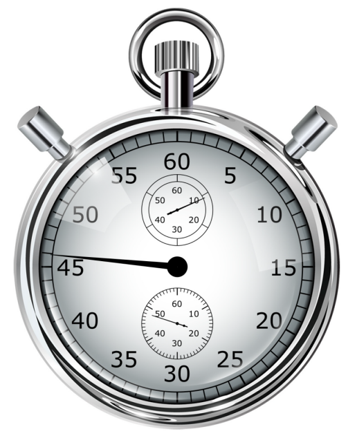

////

|metadata|
{
    "name": "iggaugeview",
    "controlName": ["IGGaugeView"],
    "tags": ["Charting","Getting Started"],
    "guid": "b9b5b85b-f8ba-4596-80ad-ad1bdc5e8176",  
    "buildFlags": [],
    "createdOn": "2013-02-13T14:26:35.6030047Z"
}
|metadata|
////

= IGGaugeView

This section gives you an overview of the use of the  _IGGaugeView_™ control. It contains information ranging from what the control does to the step-by-step procedures on how to accomplish common tasks using the control.

Click the links below to access important information about the  _IGGaugeView_   control.

== About IGGaugeView

_IGGaugeView_   is a data visualization control, capable of displaying a gauge. It contains a number of visual elements, such as a scale with tickmarks and labels, a needle and a number of ranges. A scale is created by supplying `minimumValue` and `maximumValue` and a needle is created by setting `value` property. The needle can be set to any of the predefined shapes. The gauge also supports ranges, which provide visual cues for the scale.

The gauge has a backing shape. This shape is drawn behind the scale and acts as a background for the gauge. The backing can be circular, which turns the shape into a full circle, or it can be fitted, which makes it sweep the scale.

The gauge needle takes on one of the several predefined shapes. The needle can have a pivot shape, which is placed in the center of the gauge. The pivot shape also takes one of the predefined shapes. Pivot shapes that include an overlay or an underlay can have a separate pivot brush applied to the shape.

== link:igchartview-adding-the-chart-framework-file.html[Adding the Chart Framework File]

This topic demonstrates how to add the chart framework file to a project.

== link:iggaugeview-adding-iggaugeview-uiview.html[Adding the IGGaugeView to a UIView]

This topic provides basic information about creating an instance of the  _IGGaugeView_   and displaying a gauge to help you get up and running with this control.

== link:iggaugeview-configuring-iggaugeview.html[Configuring IGGaugeView]

The topics in this group explain and demonstrate enabling, configuring, and using the  _IGGaugeView_   control’s supported features.

== link:iggaugeview-needles.html[Needles]

This topic provides a conceptual overview of needle and needle pivot shapes available with the  _IGGaugeView_   control.

== link:iggaugeview-themes.html[Themes]

This topic provides a conceptual overview of the supported themes available in the  _IGGaugeView_   control.