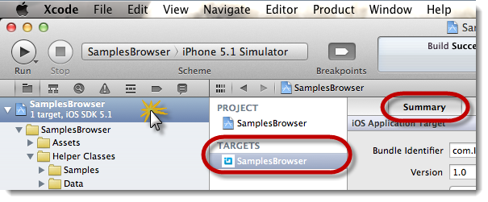
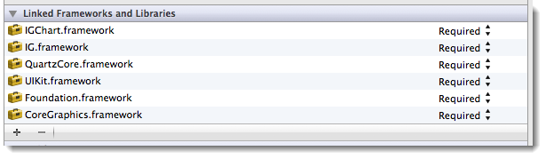

////

|metadata|
{
    "name": "iggridview-adding-the-ig-framework-file",
    "controlName": ["IGGridView"],
    "tags": ["Getting Started","Grids","How Do I"],
    "guid": "d22fd8c5-dc74-43aa-929a-7bf912027580",  
    "buildFlags": [],
    "createdOn": "2012-04-25T13:10:33.3592464Z"
}
|metadata|
////

= Adding the IG Framework File

== Topic Overview

=== Purpose

This topic explains the requirements for adding the IG framework file to an Xcode project; a requirement for using the  _IGGridView™, IGLabel™, IGOverlayView™, or the IGProgressView™_   control.

=== In this topic

This topic contains the following sections:

* <<_Ref330884126, Adding the IG Framework File >>
** <<_Ref323111357,Introduction>>
** <<_Ref323111426,Requirements>>
** <<_Ref329345236,Overview>>
** <<_Ref323111435,Steps>>

* <<_Ref323111244, Related Content >>

[[_Ref323111235]]

[[_Ref330884126]]
== Adding the IG Framework File

[[_Ref323111357]]

=== Introduction

Importing the header file is necessary for creating objects contained within the IG framework. This procedure provides step-by-step instructions for adding the framework file to an Xcode iOS project. Successful completion of this procedure require you to complete two tasks; adding the IG.framework file to the Xcode project and then importing the IG header file into your view controller’s header file.

[[_Ref323111426]]

=== Requirements

* To complete this procedure, you need the following:
** A new or existing Xcode iOS project
** The IG.framework folder stored locally on your machine
** The  _QuartzCore.framework_   and  _CoreText.framework_   added to the Xcode project

[[_Ref329345236]]

=== Overview

*1. Adding the IG Framework File*

*2. Adding the Header File*

[[_Ref323111435]]

=== Steps

=== 1. Add the IG Framework File.

a. Open or create an Xcode iOS project that will use the IG framework.

b. On the  _Project Navigator_   pane,  *click*   *on the project name* . (The project name is the parent item in the  _Project Navigator’s_   tree-view.) The project settings should appear in the main content area of Xcode.

.Note:
[NOTE]
====
Make sure to select the project name under the  _TARGETS_   heading, and select the  _Summary_   tab. You should see the settings panel that lets you configure different project attributes.
====

c. Scroll down the  _Summary_   tab page until coming to the section titled, Linked Frameworks and Libraries. Click the  *+*  (plus) button, located in the lower left-hand corner directly below the listed Linked Frameworks and Libraries listing.

d. Click the  *Add Other*  button.

e. Navigate to the saved location of the  _IG.framework_   folder, select the folder and click the  *Open*  button. That is it; you have successfully added the framework to your project.

f. Repeat steps  *d*  and  *e*  to add the  _QuartzCore.framework_   and  _CoreText.framework_   if this is not already included in your project.

=== 2. Add the Header File.

a. Navigate and select the header (.h) file of your  _UIViewController_   that will use the  _IGGridView_  .

b. Add the import statement at the top of the source file:

*In Objective-C:*

[source,csharp]
----
#import <IG/IG.h>
----

The IG framework objects and controls are now available for use in your  _UIViewController_  .

[[_Ref323111244]]
== Related Content

=== Topics

The following topics provide additional information related to this topic.

[options="header", cols="a,a"]
|====
|Topic|Purpose

| link:ios-getting-support.html[Getting Support]
|This topic provides information about obtaining support for the NucliOS product.

| link:known-issues-breaking-changes.html[Known Issues & Breaking Changes]
|This topic provides information about any known issues or breaking changes that appear in the NucliOS product.

|====