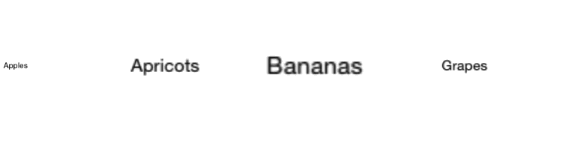

////

|metadata|
{
    "name": "iggridview-configuring-cell-location-viewport",
    "controlName": ["IGGridView"],
    "tags": ["Getting Started","How Do I"],
    "guid": "531d73fa-906d-4368-9e23-6f76d9153446",  
    "buildFlags": [],
    "createdOn": "2014-09-12T13:12:32.1692169Z"
}
|metadata|
////

= Configuring the Cell Location within the Viewport

== Topic Overview

=== Purpose

This topic provides a conceptual overview of configuring the cell location within the viewport on the _IGGridView_™ control and demonstrates the configuration using a code example.

=== In this topic

This topic contains the following sections:

* <<_Ref324841248, Introduction >>
* <<_Ref248895787, Configuring Cell Location within the Viewport – Code Example >>

** <<_Ref327344209,Description>>
** <<_Ref252521837,Preview>>
** <<_Ref327523606,Prerequisites>>
** <<_Ref327344217,Code>>

* <<_Ref215823716, Related Content >>

[[_Ref324841248]]
== Introduction

=== Cell location summary

Designed to be a derivable class, the _IGGridViewCell_ can receive an override method call notifying it of changes to the cell’s location within the _IGGridView_ viewport. When called, this method receives a `CGPoint` location argument specifying the cell’s location within the _IGGridView_’s viewport.

The cell’s location is expressed using an X &amp; Y `CGFloat` value ranging from 0-1, with:

* (X) representing either the cell’s left (0) or right (1) edge 
* (Y) representing either the cell’s top (0) or bottom (1) edge

[options="header", cols="a,a,a"]
|====
|X [Left : 0 Right : 1]|Y [Top : 0 Bottom : 1]|View's Edge

| 0
| 0
| Left Top

| 0
| 1
| Left Bottom

| 1
| 0
| Right Top

| 1
| 1
| Right Bottom

|====

[NOTE]
====
Note: The `cellLocationInViewportChanged:` method is for use in a derived class and should not be called directly.
====

[[_Ref324841253]]
== Configuring Cell Location within the Viewport – Code Example

[[_Ref327344209]]
=== Description

The code example below creates an instance of the _IGGridView_ that uses a custom cell that changes the size of the cell’s text label based on the cell’s location.

[[_Ref252521837]]
=== Preview

[[_Ref327523606]]
=== Prerequisites

This code example requires the inclusion of the IG framework; details about how to add this framework are available in the link:iggridview-adding-the-ig-framework-file.html[Adding the IG Framework File] topic.

[[_Ref327344217]]
=== Code

*In Objective-C:*

[source,csharp]
----
@interface LabelCell : IGGridViewCell
@end
@implementation LabelCell
- (void)cellAttached
{
    [super cellAttached];
    self.textLabel.textAlignment = NSTextAlignmentCenter;
}
- (void)cellLocationInViewportChanged:(CGPoint)location
{
    self.textLabel.layer.transform = CATransform3DIdentity;
    CGFloat scale = [self centerLocation:location.x];
    CGFloat min = 0.6, max = 2.5;
    scale = ((max - min) * scale) + min;
    [self applyScale:scale toView:self.textLabel];
}
- (void)applyScale:(CGFloat)percent toView:(UIView *)view
{
    CATransform3D transform = view.layer.transform;
    transform = CATransform3DScale(transform, percent, percent, percent);
    view.layer.transform = transform;
}
- (CGFloat)centerLocation:(CGFloat)value
{
    if(value >= .5)
        value = 1 - value;
    if(value <= .5)
        value = value /.5;
    return value;
}
@end
@interface igViewController ()
{
    IGGridView *_grid;
    IGGridViewSingleRowSingleFieldDataSourceHelper *_dsh;
}
@end
@implementation igViewController
- (void)viewDidLoad
{
    [super viewDidLoad];
    self.view.backgroundColor = [UIColor colorWithWhite:1 alpha:1];
    _grid = [[IGGridView alloc]initWithFrame:self.view.bounds];
    _grid.alwaysBounceVertical = NO;
    _grid.allowHorizontalBounce = YES;
    _grid.autoresizingMask = UIViewAutoresizingFlexibleHeight | UIViewAutoresizingFlexibleWidth;
    _grid.rowHeight = [UIDevice currentDevice].userInterfaceIdiom == UIUserInterfaceIdiomPhone ? 175 : 350;
    _grid.columnWidth = [IGColumnWidth CreateWithFixedWidth:_grid.rowHeight];
    _grid.columnSpacing = -150;
    _grid.emptyRows = NO;
    _grid.headerHeight = 0;
    _grid.infiniteScrolling = IGGridViewInfiniteScrollingHorizontal;
    _grid.rowSeparatorHeight = 0;
    _grid.selectionType = IGGridViewSelectionTypeNone;
    [self.view addSubview:_grid];
    [_grid registerClass:[LabelCell class] forCellReuseIdentifier:@"Cell"];
    IGGridViewValueColumnDefinition *col = [[IGGridViewValueColumnDefinition alloc] initWithKey:@"self"];
    _dsh = [[IGGridViewSingleRowSingleFieldDataSourceHelper alloc]initWithField:col];
    _dsh.data = @[@"Apples", @"Apricots", @"Bananas", @"Grapes", @"Kiwi", @"Oranges", @"Peaches", @"Pears",
            @"Star Fruit", @"Strawberries"];
    _grid.dataSource = _dsh;
}
@end
----

*In C#:*

[source,csharp]
----
[Register("LabelCell", false)]
public class LabelCell : IGGridViewCell
{
      public override void CellAttached ()
      {
            base.CellAttached ();
            this.TextLabel.TextAlignment = UITextAlignment.Center;
      }
      public override void CellLocationInViewportChanged (PointF location)
      {
            base.CellLocationInViewportChanged (location);
            this.TextLabel.Layer.Transform = CATransform3D.Identity;
            float scale = CenterLocation (location.X);
            float min = 0.6f, max = 2.5f;
            scale = ((max - min) * scale) + min;
            ApplyScale (scale, this.TextLabel);
      }
      private void ApplyScale(float percent, UIView toView)
      {
            CATransform3D transform = toView.Layer.Transform;
            transform = transform.Scale (percent, percent, percent);
            toView.Layer.Transform = transform;
      }
      private float CenterLocation(float value)
      {
            if(value >= 0.5f)
                  value = 1.0f - value;
            if (value <= 0.5f)
                  value = value / 0.5f;
            return value;
      }
}
public partial class GridCellLocation_CSViewController : UIViewController
{
      IGGridView _grid;
      IGGridViewSingleRowSingleFieldDataSourceHelper _dsh;
      public GridCellLocation_CSViewController (IntPtr handle) : base (handle)
      {
      }
      public override void ViewDidLoad ()
      {
            base.ViewDidLoad ();
            this.View.BackgroundColor = UIColor.White;
            _grid = new IGGridView (this.View.Bounds, IGGridViewStyle.IGGridViewStyleDefault);
            _grid.AlwaysBounceVertical = false;
            _grid.AllowHorizontalBounce = true;
            _grid.AutoresizingMask = UIViewAutoresizing.FlexibleHeight | UIViewAutoresizing.FlexibleWidth;
            _grid.RowHeight = UIDevice.CurrentDevice.UserInterfaceIdiom == UIUserInterfaceIdiom.Phone ? 175 : 350;
            _grid.ColumnWidth = IGColumnWidth.CreateNumericColumnWidth (_grid.RowHeight);
            _grid.ColumnSpacing = -150;
            _grid.EmptyRows = false;
            _grid.HeaderHeight = 0;
            _grid.InfiniteScrolling = IGGridViewInfiniteScrolling.IGGridViewInfiniteScrollingHorizontal;
            _grid.RowSeparatorHeight = 0;
            _grid.SelectionType = IGGridViewSelectionType.IGGridViewSelectionTypeNone;
            this.View.AddSubview (_grid);
            _grid.RegisterClassForCellReuse (new Class ("LabelCell"), "Cell");
            IGGridViewValueColumnDefinition col = new IGGridViewValueColumnDefinition ("self");
            _dsh = new IGGridViewSingleRowSingleFieldDataSourceHelper (col);
            _dsh.Data = new NSObject[] { new NSString ("Apples"), new NSString ("Apricots"), new NSString ("Bananas"), 
                  new NSString ("Grapes"), new NSString ("Kiwi"), new NSString ("Oranges"), new NSString ("Peaches"),
                  new NSString ("Pears"), new NSString ("Star Fruit"), new NSString ("Strawberries")
            };
            _grid.DataSource = _dsh;
      }
}
----

[[_Ref215823716]]
== Related Content

=== Topics

The following topics provide additional information related to this topic.

[options="header", cols="a,a"]
|====
|Topic|Purpose

| link:iggridview.html[IGGridView]
|The topics in this group cover enabling, configuring, and using the _IGGridView_ control’s supported features.

|====
