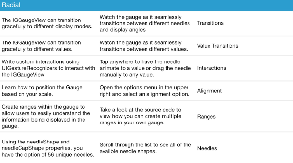

////

|metadata|
{
    "name": "iggridview-configuring-dynamic-row-height",
    "tags": ["How Do I","Getting Started"],
    "controlName": ["IGGridView"],
    "guid": "47e22561-8204-4e2e-a111-cfe195e21298",  
    "buildFlags": [],
    "createdOn": "2014-03-18T17:10:32.5535351Z"
}
|metadata|
////

= Configuring Dynamic Row Height

== Topic Overview

=== Purpose

This topic provides an overview of configuring dynamic row height on the  _IGGridView_™ control.

=== In this topic

This topic contains the following sections:

* <<_Ref324841248, Introduction >>
* <<_Ref215823716, Related Content >>

[[_Ref324841248]]
== Introduction

=== Dynamic Row Height summary

Dynamic row height is a data source helper feature that adjusts a row’s height to make all cells’ content visible. To enable this feature, set the `dynamicRowHeight` property, found on the  _IGGridViewDataSourceHelper_   instance, to `YES`. The following image illustrates a dynamically sized section of rows.

To support the dynamic row height feature when using a custom column definition, override the `resolveHeightForPath:inGrid:usingWidth:inDataSource:`  _IGGridViewColumnDefinition_   method. The aforementioned method asks a column the amount of height it needs for a row. It provides the actual width of the column so that you can make the calculation properly. After all the columns in a row are calculated, the  _IGGridViewDataSourceHelper_   uses the largest height for the row.

[[_Ref215823716]]
== Related Content

=== Topics

The following topic provides additional information related to this topic.

[options="header", cols="a,a"]
|====
|Topic|Purpose

| link:iggridview.html[IGGridView]
|The topics in this group cover enabling, configuring, and using the _IGGridView_ control’s supported features.

|====