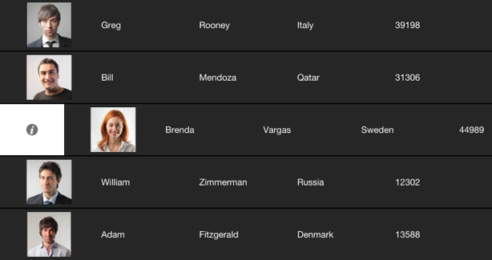

////

|metadata|
{
    "name": "iggridview-configuring-swipe-row",
    "controlName": ["IGGridView"],
    "tags": ["Grids","How Do I","Navigation"],
    "guid": "d5e3d07d-844c-4909-9422-facf716e524e",  
    "buildFlags": [],
    "createdOn": "2013-02-28T15:46:34.5375696Z"
}
|metadata|
////

= Configuring Swipe Row

== Topic Overview

=== Purpose

This topic provides a conceptual overview of the  _IGGridView_™ control’s swipe row and demonstrates how to configure it on the grid view.

=== In this topic

This topic contains the following sections:

* <<_Ref324841248, Introduction >>
* <<_Ref236276557, Swipe Row Percentage >>
* <<_Ref236794381, Manual Slide Row – Code Example >>

** <<_Ref327344209,Description>>
** <<_Ref327523606,Prerequisites>>
** <<_Ref327344217,Code>>

* <<_Ref236794419, Slide Row Percent – Code Example >>

** <<_Ref236794431,Description>>
** <<_Ref236794439,Prerequisites>>
** <<_Ref236794447,Code>>

* <<_Ref236794457, Related Content >>

[[_Ref324841248]]
== Introduction

[[_Ref215022102]]

=== Swipe row summary

Swipe row allows a user to swipe their finger on a row and have the row slide in a specific direction, exposing a  _UIView_   on the left or right side of the row. In the illustration below, the slide row view appears to the left of the row displaying an information icon.

The `swipeRowAction` property found on the  _IGGridView_   allows you to customize which side the  _UIView_   appears.

* `IGGridViewSwipeRowActionManualSlideRowBoth` – Dragging your finger to the either the left or the right drags the row in the same direction.
* `IGGridViewSwipeRowActionManualSlideRowLeft` – Dragging your finger to the left drags the row to the left
* `IGGridViewSwipeRowActionManualSlideRowRight` – Dragging your finger to the right drags the row to the right
* `IGGridViewSwipeRowActionSlideRowBoth` - Swipe your finger to the left will slide the row to the left, swipe your finger to the right will slide the row to the right
* `IGGridViewSwipeRowActionSlideRowLeft` - Swipe your finger left or right will slide the row to the left
* `IGGridViewSwipeRowActionSlideRowRight` - Swipe your finger left or right will slide the row to the right

.Note:
[NOTE]
====
For this feature to work there cannot be any horizontal scrolling.
====

To control what view is displayed on the exposed swipe row, implement the following methods on the  _IGGridViewDelegate_  .

* `-(UIView$$*$$)gridView:(IGGridView $$*$$)gridView viewForSlideRowLeft:(IGRowPath $$* $$)path;`
* `-(UIView $$*$$)gridView:(IGGridView $$*$$)gridView viewForSlideRowRight:(IGRowPath $$* $$)path;`

The displayed view does not dictate the actual width of the slide row. The width of the slide row is set by one or both of the following properties; `slideRowLeftWidth`, `slideRowRightWidth`.

Additionally, the  _IGGridViewDelegate_   provides methods for enabling and disabling the swipe row feature for a specific row.

* `-(BOOL)gridView:(IGGridView$$*$$)gridView canSlideRowLeft:(IGRowPath$$* $$)path;`
* `-(BOOL)gridView:(IGGridView$$*$$)gridView canSlideRowRight:(IGRowPath$$* $$)path;`

[[_Ref236276557]]
[[_Ref324841253]]
== Swipe Row Percentage

=== Swipe row percentage summary

Swipe row percentage allows a user to drag a row a predetermined percentage of the IGGridView width to expose a  _UIView_   to either the left or right of the row. Use the `swipeRowAction` property found on the  _IGGridView_   to enable one of the following swipe row percentage options.

* `IGGridViewSwipeRowActionPercentSlideBoth` - Dragging your finger to the either the left or the right drags the row in the same direction.
* `IGGridViewSwipeRowActionPercentSlideLeft` - Dragging your finger to the left drags the row to the left
* `IGGridViewSwipeRowActionPercentSlideRight` – Dragging your finger to the right drags the row to the right

To use the swipe row percentage option, implement the following optional delegate methods below to handle the row being swiped or released after dragging.

* `-(UIView $$*$$)gridView:(IGGridView $$*$$)gridView viewForSlideRowLeft:(IGRowPath $$* $$)path atPercentage:(CGFloat)percent withFinishingPercentange:(CGFloat)finishPercent`

* `-(UIView$$*$$)gridView:(IGGridView $$*$$)gridView viewForSlideRowRight:(IGRowPath$$* $$)path atPercentage:(CGFloat)percent withFinishingPercentange:(CGFloat)finishPercent`
* `-(BOOL)gridView:(IGGridView $$*$$)gridView acceptSlideRowLeftForRow:(IGRowPath$$* $$)path atPercentage:(CGFloat)percent`
* `-(BOOL)gridView:(IGGridView $$*$$)gridView acceptSlideRowRightForRow:(IGRowPath$$* $$)path atPercentage:(CGFloat)percent`
* `-(void)gridView:(IGGridView $$*$$)gridView slideRowLeftFinished:(IGRowPath$$* $$)path atPercentage:(CGFloat)percent`
* `-(void)gridView:(IGGridView $$*$$)gridView slideRowRightFinished:(IGRowPath$$* $$)path atPercentage:(CGFloat)percent`

When a percentage swipe begins the `gridView:viewForSlideRowLeft:atPercentage:withFinishingPercentage:` or `gridView:viewForSlideRowRight:atPercentage:withFinishingPercentage:` delegate method calls constantly throughout the dragging of the row to display a returned  _UIView_  . The `atPercentage` parameter of these methods contains the current percent the row has moved, whereas the `withFinishingPercentage` parameter contains the percentage at which the row was released while dragging. If the row is currently being dragged, the `withFinishingPercentage` will equal `NAN`.

Once a user stops dragging a swiped row and releases it, the `gridView:acceptSlideRowLeftForRow:atPercentage:` or `gridView:acceptSlideRowLeftForRow:atPercentage:` delegate method calls to check if the released percentage has been logically satisfied to animate the row off screen. Returning a `NO` slides the row back to the original position, whereas returning `YES` animates the row off screen. In addition, if a `YES` is returned, the delegate method `gridView:slideRowLeftFinished:atPercentage:` or `gridView:slideRowRightFinished:atPercentage:` is called to allow for final processing of the row that has been accepted and animated off screen.

[[_Ref327936206]]
[[_Ref236794381]]
[[_Ref236276583]]
== Manual Slide Row – Code Example

[[_Ref327344209]]

=== Description

The code below creates an instance of the  _IGGridView_   that enables manual slide left. Dragging a row to the left exposes a view allowing the user to delete the row by tapping on it.

[[_Ref327523606]]

=== Prerequisites

This code example requires the inclusion of the  __IG__  framework; details about how to add this framework are available in the link:iggridview-adding-the-ig-framework-file.html[Adding the IG Framework File] topic.

[[_Ref327344217]]

=== Code

*In Objective-C:*

[source,csharp]
----
@interface igViewController () <IGGridViewDelegate>
{
    IGGridView *_gridView;
    IGGridViewDataSourceHelper *_dsh;
    IGGridViewDarkTheme *_theme;
    __weak IGRowPath *_swipeRowPath;
}
@end
@implementation igViewController
- (void)viewDidLoad
{
    [super viewDidLoad];
    self.view.backgroundColor = [UIColor whiteColor];
    NSMutableArray *data = [NSMutableArray arrayWithObjects:@"Apple", @"Banana", @"Cherry", @"Dragonfruit", @"Elderberry", nil];
    _dsh = [[IGGridViewDataSourceHelper alloc] init];
    _dsh.data = data;
    _gridView = [[IGGridView alloc] initWithFrame:self.view.bounds style:IGGridViewStyleDefault];
    _gridView.autoresizingMask = UIViewAutoresizingFlexibleWidth|UIViewAutoresizingFlexibleHeight;
    _gridView.headerHeight = 0;
    _gridView.emptyRows = NO;
    _gridView.theme = _theme = [[IGGridViewDarkTheme alloc] init];
    _gridView.swipeRowAction = IGGridViewSwipeRowActionManualSlideLeft;
    _gridView.delegate = self;
    [self.view addSubview:_gridView];
    _gridView.dataSource = _dsh;
}
- (UIView *)gridView:(IGGridView *)gridView viewForSlideRowLeft:(IGRowPath * )path
{
    _swipeRowPath = path;
    UILabel *label = [[UILabel alloc] init];
    label.backgroundColor = [UIColor redColor];
    label.textColor = [UIColor whiteColor];
    label.textAlignment = NSTextAlignmentCenter;
    label.text = @"Trash";
    label.userInteractionEnabled = YES;
    UITapGestureRecognizer *tapGestureRecognizer = [[UITapGestureRecognizer alloc] initWithTarget:self action:@selector(removeRowButton)];
    [label addGestureRecognizer:tapGestureRecognizer];
    return label;
}
-(void)removeRowButton
{
    NSMutableArray* data = [NSMutableArray arrayWithArray:_dsh.data];
    [data removeObjectAtIndex:_swipeRowPath.rowIndex];
    _dsh.data = data;
    [_gridView deleteRowsAtPaths:@[_swipeRowPath] withAnimation:IGGridViewAnimationLeft];
}
@end
----

*In C#:*

[source,csharp]
----
public partial class GridSlideRowManual_CSViewController : UIViewController
{
      IGGridView _gridView;
      IGGridViewDataSourceHelper _dsh;
      List<NSObject> data;
      IGGridViewDarkTheme _theme;
      public GridSlideRowManual_CSViewController () {}
      public override void ViewDidLoad ()
      {
            base.ViewDidLoad ();
            this.View.BackgroundColor = UIColor.White;
            data = new List<NSObject> ();
            data.Add(new NSString("Apple"));
            data.Add(new NSString("Banana"));
            data.Add(new NSString("Cherry"));
            data.Add(new NSString("Dragonfruit"));
            data.Add(new NSString("Elderberry"));
            _dsh = new IGGridViewDataSourceHelper();
            _dsh.Data = data.ToArray();
            _gridView = new IGGridView(this.View.Bounds, IGGridViewStyle.IGGridViewStyleDefault);
            _gridView.AutoresizingMask = UIViewAutoresizing.FlexibleWidth|UIViewAutoresizing.FlexibleHeight;
            _gridView.HeaderHeight = 0;
            _gridView.EmptyRows = false;
            _gridView.Theme = _theme = new IGGridViewDarkTheme();
            _gridView.SwipeRowAction = IGGridViewSwipeRowAction.IGGridViewSwipeRowActionManualSlideLeft;
            _gridView.Delegate = new GridViewDelegate();
            this.View.Add (_gridView);
            _gridView.DataSource = _dsh;
      }
}
public class GridViewDelegate : IGGridViewDelegate
{
      IGGridView _gridView;
      IGGridViewDataSourceHelper _dsh;
      IGRowPath _swipeRowPath;
      public GridViewDelegate() { }
      public override UIView ResolveSlideRowLeftView (IGGridView gridView, IGRowPath path)
      {
            _swipeRowPath = path;
            _gridView = gridView;
            _dsh = gridView.DataSource as IGGridViewDataSourceHelper;
            UILabel label = new UILabel();
            label.BackgroundColor = UIColor.Red;
            label.TextColor = UIColor.White;
            label.TextAlignment = UITextAlignment.Center;
            label.Text = "Trash";
            label.UserInteractionEnabled = true;
            NSAction action = () => {
                  List<NSObject> data = new List<NSObject>(_dsh.Data);
                  data.RemoveAt(_swipeRowPath.RowIndex);
                  _dsh.Data = data.ToArray();
                  _gridView.DeleteRows(new NSObject[]{ _swipeRowPath}, IGGridViewAnimation.IGGridViewAnimationLeft);
            };
            UITapGestureRecognizer tapGestureRecognizer = new UITapGestureRecognizer(action);
            label.AddGestureRecognizer(tapGestureRecognizer);
            return label;
      }
}
----

[[_Ref236794419]]
== Slide Row Percent – Code Example

[[_Ref236794431]]

=== Description

The code below creates an instance of the  _IGGridView_   that enables slide row percent right. When a user drags a row to the right, it exposes a view that changes from gray to red depending on the percentage the row has moved. Once the percentage is above 35%, the exposed view turns red and when released, deletes the row.

[[_Ref236794439]]

=== Prerequisites

This code example requires the inclusion of the  __IG__  framework; details about how to add this framework are available in the link:iggridview-adding-the-ig-framework-file.html[Adding the IG Framework File] topic.

[[_Ref236794447]]

=== Code

*In Objective-C:*

[source,csharp]
----
@interface igViewController () <IGGridViewDelegate>
{
    IGGridView *_gridView;
    IGGridViewDataSourceHelper *_dsh;
    IGGridViewDarkTheme *_theme;
    UIView *_swipeView;
}
@end
@implementation igViewController
- (void)viewDidLoad
{
    [super viewDidLoad];
    self.view.backgroundColor = [UIColor whiteColor];
    _swipeView = [[UIView alloc] init];
    NSMutableArray *data = [NSMutableArray arrayWithObjects:@"Apple", @"Banana", @"Cherry", @"Dragonfruit", @"Elderberry", nil];
    _dsh = [[IGGridViewDataSourceHelper alloc] init];
    _dsh.data = data;
    _gridView = [[IGGridView alloc] initWithFrame:self.view.bounds style:IGGridViewStyleDefault];
    _gridView.autoresizingMask = UIViewAutoresizingFlexibleWidth|UIViewAutoresizingFlexibleHeight;
    _gridView.headerHeight = 0;
    _gridView.emptyRows = NO;
    _gridView.theme = _theme = [[IGGridViewDarkTheme alloc] init];
    _gridView.swipeRowAction = IGGridViewSwipeRowActionPercentSlideRight;
    _gridView.delegate = self;
    [self.view addSubview:_gridView];
    _gridView.dataSource = _dsh;
}
-(UIView *)gridView:(IGGridView *)gridView viewForSlideRowRight:(IGRowPath * )path atPercentage:(CGFloat)percent withFinishingPercentange:(CGFloat)finishPercent
{
    if(percent < 0.35)
        [UIView animateWithDuration:0.35 animations:^{ _swipeView.backgroundColor = [UIColor grayColor]; }];
    else
        [UIView animateWithDuration:0.35 animations:^{ _swipeView.backgroundColor = [UIColor redColor]; }];
    return _swipeView;
}
-(BOOL)gridView:(IGGridView *)gridView acceptSlideRowRightForRow:(IGRowPath * )path atPercentage:(CGFloat)percent
{
    return (percent >= 0.35);
}
-(void)gridView:(IGGridView *)gridView slideRowRightFinished:(IGRowPath * )path atPercentage:(CGFloat)percent
{
    NSMutableArray* data = [NSMutableArray arrayWithArray:_dsh.data];
    [data removeObjectAtIndex:path.rowIndex];
    _dsh.data = data;
    [gridView deleteRowsAtPaths:@[path] withAnimation:IGGridViewAnimationRight];
}
@end
----

*In C#:*

[source,csharp]
----
public partial class GridSlideRowPercent_CSViewController : UIViewController
{
      IGGridView _gridView;
      IGGridViewDataSourceHelper _dsh;
      IGGridViewDarkTheme _theme;
      public GridSlideRowPercent_CSViewController () { }
      public override void ViewDidLoad ()
      {
            base.ViewDidLoad ();
            this.View.BackgroundColor = UIColor.White;
            List<NSObject> data = new List<NSObject> ();
            data.Add(new NSString("Apple"));
            data.Add(new NSString("Banana"));
            data.Add(new NSString("Cherry"));
            data.Add(new NSString("Dragonfruit"));
            data.Add(new NSString("Elderberry"));
            _dsh = new IGGridViewDataSourceHelper();
            _dsh.Data = data.ToArray();
            _gridView = new IGGridView(this.View.Bounds, IGGridViewStyle.IGGridViewStyleDefault);
            _gridView.AutoresizingMask = UIViewAutoresizing.FlexibleWidth|UIViewAutoresizing.FlexibleHeight;
            _gridView.HeaderHeight = 0;
            _gridView.EmptyRows = false;
            _gridView.Theme = _theme = new IGGridViewDarkTheme();
            _gridView.SwipeRowAction = IGGridViewSwipeRowAction.IGGridViewSwipeRowActionPercentSlideRight;
            _gridView.Delegate = new GridViewDelegate();
            this.View.Add (_gridView);
            _gridView.DataSource = _dsh;
      }
}
public class GridViewDelegate : IGGridViewDelegate
{
      UIView _swipeView = new UIView();
      public GridViewDelegate() { }
      public override UIView ResolveSlideRowRightView (IGGridView gridView, IGRowPath path, float percent, float finishPercent)
      {
            if (percent < 0.35f)
                  UIView.Animate (0.35f, () => {
                        _swipeView.BackgroundColor = UIColor.Gray; });
            else
                  UIView.Animate (0.35f, () => {
                        _swipeView.BackgroundColor = UIColor.Red; });
            return _swipeView;
      }
      public override bool ShouldAcceptSlideRowRight (IGGridView gridView, IGRowPath path, float percent)
      {
            return (percent >= 0.35f);
      }
      public override void SlideRowRightFinished (IGGridView gridView, IGRowPath path, float percent)
      {
            IGGridViewDataSourceHelper dsh = (IGGridViewDataSourceHelper)gridView.DataSource;
            NSObject[] strings = (NSObject[])dsh.Data;
            List<NSObject> data = new List<NSObject> (strings);
            data.RemoveAt (path.RowIndex);
            dsh.Data = data.ToArray();
            gridView.DeleteRows (new NSObject[] { path }, IGGridViewAnimation.IGGridViewAnimationRight);
      }
}
----

[[_Ref236794457]]
== Related Content

=== Topics

[[_Ref215021884]]
The following topic provides additional information related to this topic.

[options="header", cols="a,a"]
|====
|Topic|Purpose

| link:iggridview.html[IGGridView]
|This section serves as an introduction to the _IGGridView’s_ key features and functionalities.

|====