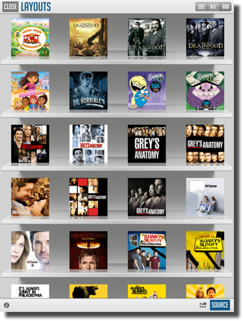

////

|metadata|
{
    "name": "iggridview",
    "controlName": ["IGGridView"],
    "tags": ["Getting Started","Grids"],
    "guid": "df041f08-aeb0-444c-a1ae-cd27bef78cea",  
    "buildFlags": [],
    "createdOn": "2012-04-25T12:51:31.4940713Z"
}
|metadata|
////

= IGGridView

This section gives you an overview of the use of the  _IGGridView_™ control. It contains information ranging from what the control does to the step-by-step procedures on how to accomplish common tasks using the control.

Click the links below to access important information about the  _IGGridView_   control.

== About IGGridView

A grid view is a single or multiple column view, which allows users to scroll through rows and cells both vertically and horizontally. The cells comprising the individual items of the grid are  _IGGridViewCellBase_   objects. These objects represent a specific column and row that users can insert, delete, and reorder, both on the invdiual cell level or row level.

A grid view is made up of zero or more sections, each with its own rows. Sections are identified by their index number within the grid view, rows are identified by their index number within a section and columns are identified by their index within a row. Any section can be optionally be preceded by a section header, and optionally followed by a section footer.

Grid views can have one of two styles,  _IGGridViewStyleDefault_   and  _IGGridViewStyleSingleCellPaging_  . When you create an  _IGGridView_   instance you must specify a grid style, and this style cannot be changed. If no style is chosen, the default style will be used. In the default style, cells and rows size to their column widths and row heights, and sections can display headers and footers. The single cell paging style, will only display a single cell sized to the size of the grid’s viewport. This type of style is useful for applications that would want to display one item at a time, such as an image viewer or a document reader.

Many methods of the  _IGGridView_   take  _IGRowPath_   or  _IGCellPath_   objects as parameters and return values. You can use the `pathForRow:inSection:` static method to create an  _IGRowPath_   and the the `cellPathForRow:inSection:inColumn:` static method to create an  _IGCellPath_  .

A  _IGGridView_   object must have an object that acts as a data source and an object that acts as a delegate; typically these objects are the application delegate. The data source must adopt the  _IGGridViewDataSource_   protocol and the delegate must adopt the  _IGGridViewDelegate_   protocol. The data source provides information that the grid view needs to construct tables and manages the data model when rows or cells of a table are inserted, deleted, or reordered. The delegate provides the cells used by the grid and performs other tasks, such as selection. To shorten development time you can take advantage of the  _IGGridViewDataSourceHelper_   object which simplifies the creation of cells and data management. There are a few different implementations of the data source helpers such as  _IGGridViewSingleRowSingleFieldDataSourceHelper_   and  _IGGridViewSingleFieldMultiColumnDataSourceHelper_   which offer different ways to display your linear data, such as treaing every row as a column.

_IGGridView_   caches cells only for visible rows, but caches row, header, and footer heights for the entire grid. You can create custom cells by deriving from  _IGGridViewCellBase_  .

_IGGridView_   calls `reloadData` only when you create a new instance of the  _IGGridView_   or when you assign a new data source. Reloading the grid view clears current state, including the current selection. If you would like to keep state, but refresh the current data that is being displayed in the grid view, you can call `updateData`.

To display a shortcut bar in the grid view, your datasource must implement the following methods: `sectionIndexTitlesForGridView: gridView:` `sectionForSectionIndexTitle:atIndex:`. You can then customize the appearance of the shortcut bar using the following properties of the grid view: `shortcutBarColumnBackgroundView`, `shortcutBarColumnWidth` and `shorcutBarColor`.

To implement a pull down to refresh mechanism similar to apps such as Facebook, your delegate must implement the `updateRequestedInGridView:` method. When you’'re done with refreshing you can then invoke the `finishedUpdating` method on the grid view. To control the height of the pull down you can set the `pullDownRowHeight` property of the grid view. To customize the content displayed in the pull down view you can implement the `pullDownCellForGridView:` method on your datasource.

== link:iggridview-adding-the-ig-framework-file.html[Adding the Grid Framework File]

This topic explains the requirements for adding the grid framework file to an Xcode project; a requirement for using the  _IGGridView_   control.

== link:iggridview-adding-the-iggridview-uiview.html[Adding the IGGridView to a UIView]

This topic provides basic information about creating an instance of the  _IGGridView_   and displaying data to help you get up and running with this control.

== link:iggridview-configuring-iggridview.html[Configuring IGGridView]

The topics in this group cover enabling, configuring, and using the  _IGGridView_   control’s supported features.

== link:iggridview-data-binding.html[Data Binding]

The  _IGGridView_   contains properties and methods that allow for easily wiring data and manipulating the data based on user interaction. This topic contains links to conceptual information and code snippets for connecting data.

== link:iggridview-themes.html[Themes]

This topic provides a conceptual overview of the supported themes available in the  _IGGridView_   control.