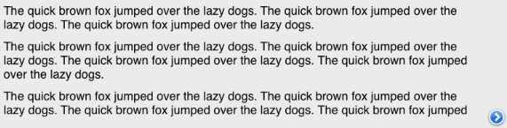

////

|metadata|
{
    "name": "iglabel-configuring-overflow-indicator",
    "controlName": ["IGLabel"],
    "tags": ["How Do I","Styling"],
    "guid": "c80e6961-26b1-4c21-a175-3a0b52a32ea6",  
    "buildFlags": [],
    "createdOn": "2013-02-05T13:27:50.8127547Z"
}
|metadata|
////

= Configuring the Overflow Indicator

== Topic Overview

=== Purpose

This topic provides a conceptual overview of the overflow indicator in the  _IGLabel™_   control and uses a code example to demonstrate how to configure it.

=== In this topic

This topic contains the following sections:

* <<_Ref324841248, Introduction >>
* <<_Ref327936206,Adding an Overflow Indicator to the IGLabel – Code Example>>

** <<_Ref327344209,Description>>
** <<_Ref327523606,Prerequisites>>
** <<_Ref327344217,Code>>

* <<_Ref215823716, Related Content >>

[[_Ref324841248]]
== Introduction

[[_Ref215796828]]

=== Overflow indicator summary

An overflow indicator is a  _UIView_   appearing when the  _IGLabel_  ’s text has overflown its bounds. To configure a  _UIView_   as the overflow indicator access the `overflowIndicatorView` property and set the `overflowIndicatorVisible` to `YES`.

The default alignment of the overflow indicator is `IGTextOverflowAlignmentRightCenter`. The `overflowIndicatorAlignment` property supports other alignments by setting it to one of the following enumerations.

* `IGTextOverflowAlignmentBottomCenter` – Aligns the overflow indicator to the bottom center of the label
* `IGTextOverflowAlignmentBottomLeft` – Aligns the overflow indicator to the bottom left of the label
* `IGTextOverflowAlignmentBottomRight` – Aligns the overflow indicator to the bottom right of the label
* `IGTextOverflowAlignmentLeftCenter` – Aligns the overflow indicator to the left center of the label
* `IGTextOverflowAlignmentRightCenter` – Aligns the overflow indicator to the right center of the label
* `IGTextOverflowAlignmentTopCenter` – Aligns the overflow indicator to the top center of the label
* `IGTextOverflowAlignmentTopLeft` – Aligns the overflow indicator to the top left of the label
* `IGTextOverflowAlignmentTopRight` – Aligns the overflow indicator to the top right of the label

[[_Ref324842387]]
[[_Ref327936206]]
[[_Ref324841253]]
== Adding an Overflow Indicator to the  _IG_  _Label_  – Code Example

[[_Ref327344209]]

=== Description

The code below adds an overflow indicator to the bottom right of the label when the text has overflown its bounds. Margins are set to provide the overflow indicator view ample space and padding between the edge of the control and the text.

[[_Ref327523606]]

=== Prerequisites

This code example requires the inclusion of the  _IG_   framework, detail about how to add this framework can be found in the link:iglabel-adding-the-label-framework-file.html[Adding the Label Framework File] topic.

[[_Ref327344217]]

=== Code

*In C#:*

[source,csharp]
----
IGLabel label = new IGLabel();
label.Frame = new RectangleF(0.0f, 0.0f, 150.0f, 100.0f);
label.Font = UIFont.SystemFontOfSize(18);
label.OverflowIndicatorVisible = true;
label.Text = "The quick brown fox jumped over the lazy dogs. The quick brown fox jumped over the lazy dogs. The quick brown fox jumped over the lazy dogs.\n";
label.Text = String.Format("{0}{0}{0}{0}", label.Text);
label.BackgroundColor = new UIColor(0.8f, 0.8f, 0.8f, 0.4f);
(this.View).AddSubview(label);
UIButton button = new UIButton(UIButtonType.DetailDisclosure);
button.SizeToFit();
label.OverflowIndicatorView = button;
label.OverflowIndicatorAlignment = IGTextOverflowAlignment.IGTextOverflowAlignmentBottomRight;
label.MarginBottom = 8.0f;
label.MarginLeft = 8.0f;
label.MarginRight = 50.0f;
label.MarginTop = 8.0f;
----

*In Objective-C:*

[source,csharp]
----
IGLabel *label = [[IGLabel alloc] init];
label.frame = CGRectMake(0, 0, 150, 100);
label.font = [UIFont systemFontOfSize:18];
label.overflowIndicatorVisible = YES;
label.text = @"The quick brown fox jumped over the lazy dogs. The quick brown fox jumped over the lazy dogs. The quick brown fox jumped over the lazy dogs.\n";
label.text = [NSString stringWithFormat:@"%@%@%@%@", label.text, label.text, label.text, label.text];
label.backgroundColor = [[UIColor alloc] initWithWhite:0.8 alpha:0.4];[self.view addSubview:label];
UIButton *button = [UIButton buttonWithType:UIButtonTypeDetailDisclosure];[button sizeToFit];
label.overflowIndicatorView = button;
label.overflowIndicatorAlignment = IGTextOverflowAlignmentBottomRight;
label.marginBottom = 8.0;
label.marginLeft = 8.0;
label.marginRight = 50.0;
label.marginTop = 8.0;
----

[[_Ref215823716]]
== Related Content

=== Topics

The following topics provide additional information related to this topic.

[options="header", cols="a,a"]
|====
|Topic|Purpose

| link:iglabel-configuring-iglabel.html[Configuring IGLabel]
|The topics in this group cover enabling, configuring, and using the _IGLabel_ control’s supported features.

|====