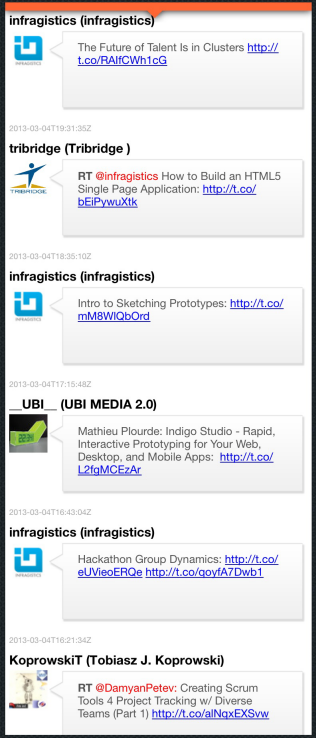

////

|metadata|
{
    "name": "iglabel",
    "controlName": ["IGLabel"],
    "tags": ["Getting Started"],
    "guid": "3ea45c91-9fd2-4394-9d18-a450def81643",  
    "buildFlags": [],
    "createdOn": "2012-11-06T13:30:49.5065726Z"
}
|metadata|
////

= IGLabel

This section gives you an overview of the use of the  _IGLabel_™ control. It contains information ranging from what the control does to the step-by-step procedures on how to accomplish common tasks using the control.

Click the links below to access important information about the  _IGLabel_   control.

== About IGLabel

The  _IGLabel_   is a rich text label that works similarly to the generic  _UILabel_   and applies styles to text in a similar fashion that is done when using attributed strings. It is based on Core Text to boost performance and functionality over the generic  _UILabel_  .

Attributes are used to decorate the displayed text using an  _NSRange_   or a regular expression search string through these two methods; `addAttributes:range:`, and `addAttributes:forRegEx:error:`. Attributes allow you to adjust these text characteristics; bold appearance, font used, text foreground color, italic appearance, kern spacing, text stroke color and width, interaction of text through tap, and underline appearance and color.

Text variables are added by using the `addTextVariable:value:` method and are used to allow for the usage of dynamic text values. When the text property changes and text variables were defined, they are automatically updated with the configured value.

== link:iglabel-adding-the-label-framework-file.html[Adding the Label Framework File]

This topic explains the requirements for adding the label framework file to an Xcode project; a requirement for using the  _IGLabel_   control.

== link:iglabel-adding-iglabel-uiview.html[Adding IGLabel to a UIView]

This topic provides basic information about creating an instance of the  _IGLabel_   and styling its text to help you get up and running with this control.

== link:iglabel-configuring-iglabel.html[Configuring IGLabel]

The topics in this group cover enabling, configuring, and using the  _IGLabel_   control’s supported features.