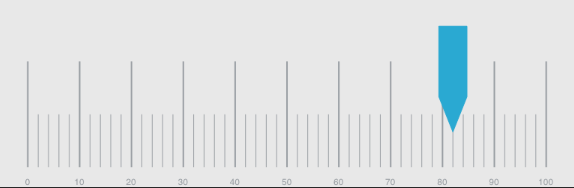

////

|metadata|
{
    "name": "iglineargaugeview-adding-linear-gauge-view",
    "tags": ["Getting Started","How Do I"],
    "controlName": ["IGLinearGaugeView"],
    "guid": "f2a9850c-db54-4e23-aca7-2a605a276097",  
    "buildFlags": [],
    "createdOn": "2013-09-10T12:29:15.6561071Z"
}
|metadata|
////

= Adding the Linear Gauge to a View

== Topic Overview

=== Purpose

This topic explains, with a code example how to create a basic instance of the  _IGLinearGaugeView_™ control and display it on a view.

=== Required background

The following table lists the prerequisite topic required to understanding this topic.

[options="header", cols="a,a"]
|====
|Topic|Purpose

| link:igchartview-adding-the-chart-framework-file.html[Adding the Chart Framework File]
|This topic explains how to add the Chart framework file to a project.

|====

=== In this topic

This topic contains the following sections:

* <<_Ref328621638, Displaying an   IGLinearGaugeView   – Code Example >>

** <<_Ref323199287,Description>>
** <<_Ref357071611,Preview>>
** <<_Ref323199293,Code>>

* <<_Ref323199323, Related Content >>

[[_Ref323199279]]
[[_Ref328621638]]
[[_Ref323111244]]
== Displaying an IGLinearGaugeView – Code Example

[[_Ref323199287]]

=== Description

This code example illustrates how to create and add a (default) horizontally oriented linear gauge with the `value` property set to 82 to a view.

[[_Ref357071611]]

=== Preview

[[_Ref323199293]]

=== Code

To start, initialize a frame to serve as the linear gauge’s size and position.

*In Objective-C:*

[source,csharp]
----
CGRect gaugeRect = self.view.bounds;
gaugeRect.size.height = 250;
gaugeRect.origin.y = (self.view.bounds.size.height / 2) - 125;
----

*In C#:*

[source,csharp]
----
RectangleF gaugeRect = this.View.Bounds;
gaugeRect.Height = 250;
gaugeRect.Y = (this.View.Bounds.Height / 2) - 125;
----

Next, create an instance of the linear gauge using the dimensions of the frame.

*In Objective-C:*

[source,csharp]
----
IGLinearGaugeView *gauge = [[IGLinearGaugeView alloc] initWithFrame:gaugeRect];
----

*In C#:*

[source,csharp]
----
IGLinearGaugeView gauge = new IGLinearGaugeView ();
gauge.Frame = gaugeRect;
----

Next, set the auto-resizing mask to allow the linear gauge to float in the center of the current device orientation without requiring a size adjustment.

*In Objective-C:*

[source,csharp]
----
gauge.autoresizingMask = UIViewAutoresizingFlexibleHeight|UIViewAutoresizingFlexibleWidth|UIViewAutoresizingFlexibleTopMargin|UIViewAutoresizingFlexibleBottomMargin;
----

*In C#:*

[source,csharp]
----
gauge.AutoresizingMask = UIViewAutoresizing.FlexibleHeight | UIViewAutoresizing.FlexibleWidth | UIViewAutoresizing.FlexibleTopMargin | UIViewAutoresizing.FlexibleBottomMargin;
----

Set the `value` property of the linear gauge to 82.

*In Objective-C:*

[source,csharp]
----
gauge.value = 82;
----

*In C#:*

[source,csharp]
----
gauge.Value = 82;
----

Finally, add the linear gauge to the view.

*In Objective-C:*

[source,csharp]
----
 [self.view addSubview:gauge];
----

*In C#:*

[source,csharp]
----
this.View.Add(gauge);
----

[[_Ref323199323]]
== Related Content

=== Topics

The following topic provides additional information related to this topic.

[options="header", cols="a,a"]
|====
|Topic|Purpose

| link:iglineargaugeview.html[IGLinearGaugeView]
|This topic provides a conceptual overview of the _IGLinearGaugeView_ control and its key features.

|====