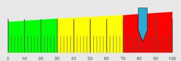

////

|metadata|
{
    "name": "iglineargaugeview-configuring-ranges",
    "tags": ["Getting Started","How Do I"],
    "controlName": ["IGLinearGaugeView"],
    "guid": "a4d8d98b-a08e-424b-b878-c1645c76df56",  
    "buildFlags": [],
    "createdOn": "2013-09-10T12:51:54.3549634Z"
}
|metadata|
////

= Configuring Ranges

== Topic Overview

=== Purpose

This topic provides a conceptual overview of ranges with the  _IGLinearGaugeView_™ control and demonstrates how to configure them using a code example.

=== In this topic

This topic contains the following sections:

* <<_Ref324841248, Introduction >>
* <<_Ref327936206, Configuring Ranges – Code Example >>

** <<_Ref327344209,Description>>
** <<_Ref327523606,Prerequisites>>
** <<_Ref223063339,Preview>>
** <<_Ref327344217,Code>>

* <<_Ref215823716, Related Content >>

[[_Ref324841248]]
== Introduction

[[_Ref215796828]]

=== Ranges summary

A range highlights a set of continuous values bound by a specified minimum and maximum Value on a scale. To add a range to the  _IGLinearGaugeView_  , create an  _IGLinearGaugeRange_   object and assign values to the following properties:

* `brush`
* `startValue`
* `endValue`

With the brush, start, and end values defined, the linear gauge range needs a width of the area to fill. The  _IGLinearGaugeRange_   has four properties.

* `innerStartExtent` - The start position of the inner part of the range measured from the center of the gauge. The value of this property should be between 0 and 1.
* `innerEndExtent` - The end position of the inner part of the range measured from the center of the gauge. The value of this property should be between 0 and 1.
* `outerStartExtent` - The start position of the outer part of the range measured from the center of the gauge. The value of this property should be between 0 and 1.
* `outerEndExtend` - The end position of the outer part of the range measured from the center of the gauge. The value of this property should be between 0 and 1.

Use the  _IGLinearGaugeView_   control’s `addRange:` method to add the  _IGLinearGaugeRange_  .

[[_Ref327936206]]
[[_Ref324841253]]
== Configuring Ranges – Code Example

[[_Ref327344209]]

=== Description

The code below creates an instance of the  _IGLinearGaugeView_   with a value of 82 and adds 3 ranges to the  _IGLinearGaugeView_   represented by the colors green, yellow, and red.

[[_Ref327523606]]

=== Prerequisites

This code example requires the inclusion of the  _Chart_   framework; details about how to add this framework are available in the link:igchartview-adding-the-chart-framework-file.html[Adding the Chart Framework File] topic.

[[_Ref223063339]]

=== Preview

The following image previews the  _IGLinearGaugeView_   as rendered using the following code snippet.

[[_Ref327344217]]

=== Code

*In Objective-C:*

[source,csharp]
----
CGRect gaugeRect = self.view.bounds;
gaugeRect.size.height = 250;
gaugeRect.origin.y = (self.view.bounds.size.height / 2) - 125;
IGLinearGaugeView *gauge = [[IGLinearGaugeView alloc] initWithFrame:gaugeRect];
gauge.autoresizingMask = UIViewAutoresizingFlexibleHeight|UIViewAutoresizingFlexibleWidth|UIViewAutoresizingFlexibleTopMargin|UIViewAutoresizingFlexibleBottomMargin;
gauge.minorTickBrush = gauge.tickBrush = gauge.fontBrush = [[IGBrush alloc] initWithR:0.33 andG:0.33 andB:0.33 andA:1];
gauge.needleOutline = [[IGBrush alloc] initWithR:0 andG:0 andB:0 andA:1];
gauge.value = 82;
[self.view addSubview:gauge];
IGLinearGaugeRange *range1 = [[IGLinearGaugeRange alloc] init];
range1.brush = [[IGBrush alloc] initWithColor:[UIColor greenColor]];
range1.startValue = 0;
range1.endValue = 30;
range1.outerStartExtent = 0.6;
range1.outerEndExtent = 0.66;
IGLinearGaugeRange *range2 = [[IGLinearGaugeRange alloc] init];
range2.brush = [[IGBrush alloc] initWithColor:[UIColor yellowColor]];
range2.startValue = 30;
range2.endValue = 70;
range2.outerStartExtent = 0.66;
range2.outerEndExtent = 0.72;
IGLinearGaugeRange *range3 = [[IGLinearGaugeRange alloc] init];
range3.brush = [[IGBrush alloc] initWithColor:[UIColor redColor]];
range3.startValue = 70;
range3.endValue = 100;
range3.outerStartExtent = 0.72;
range3.outerEndExtent = 0.78;
[gauge addRange:range1];
[gauge addRange:range2];
[gauge addRange:range3];
----

*In C#:*

[source,csharp]
----
RectangleF gaugeRect = this.View.Bounds;
gaugeRect.Height = 250;
gaugeRect.Y = (this.View.Bounds.Height / 2) - 125;
IGLinearGaugeView gauge = new IGLinearGaugeView ();
gauge.Frame = gaugeRect;
gauge.AutoresizingMask = UIViewAutoresizing.FlexibleHeight | UIViewAutoresizing.FlexibleWidth | UIViewAutoresizing.FlexibleTopMargin | UIViewAutoresizing.FlexibleBottomMargin;
gauge.MinorTickBrush = gauge.TickBrush = gauge.FontBrush = new IGBrush (0.33f, 0.33f, 0.33f, 1.0f);
gauge.NeedleOutline = new IGBrush (UIColor.Black);
gauge.Value = 82;
this.View.Add (gauge);
IGLinearGaugeRange range1 = new IGLinearGaugeRange();
range1.Brush = new IGBrush(UIColor.Green);
range1.StartValue = 0;
range1.EndValue = 30;
range1.OuterStartExtent = 0.6f;
range1.OuterEndExtent = 0.66f;
IGLinearGaugeRange range2 = new IGLinearGaugeRange();
range2.Brush = new IGBrush(UIColor.Yellow);
range2.StartValue = 30;
range2.EndValue = 70;
range2.OuterStartExtent = 0.66f;
range2.OuterEndExtent = 0.72f;
IGLinearGaugeRange range3 = new IGLinearGaugeRange();
range3.Brush = new IGBrush(UIColor.Red);
range3.StartValue = 70;
range3.EndValue = 100;
range3.OuterStartExtent = 0.72f;
range3.OuterEndExtent = 0.78f;
gauge.AddRange(range1);
gauge.AddRange(range2);
gauge.AddRange(range3);
----

[[_Ref215823716]]
== Related Content

=== Topics

The following topic provides additional information related to this topic.

[options="header", cols="a,a"]
|====
|Topic|Purpose

| link:iglineargaugeview.html[IGLinearGaugeView]
|The topics in this group cover enabling, configuring, and using the _IGLinearGaugeView_ control’s supported features.

|====