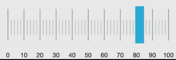
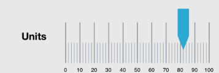

////

|metadata|
{
    "name": "iglineargaugeview-configuring-the-scale",
    "tags": ["Getting Started","How Do I"],
    "controlName": ["IGLinearGaugeView"],
    "guid": "20b65a47-501f-4c24-9543-9644ba5ae427",  
    "buildFlags": [],
    "createdOn": "2013-09-10T12:52:14.5079785Z"
}
|metadata|
////

= Configuring the Scale

== Topic Overview

=== Purpose

This topic explains uses examples demonstrating how to customize the scale of the  _IGLinearGaugeView_™ control.

=== In this topic

This topic contains the following sections:

* <<_Ref324841248, Introduction >>

** <<_Ref215796828,Scale summary>>
** <<_Ref238701892,Scale configuration chart>>

* <<_Ref238704210, Customizing Tick Marks – Code Example >>

** <<_Ref327344209,Description>>
** <<_Ref327523606,Prerequisites>>
** <<_Ref327344217,Code>>

* <<_Ref238712516, Customizing the Scale – Code Example >>

** <<_Ref238712529,Description>>
** <<_Ref238712549,Prerequisites>>
** <<_Ref238712556,Preview>>
** <<_Ref238712563,Code>>

* <<_Ref215823716, Related Content >>

[[_Ref324841248]]
== Introduction

[[_Ref215796828]]

=== Scale summary

The scale of the  _IGLinearGaugeView_   control is a logical entity formed by combining tick marks and (numbering) labels. The supported tick marks of the  _IGLinearGaugeView_   control, both major and minor, mark off equal intervals of measure along the gauge’s scale. Both can be positioned along the scale by adjusting the values of the respective extent-related properties, which are measured as a percentage of the gauge area. All aspects of the tick marks’ exact count, position, look, and frequency are customizable by property settings.

[[_Ref238701892]]

=== Scale configuration chart

The following table lists the  _IGLinearGaugeView’s_   scale configurable properties along with a brief description of each property.

[options="header", cols="a,a"]
|====
|Property|Description

|`font`
|Scale label Font

|`fontBrush`
|Scale label color

|`interval`
|Major tick mark count

|`labelExtent`
|Label position, as a value from 0 to 1, measured from the font/bottom of the scale.

|`labelInterval`
|Label rendering interval

|`labelsPostInitial`
|Label start rendering point from the minimum value

|`labelsPreTerminal`
|Starting from the maximum value, when to stop rendering labels.

|`maximumValue`
|The linear scale’s highest value

|`minimumValue`
|The linear scale’s lowest value

|`minorTickBrush`
|Minor tick mark color

|`minorTickCount`
|Count of tick marks between major tick marks

|`minorTickEndExtent`
|Minor tick marks stop rendering position, measured from the front/bottom of the linear gauge depending on the gauge orientation

|`minorTickStartExtent`
|Minor tick marks start rendering position, measured from the front/bottom of the linear gauge depending on the gauge orientation

|`minorTickStrokeThickness`
|Minor tick mark stroke thickness

|`scaleEndExtent`
|Position at which to stop rendering the scale as a value from 0 to 1, measured from the front/bottom of the linear gauge

|`scaleStartExtent`
|Position at which to start rendering the scale as a value from 0 to 1, measured from the front/bottom of the linear gauge.

|`tickBrush`
|Major tick mark color

|`tickEndExtent`
|Major tick marks end position, measured from the side of the linear gauge containing the `maximumValue`

|`ticksPostInitial`
|A value to start adding tick marks, added to the scale's `minimumValue`

|`ticksPreTerminal`
|A value to stop adding tick marks, subtracted from the scale's `maximumValue`

|`tickStartExtent`
|Major tick marks start position, measured from the side of the linear gauge containing the `minimumValue`

|`tickStrokeThickness`
|Major tick mark stroke thickness

|====

[[_Ref238704210]]
[[_Ref324841253]]
== Customizing Tick Marks – Code Example

[[_Ref327344209]]

=== Description

The code example configures the major and minor tick marks centering them within the  _IGLinearGaugeView_   and rendering the scale labels in black using the  _HelveticaNeue_   font.

[[_Ref327523606]]

=== Prerequisites

This code example requires the inclusion of the  _Chart_   framework, detail about how to add this framework can be found in the link:igchartview-adding-the-chart-framework-file.html[Adding the Chart Framework File] topic.

=== Preview

The image below illustrates the code example when ran.

[[_Ref327344217]]

=== Code

*In Objective-C:*

[source,csharp]
----
CGRect gaugeRect = self.view.bounds;
gaugeRect.size.height = 250;
gaugeRect.origin.y = (self.view.bounds.size.height / 2) - 125;
IGLinearGaugeView *gauge = [[IGLinearGaugeView alloc] initWithFrame:gaugeRect];
gauge.autoresizingMask = UIViewAutoresizingFlexibleHeight|UIViewAutoresizingFlexibleWidth|UIViewAutoresizingFlexibleTopMargin|UIViewAutoresizingFlexibleBottomMargin;
gauge.font = [UIFont fontWithName:@"HelveticaNeue" size:17.0];
gauge.fontBrush = [[IGBrush alloc] initWithR:0 andG:0 andB:0 andA:1];
gauge.minorTickStartExtent = 0.3;
gauge.minorTickEndExtent = 0.6;
gauge.tickStartExtent = 0.2;
gauge.tickEndExtent = 0.8;
gauge.needleShape = IGLinearGraphNeedleShapeRectangle;
gauge.needleInnerExtent = 0.15;
gauge.needleOuterExtent = 0.85;
gauge.value = 82;
[self.view addSubview:gauge];
----

*In C#:*

[source,csharp]
----
RectangleF gaugeRect = this.View.Bounds;
gaugeRect.Height = 250;
gaugeRect.Y = (this.View.Bounds.Height / 2) - 125;
IGLinearGaugeView gauge = new IGLinearGaugeView ();
gauge.Frame = gaugeRect;
gauge.AutoresizingMask = UIViewAutoresizing.FlexibleHeight | UIViewAutoresizing.FlexibleWidth | UIViewAutoresizing.FlexibleTopMargin | UIViewAutoresizing.FlexibleBottomMargin;
gauge.Font = UIFont.FromName ("HelveticaNeue", 17.0f);
gauge.FontBrush = new IGBrush (0, 0, 0, 1); 
gauge.MinorTickStartExtent = 0.3f;
gauge.MinorTickEndExtent = 0.6f;
gauge.TickStartExtent = 0.2f;
gauge.TickEndExtent = 0.8f;
gauge.NeedleShape = IGLinearGraphNeedleShape.IGLinearGraphNeedleShapeRectangle;
gauge.NeedleInnerExtent = 0.15f;
gauge.NeedleOuterExtent = 0.85f;
gauge.Value = 82;
this.View.Add (gauge);
----

[[_Ref238712516]]
[[_Ref215823716]]
== Customizing the Scale – Code Example

[[_Ref238712529]]

=== Description

The code example uses the `scaleStartExtent` and `scaleEndExtent` properties of the  _IGLinearGaugeView_   to adjust the scale’s position making space for the label.

[[_Ref238712549]]

=== Prerequisites

This code example requires the inclusion of the  _Chart_   framework, detail about how to add this framework can be found in the link:igchartview-adding-the-chart-framework-file.html[Adding the Chart Framework File] topic.

[[_Ref238712556]]

=== Preview

The image below illustrates the code example when ran on a device.

[[_Ref238712563]]

=== Code

*In Objective-C:*

[source,csharp]
----
CGRect gaugeRect = self.view.bounds;
gaugeRect.size.height = 250;
gaugeRect.origin.y = (self.view.bounds.size.height / 2) - 125;
IGLinearGaugeView *gauge = [[IGLinearGaugeView alloc] initWithFrame:gaugeRect];
gauge.autoresizingMask = UIViewAutoresizingFlexibleHeight|UIViewAutoresizingFlexibleWidth|UIViewAutoresizingFlexibleTopMargin|UIViewAutoresizingFlexibleBottomMargin;
gauge.fontBrush = [[IGBrush alloc] initWithR:0 andG:0 andB:0 andA:1];
gauge.scaleStartExtent = 0.3;
gauge.scaleEndExtent = 0.95;
gauge.value = 82;
[self.view addSubview:gauge];
UILabel *label = [[UILabel alloc] init];
label.frame = CGRectMake(0, 0, 100, gauge.bounds.size.height);
label.autoresizingMask = UIViewAutoresizingFlexibleHeight|UIViewAutoresizingFlexibleWidth|UIViewAutoresizingFlexibleRightMargin;
label.backgroundColor = [UIColor clearColor];
label.font = [UIFont fontWithName:@"HelveticaNeue-Bold" size:22.0];
label.textAlignment = NSTextAlignmentCenter;
label.text = @"Units";
[gauge addSubview:label];
----

*In C#:*

[source,csharp]
----
RectangleF gaugeRect = this.View.Bounds;
gaugeRect.Height = 250;
gaugeRect.Y = (this.View.Bounds.Height / 2) - 125;
IGLinearGaugeView gauge = new IGLinearGaugeView ();
gauge.Frame = gaugeRect;
gauge.AutoresizingMask = UIViewAutoresizing.FlexibleHeight | UIViewAutoresizing.FlexibleWidth | UIViewAutoresizing.FlexibleTopMargin | UIViewAutoresizing.FlexibleBottomMargin;
gauge.FontBrush = new IGBrush (0, 0, 0, 1);
gauge.ScaleStartExtent = 0.3f;
gauge.ScaleEndExtent = 0.95f;
gauge.Value = 82;
this.View.Add (gauge);
UILabel label = new UILabel ();
label.Frame = new RectangleF(0, 0, 100, gauge.Bounds.Height);
label.AutoresizingMask = UIViewAutoresizing.FlexibleHeight | UIViewAutoresizing.FlexibleWidth | UIViewAutoresizing.FlexibleRightMargin;
label.BackgroundColor = UIColor.Clear;
label.Font = UIFont.FromName ("HelveticaNeue-Bold", 22.0f);
label.TextAlignment = UITextAlignment.Center;
label.Text = @"Units";
gauge.Add (label);
----

== Related Content

=== Topics

The following topic provides additional information related to this topic.

[options="header", cols="a,a"]
|====
|Topic|Purpose

| link:iglineargaugeview-configuring-iglineargaugeview.html[Configuring IGLinearGaugeView]
|The topics in this group cover enabling, configuring, and using the _IGLinearGaugeView_ control’s supported features.

|====