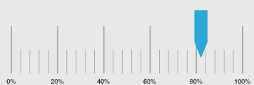

////

|metadata|
{
    "name": "iglineargaugeview-customizing-scale-labels",
    "tags": ["Formatting","Getting Started","How Do I"],
    "controlName": ["IGLinearGaugeView"],
    "guid": "4eba8872-cf2c-4b6c-a0b1-420447fd4ef8",  
    "buildFlags": [],
    "createdOn": "2013-09-10T12:52:42.3767651Z"
}
|metadata|
////

= Customizing Scale Labels

== Topic Overview

=== Purpose

This topic provides a conceptual overview of customizing scale labels on the  _IGLinearGaugeView_™ control and demonstrates how to configure it using a code example.

=== In this topic

This topic contains the following sections:

* <<_Ref324841248, Introduction >>
* <<_Ref238777569, Customizing Scale Labels – Code Example >>

** <<_Ref327344209,Description>>
** <<_Ref327523606,Prerequisites>>
** <<_Ref238777592,Preview>>
** <<_Ref327344217,Code>>

* <<_Ref215823716, Related Content >>

[[_Ref324841248]]
== Introduction

[[_Ref215796828]]

=== Custom labels summary

The scale labels on the  _IGLinearGaugeView_   control are extremely flexible allowing you to present some highly specialized information via customization using the control’s `linearGaugeView``:formatStringForValue``:` delegate method. The method provides the  _IGLinearGaugeView_   calling the method with the label value to format and returns an  _NSString_   containing the text of the new label.

[[_Ref327936206]]
[[_Ref238777569]]
[[_Ref324841253]]
== Customizing Scale Labels – Code Example

[[_Ref327344209]]

=== Description

The code example uses the  _IGLinearGaugeViewDelegate_   to implement the `linearGaugeView``:formatStringForValue``:` delegate method for adding a percent symbol to the label formatting.

[[_Ref327523606]]

=== Prerequisites

This code example requires the inclusion of the  _Chart_   framework; details about how to add this framework are available in the link:igchartview-adding-the-chart-framework-file.html[Adding the Chart Framework File] topic.

[[_Ref238777592]]

=== Preview

[[_Ref327344217]]

=== Code

*In Objective-C:*

[source,csharp]
----
@interface igViewController () <IGLinearGaugeViewDelegate>
@end
@implementation igViewController
- (void)viewDidLoad
{
    [super viewDidLoad];
    CGRect gaugeRect = self.view.bounds;
    gaugeRect.size.height = 250;
    gaugeRect.origin.y = (self.view.bounds.size.height / 2) - 125;
    IGLinearGaugeView *gauge = [[IGLinearGaugeView alloc] initWithFrame:gaugeRect];
    gauge.autoresizingMask = UIViewAutoresizingFlexibleHeight|UIViewAutoresizingFlexibleWidth|UIViewAutoresizingFlexibleTopMargin|UIViewAutoresizingFlexibleBottomMargin;
    gauge.fontBrush = [[IGBrush alloc] initWithR:0 andG:0 andB:0 andA:1];
    gauge.interval = 20;
    gauge.value = 82;
    gauge.delegate = self;
    [self.view addSubview:gauge];
}
- (NSString *)linearGaugeView:(IGLinearGaugeView * )linearGaugeView formatStringForValue:(double)labelValue
{
    return [NSString stringWithFormat:@"%.0f%%", labelValue];
}
@end
----

*In C#:*

[source,csharp]
----
public partial class LinearGaugeScaleLabels_CSViewController : UIViewController
{
      public LinearGaugeScaleLabels_CSViewController ()
      {
      }
      public override void ViewDidLoad ()
      {
            base.ViewDidLoad ();
            RectangleF gaugeRect = this.View.Bounds;
            gaugeRect.Height = 250;
            gaugeRect.Y = (this.View.Bounds.Height / 2) - 125;
            IGLinearGaugeView gauge = new IGLinearGaugeView ();
            gauge.Frame = gaugeRect;
            gauge.AutoresizingMask = UIViewAutoresizing.FlexibleHeight | UIViewAutoresizing.FlexibleWidth | UIViewAutoresizing.FlexibleTopMargin | UIViewAutoresizing.FlexibleBottomMargin;
            gauge.FontBrush = new IGBrush (UIColor.Black);
            gauge.Interval = 20;
            gauge.Value = 82;
            gauge.Delegate = new LinearGaugeDelegate ();
            this.View.Add (gauge);
      }
}
public class LinearGaugeDelegate : IGLinearGaugeViewDelegate
{
      public override string ResolveFormatString (IGLinearGaugeView linearGaugeView, double labelValue)
      {
            return String.Format ("{0}%", labelValue);
      }
}
----

[[_Ref215823716]]
== Related Content

=== Topics

The following topic provides additional information related to this topic.

[options="header", cols="a,a"]
|====
|Topic|Purpose

| link:iglineargaugeview-configuring-iglineargaugeview.html[Configuring IGLinearGaugeView]
|The topics in this group cover enabling, configuring, and using the _IGLinearGaugeView_ control’s supported features.

|====