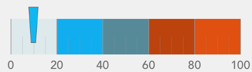

////

|metadata|
{
    "name": "iglineargaugeview",
    "tags": ["Getting Started"],
    "controlName": ["IGLinearGaugeView"],
    "guid": "b11b9a8e-73f5-46a3-b10d-44ebd9e7768c",  
    "buildFlags": [],
    "createdOn": "2013-09-10T12:24:06.444189Z"
}
|metadata|
////

= IGLinearGaugeView

This section gives you an overview of the use of the  _IGLinearGaugeView_™ control. It contains information ranging from what the control does to the step-by-step procedures on how to accomplish common tasks using the control.

Click the links below to access important information about the  _IGLinearGaugeView_   control.

== About IGLinearGaugeView

_IGLinearGaugeView_   is a data visualization control, capable of displaying a linear gauge. It contains a number of visual elements, such as a scale with tickmarks and labels, a needle and a number of ranges. A scale is created by supplying `minimumValue` and `maximumValue` and a needle is created by setting value property. The needle can be set to any of the predefined shapes. The linear gauge also supports ranges, which provide visual cues for the scale. Additionally, the gauge has a backing shape. This shape is drawn behind the scale and acts as a background for the gauge.

== link:igchartview-adding-the-chart-framework-file.html[Adding the Chart Framework File]

This topic demonstrates how to add the chart framework file to a project.

== link:iglineargaugeview-adding-linear-gauge-view.html[Adding the Linear Gauge to a View]

This topic provides basic information about creating an instance of the  _IGLinearGaugeView_   to help you get up and running with this control.

== link:iglineargaugeview-configuring-iglineargaugeview.html[Configuring IGLinearGaugeView]

The topics in this group explain and demonstrate enabling, configuring, and using the  _IGLinearGaugeView_   control’s supported features.

== link:iglineargaugeview-needles.html[Needles]

This topic provides a conceptual overview of needle and needle pivot shapes available with the  _IGLinearGaugeView_   control.

== link:iglineargaugeview-themes.html[Themes]

This topic provides a conceptual overview of the supported themes available in the  _IGLinearGaugeView_   control.