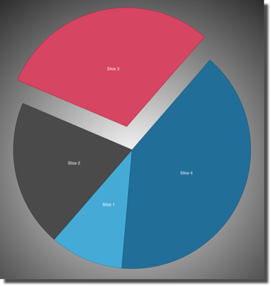

////

|metadata|
{
    "name": "igpiechart-exploding-slices-igpiechartview",
    "controlName": ["IGPieChartView"],
    "tags": ["Charting","How Do I","Selection"],
    "guid": "1f7e55c1-ac38-4aec-ab6b-f64e22a7a6cf",  
    "buildFlags": [],
    "createdOn": "2013-01-24T16:38:15.1284244Z"
}
|metadata|
////

= Exploding Slices on the IGPieChartView

== Topic Overview

=== Purpose

This topic provides a conceptual overview of Exploding Slices on the  _IGPieChartView™_   control and demonstrates its configuration using a code example.

=== In this topic

This topic contains the following sections:

* <<_Ref324841248, Introduction >>
* <<_Ref327936206,Exploding Slices on the IGPieChartView – Code Example>>

** <<_Ref327344209,Description>>
** <<_Ref327523606,Prerequisites>>
** <<_Ref327344217,Code>>

* <<_Ref215823716, Related Content >>

[[_Ref324841248]]
== Introduction

[[_Ref215796828]]

=== Exploding slices summary

An exploded pie chart is any pie chart with one or more slices separated or extended out from the rest of the pie. Exploded slices can be visualized in one of two ways by setting the `explodedDisplayStyle` property found on the  _IGPieChartView_  . The subseqent enumerations are supported by the `explodedDisplayStyle` property.

* `IGPieSliceExplodedDisplayStyleExtendRadius` - Exploded slice has a larger radius determined by the `explodedRadius` property
* `IGPieSliceExplodedDisplayStyleAwayFromCenter` - Exploded slice is separated from the pie by the amount specified in the `explodedRadius` property from the center of origin

In the following graphic, the  _IGPieChartView_   has its explodedDisplayStyle set to `IGPieSliceExplodedDisplayStyleAwayFromCenter`, with slice 3 exploded. 

To create additional exploded slices start by adding their index to an  _NSMutableIndexSet,_   and then assigning it to the `explodedSlices` property. Additionally, when using the `pieChartView:tapWithItem:atPoint:` method from the  _IGPieChartViewDelegate_  , the `item` parameter contains a reference to the  _IGPieSliceInfo_   object. This object has a configurable property named `isExploded` that explodes the tapped slice.

[[_Ref324842387]]
[[_Ref327936206]]
[[_Ref324841253]]
== Exploding Slices on the  _IG_  _PieChartView_  – Code Example

[[_Ref327344209]]

=== Description

The code below adds three indexes of  _IGPieChartView_   slices to an  _NSMutableIndexSet_   and sets the object to the `explodedSlices` property. The result is three exploded slices separated from the pie’s center and each other.

[[_Ref327523606]]

=== Prerequisites

This code example requires the inclusion of the  _IG_   framework, detail about how to add this framework can be found in the link:igchartview-adding-the-chart-framework-file.html[Adding the Chart Framework File] topic.

[[_Ref327344217]]

=== Code

*In C#:*

[source,csharp]
----
IGPieChartView _pieChartView = new IGPieChartView();
NSMutableIndexSet exploded = new NSMutableIndexSet();
exploded.Add(0);
exploded.Add(2);
exploded.Add(3);
_pieChartView.ExplodedSlices = exploded;
----

*In Objective-C:*

[source,csharp]
----
NSMutableIndexSet *exploded = [[NSMutableIndexSet alloc]init];
[exploded addIndex:0];
[exploded addIndex:2];
[exploded addIndex:3];
_pieChartView.explodedSlices = exploded;
----

[[_Ref215823716]]
== Related Content

=== Topics

The following topics provide additional information related to this topic.

[options="header", cols="a,a"]
|====
|Topic|Purpose

| link:igpiechartview-configuring-igpiechartview.html[Configuring IGPieChartView]
|The topics in this group cover enabling, configuring, and using the _IGPieChartView_ control’s supported features.

|====