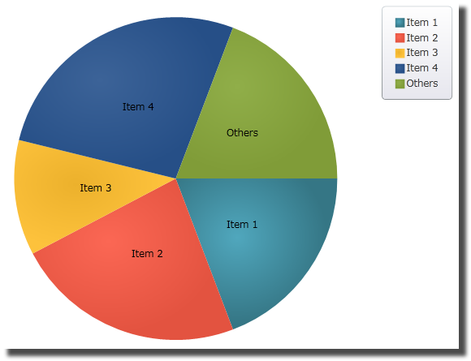

////

|metadata|
{
    "name": "igpiechartview-configuring-others-pie-slice",
    "controlName": ["IGPieChartView"],
    "tags": ["Charting","Grouping","How Do I"],
    "guid": "724efda4-9a01-4e89-a551-6448f899ba75",  
    "buildFlags": [],
    "createdOn": "2013-01-24T16:25:12.8612055Z"
}
|metadata|
////

= Configuring the Others Pie Slice

== Topic Overview

=== Purpose

This topic provides a conceptual overview of the Others pie slice in the  _IGPieChartView_™ and demonstrates its configuration using a code example.

=== In this topic

This topic contains the following sections:

* <<_Ref324841248, Introduction >>
* <<_Ref327936206,Configuring the Others Pie Slice – Code Example>>

** <<_Ref327344209,Description>>
** <<_Ref327523606,Prerequisites>>
** <<_Ref327344217,Code>>

* <<_Ref215823716, Related Content >>

[[_Ref324841248]]
== Introduction

[[_Ref215796828]]

=== Other slice summary

Sometimes, the underlying data for the  _IGPieChartView_   control contains numerous small value items. In this case, illustrated in the following picture, the Others category permits automatic aggregation of several data values into a single slice.

The Others pie slice has three customizable properties. Use the `othersCategoryText` property to customize the caption the default caption being “Others”. You can assign the `othersCategoryType` property with one of the following enumerations:

* `IGOthersCategoryTypeNumber`
* `IGOthersCategoryTypePercent`

When using the enumeration value of `IGOthersCategoryTypeNumber`, causes the direct comparison of the slice’s value to the `othersCategoryThreshold` property’s value. However, using the enumeration value of `IGOthersCategoryTypePercent` places any pie slice value that is below the `othersCategoryThreshold` value, when compared against the total pie value into the Others category.

[[_Ref327936206]]
[[_Ref324841253]]
== Configuring the Others Pie Slice – Code Example

[[_Ref327344209]]

=== Description

The code below sets the `othersCategoryType` property to `IGOthersCategoryTypeNumber` and the `othersCategoryThreshold` to 50 resulting in all slices containing a value below 50 grouped into the Others category.

[[_Ref327523606]]

=== Prerequisites

This code example requires the inclusion of the  _Chart_   framework, detail about how to add this framework can be found in the link:igchartview-adding-the-chart-framework-file.html[Adding the Chart Framework File] topic.

[[_Ref327344217]]

=== Code

*In C#:*

[source,csharp]
----
IGPieChartView piechart = new IGPieChartView();
//...
piechart.OthersCategoryType = IGOthersCategoryType.IGOthersCategoryTypeNumber;
piechart.OthersCategoryThreshold = 50;
----

*In Objective-C:*

[source,csharp]
----
IGPieChartView *piechart = [[IGPieChartView alloc] init];
//...
piechart.othersCategoryType = IGOthersCategoryTypeNumber;
piechart.othersCategoryThreshold = 50;
----

[[_Ref215823716]]
== Related Content

=== Topics

The following topics provide additional information related to this topic.

[options="header", cols="a,a"]
|====
|Topic|Purpose

| link:igpiechartview-configuring-igpiechartview.html[Configuring IGPieChartView]
|The topics in this group cover enabling, configuring, and using the _IGPieChartView_ control’s supported features.

|====