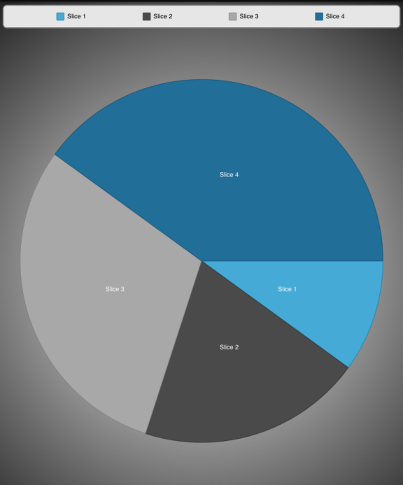

////

|metadata|
{
    "name": "igpiechartview-legends",
    "controlName": ["IGPieChartView"],
    "tags": ["Charting","Grouping","How Do I"],
    "guid": "f525e575-64d4-4af8-80af-c442455618b1",  
    "buildFlags": [],
    "createdOn": "2013-02-11T13:44:52.8217975Z"
}
|metadata|
////

= Legends

== Topic Overview

=== Purpose

This topic provides a conceptual overview about legends in the  _IGPieChartView_™ control.

=== In this topic

This topic contains the following sections:

* <<_Ref324841248, Introduction >>

** <<_Ref327859845,Legend summary>>
** <<_Ref327966938,Legend preview>>

* <<_Ref327861013, Adding a Legend to a UIView – Code Example >>

** <<_Ref326147531,Description>>
** <<_Ref326147537,Code>>

* <<_Ref324841253, Related Content >>

[[_Ref324841248]]
== Introduction

[[_Ref327859845]]

=== Legend summary

Legends identify the name of a series or its elements represented in the pie chart. The legend is a view that displays a series of legend items. Denoted by a colored icon and a label, each legend item represents a series in the pie chart view. The icon uses the series brush with the label being the series title. The legend can be positioned anywhere in the application’s view and does not have to be part of the pie chart view. Legends are linked to pie charts via the `legend` property either on the  _IGPieChartView_   or on a series. A single legend can be used to display some or all of the series in multiple chart views, although a series may only be bound to one legend view at a time.

.Note:
[NOTE]
====
If a series does not have a title property set, the label will contain the text, “Series Title” in the legend.
====

[[_Ref327966938]]

=== Legend preview

The image below presents an  _IGPieChartView_   rendered onto a view that containing a legend in the upper right corner. Each item’s icon in the legend corresponds to the series of the same color.

[[_Ref327861013]]
[[_Ref324841253]]
== Adding a Legend to a UIView – Code Example

[[_Ref326147531]]

=== Description

The following code creates an  _IGLegend_   instance and assigns it to the `legend` property on the  _IGPieChartView_   before adding the legend to the subview. With the `legend` property being set on the chart, the legend will contain items for every series that was added to the  _IGPieChartView_  .

[[_Ref326147537]]

=== Code

*In C#:*

[source,csharp]
----
IGPieChartView pieChartView = new IGPieChartView(new RectangleF(0,0, this.View.Frame.Size.Width, this.View.Frame.Size.Height), IGGridViewStyle.IGGridViewStyleDefault);
pieChart.legend = legend;
 this.View.AddSubview(pieChartView);
----

*In Objective-C:*

[source,csharp]
----
IGLegend *legend = [[IGLegend alloc]initWithFrame:CGRectMake(0, 0, 200, 100)];
yourPieChart.legend = legend;
[self.view addSubview:legend];
----

== Related Content

=== Topics

The following topic provides additional information related to this topic.

[options="header", cols="a,a"]
|====
|Topic|Purpose

| link:igpiechartview.html[IGPieChartView]
|This topic serves as a gateway to the features and functionality of the _IGPieChartView_ control.

|====