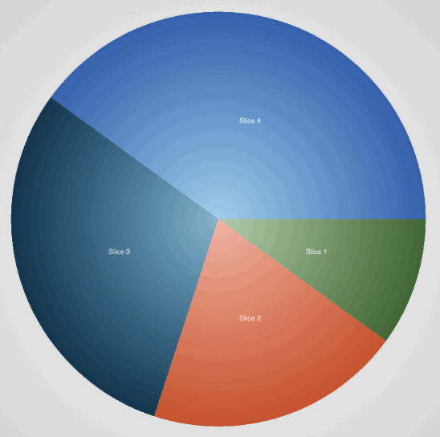
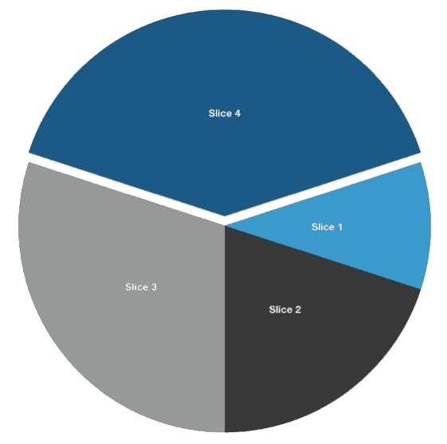
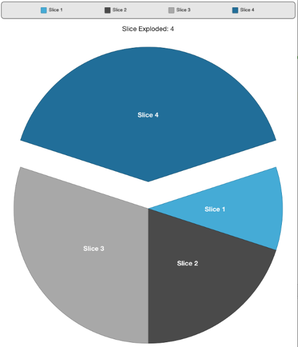

////

|metadata|
{
    "name": "igpiechartview-rotating-the-igpiechartview",
    "tags": ["How Do I","Getting Started"],
    "controlName": ["IGPieChartView"],
    "guid": "3255bfeb-4ac3-4cf5-9552-e753ca578c1c",  
    "buildFlags": [],
    "createdOn": "2014-03-18T14:18:47.0220924Z"
}
|metadata|
////

= Rotating the IGPieChartView

== Topic Overview

=== Purpose

This topic provides an overview of rotating the  _IGPieChartView_™ control and demonstrates their operation with a code example.

=== In this topic

This topic contains the following sections:

* <<_Ref324841248, Introduction >>
* <<_Ref248895787, Programmatically Rotating the Pie Chart – Code Example >>

** <<_Ref327344209,Description>>
** <<_Ref250960209,Preview>>
** <<_Ref327523606,Prerequisites>>
** <<_Ref327344217,Code>>

* <<_Ref215823716, Related Content >>

[[_Ref324841248]]
== Introduction

=== Rotation summary

The  _IGPieChartView_   has the functionality to support interactive or programmatic rotation. To conduct an interactive rotation, put two fingers on top of the pie chart and rotate.

The pie chart can be rotated programmatically by using the slice index or data point to a given angle using the start, middle, and end angles of the pie slice. Use the following  _IGPieChartView_   methods to rotate the pie chart:

* `rotateSliceWithIndex:toAngle:duration:alignment:`
* `rotateSliceWithDataPoint:toAngle:duration:alignment:`

The next illustration demonstrates the programmatic rotation of the pie chart to 270 degrees when a slice has been tapped.

[[_Ref248895787]]
[[_Ref324841253]]
== Programmatically Rotating the Pie Chart – Code Example

[[_Ref327344209]]

=== Description

The code example below creates an instance of the  _IGPieChartView_   and rotates the 4th slice to 270 degrees when tapped.

=== Preview

[[_Ref327523606]]

=== Prerequisites

This code example requires the inclusion of the  __IG__  __Chart__  framework; details about how to add this framework are available in the link:igchartview-adding-the-chart-framework-file.html[Adding the Chart Framework File] topic.

[[_Ref327344217]]

=== Code

*In Objective-C:*

[source,csharp]
----
@interface igViewController () <IGPieChartViewDelegate>
{
    IGPieChartView *_pieChart;
    IGPieChartViewDataSourceHelper *_source;
    NSMutableArray *_data;
    UILabel *_label;
}
@end
@implementation igViewController
- (void)viewDidLoad
{
    [super viewDidLoad];
    _data = [self createSimpleData:5];
    _source = [[IGPieChartViewDataSourceHelper alloc] initWithData:_data valuePath:@"value" labelPath:@"label"];
    _pieChart = [[IGPieChartView alloc] init];
    _pieChart.frame = CGRectMake(0, 50, self.view.frame.size.width, self.view.frame.size.height - 50);
    _pieChart.autoresizingMask = UIViewAutoresizingFlexibleWidth|UIViewAutoresizingFlexibleHeight;
    _pieChart.dataSource = _source;
    _pieChart.font = [UIFont fontWithName:@"HelveticaNeue-Bold" size:17.0];
    _pieChart.theme = [IGPieChartDefaultThemes IGThemeDark];
    _pieChart.backgroundColor = [UIColor clearColor];
    _pieChart.allowSliceExplosion = YES;
    _pieChart.allowSliceSelection = YES;
    _pieChart.explodedDisplayStyle = IGPieSliceExplodedDisplayStyleAwayFromCenter;
    _pieChart.delegate = self;
    [self.view addSubview:_pieChart];
    IGLegend *legend = [[IGLegend alloc] initWithLegendType:IGChartLegendTypeItem];
    legend.layer.borderColor = [UIColor grayColor].CGColor;
    legend.layer.borderWidth = 2;
    legend.frame = CGRectMake(5, 5, self.view.frame.size.width - 10, 45);
    legend.autoresizingMask = UIViewAutoresizingFlexibleWidth|UIViewAutoresizingFlexibleBottomMargin;
    legend.horizontalAlignment = IGHorizontalAlignStretch;
    legend.verticalAlignment = IGVerticalAlignCenter;
    legend.orientation = IGOrientationHorizontal;
    legend.layer.cornerRadius = 8;
    legend.layer.masksToBounds = YES;
    _pieChart.legend = legend;
    [self.view addSubview:legend];
    _label = [[UILabel alloc] init];
    _label.frame = CGRectMake(0, 0, _pieChart.bounds.size.width, 50);
    _label.autoresizingMask = UIViewAutoresizingFlexibleWidth|UIViewAutoresizingFlexibleBottomMargin;
    _label.textAlignment = NSTextAlignmentCenter;
    _label.adjustsFontSizeToFitWidth = YES;
    _label.text = @"Slice Exploded: -";
    [_pieChart addSubview:_label];
}
- (void)pieChartView:(IGPieChartView *)pieChartView tapWithItem:(IGPieSliceInfo * )item atPoint:(CGPoint)point
{
    pieChartView.explodedSlices = [[NSIndexSet alloc] init];
    item.isSelected = NO;
    item.isExploded = YES;
    _label.text = [NSString stringWithFormat:@"Slice Exploded: %d", item.index+1];
    [pieChartView rotateSliceWithIndex:item.index toAngle:270.0 duration:0.75 alignment:IGPieChartSliceAlignmentMiddle];
}
-(NSMutableArray *) createSimpleData:(int)recordCount
{
    NSMutableArray * retValue = [[NSMutableArray alloc]init ];
    for (int i = 0 ; i < recordCount ; i++)
    {
        SimpleData *data = [[SimpleData alloc]initWithValue:i andLabel: [NSString stringWithFormat:@"Slice %d", i]];
        [retValue addObject:data];
    }
    return retValue;
}
- (BOOL)prefersStatusBarHidden
{
    return YES;
}
@end
@implementation SimpleData
-(id)initWithValue:(double)value andLabel:(NSString *)label
{
    self = [super init];
    if (self)
    {
        self.value = value;
        self.label = label;
    }
    return self;
}
@end
----

*In C#:*

[source,csharp]
----
public class SimpleData : NSObject
{
      [Export("value")]
      public double value { get; set;}
      [Export("label")]
      public string label { get; set; }
      public SimpleData (double data_value, string data_label)
      {
            value = data_value;
            label = data_label;
      }
}
public partial class PieChartRotation_CSViewController : UIViewController
{
      IGPieChartView _infraPieChart;
      IGPieChartViewDataSourceHelper _source;
      IGLegend _legend;
      List<NSObject> _data;
      public PieChartRotation_CSViewController ()
      {
      }
      public override void ViewDidLoad ()
      {
            base.ViewDidLoad ();
            _data = this.CreateSimpleData(5);
            _source = new IGPieChartViewDataSourceHelper(_data.ToArray(), "value", "label");
            _infraPieChart = new IGPieChartView();
            _infraPieChart.Frame = new RectangleF(0, 50, this.View.Frame.Size.Width, this.View.Frame.Size.Height - 50);
            _infraPieChart.AutoresizingMask = UIViewAutoresizing.FlexibleWidth|UIViewAutoresizing.FlexibleHeight;
            _infraPieChart.DataSource = _source;
            _infraPieChart.Theme = IGPieChartDefaultThemes.IGThemeDark();
            _infraPieChart.BackgroundColor = UIColor.Clear;
            this.View.AddSubview(_infraPieChart);
            IGLegend legend = new IGLegend(IGChartLegendType.IGChartLegendTypeItem);
            legend.Layer.BorderColor = UIColor.Gray.CGColor;
            legend.Layer.BorderWidth = 2;
            legend.Frame = new RectangleF(5, 5, this.View.Frame.Size.Width - 10, 45);
            legend.AutoresizingMask = UIViewAutoresizing.FlexibleWidth|UIViewAutoresizing.FlexibleBottomMargin;
            legend.HorizontalAlignment = IGHorizontalAlign.IGHorizontalAlignStretch;
            legend.VerticalAlignment = IGVerticalAlign.IGVerticalAlignCenter;
            legend.Orientation = IGOrientation.IGOrientationHorizontal;
            legend.Layer.CornerRadius = 8;
            legend.Layer.MasksToBounds = true;
            _infraPieChart.Legend = legend;
            this.View.AddSubview(legend);
      }
      List<NSObject> CreateSimpleData(int recordCount)
      {
            List<NSObject> retValue = new List<NSObject>();
            for (int i = 0; i < recordCount; i++) {
                  SimpleData data = new SimpleData(i, string.Format("Slice {0}", i));
                  retValue.Add(data);
            }
            return retValue;
      }
}
----

[[_Ref215823716]]
== Related Content

=== Topics

The following topic provides additional information related to this topic.

[options="header", cols="a,a"]
|====
|Topic|Purpose

| link:igpiechartview.html[IGPieChartView]
|The topics in this group cover enabling, configuring, and using the _IGPieChartView_ control’s supported features.

|====