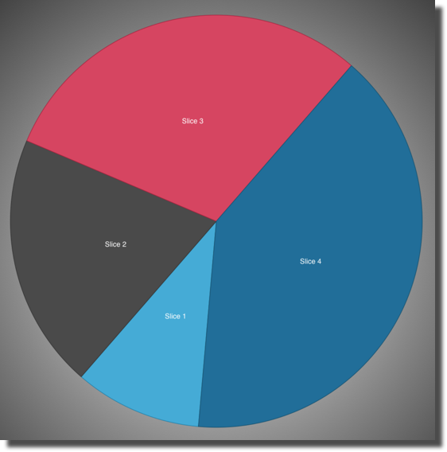

////

|metadata|
{
    "name": "igpiechartview-selecting-slices-igpiechartview",
    "controlName": ["IGPieChartView"],
    "tags": ["Charting","How Do I","Selection"],
    "guid": "c9734f90-918c-492b-b24d-31ee413ee06e",  
    "buildFlags": [],
    "createdOn": "2013-01-24T16:53:09.4518478Z"
}
|metadata|
////

= Selecting Slices on the IGPieChartView

== Topic Overview

=== Purpose

This topic provides a conceptual overview of selecting slices on the  _IGPieChartView™_   control and demonstrates its configuration using a code example.

=== In this topic

This topic contains the following sections:

* <<_Ref324841248, Introduction >>
* <<_Ref327936206,Selecting Slices on the IGPieChartView – Code Example>>

** <<_Ref327344209,Description>>
** <<_Ref327523606,Prerequisites>>
** <<_Ref327344217,Code>>

* <<_Ref215823716, Related Content >>

[[_Ref324841248]]
== Introduction

[[_Ref215796828]]

=== Selecting slices summary

A selected pie slice uses an outline, brush color or both to signify its selection. Selected slices use the `selectedBrush` and `selectedOutline` properties for applying distinct colors to the selected slices.

One method for creating Selected slices is by adding their index to an  _NSMutableIndexSet,_   and then assigning the  _NSMutableIndexSet_   instance to the `selectedSlices` property. Additionally, when using the  _IGPieChartViewDelegate_   control’s `pieChartView:tapWithItem:atPoint:` method, the `item` parameter contains a reference to the  _IGPieSliceInfo_   object, which has a settable property named `isSelected` that selects or deselects the tapped slice.

[[_Ref324842387]]
[[_Ref327936206]]
[[_Ref324841253]]
== Selecting Slices on the  _IG_  _PieChartView_  – Code Example

[[_Ref327344209]]

=== Description

The code below adds two indexes of the  _IGPieChartView_   slices to an  _NSMutableIndexSet_   and sets this object to the `selectedSlices` property. The result is a pie chart with two selected slices.

[[_Ref327523606]]

=== Prerequisites

This code example requires the inclusion of the  _IG_   framework, detail about how to add this framework can be found in the link:igchartview-adding-the-chart-framework-file.html[Adding the Chart Framework File] topic.

[[_Ref327344217]]

=== Code

*In C#:*

[source,csharp]
----
IGPieChartView _pieChartView = new IGPieChartView();
NSMutableIndexSet selected = new NSMutableIndexSet();
selected.Add(1);
selected.Add(4);
_pieChartView.SelectedSlices = selected;
----

*In Objective-C:*

[source,csharp]
----
NSMutableIndexSet *selected = [[NSMutableIndexSet alloc]init];
[selected addIndex:1];
[selected addIndex:4];
_pieChartView.selectedSlices = selected;
----

[[_Ref215823716]]
== Related Content

=== Topics

The following topic provides additional information related to this topic.

[options="header", cols="a,a"]
|====
|Topic|Purpose

| link:igpiechartview-configuring-igpiechartview.html[Configuring IGPieChartView]
|The topics in this group cover enabling, configuring, and using the _IGPieChartView_ control’s supported features.

|====