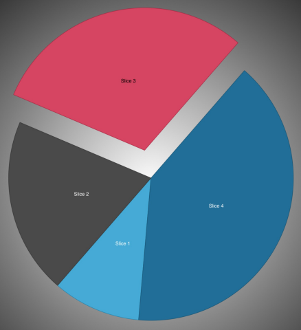

////

|metadata|
{
    "name": "igpiechartview",
    "controlName": ["IGPieChartView"],
    "tags": ["Charting","Getting Started"],
    "guid": "61f583fb-cc34-47f7-90b0-b64b7b1a4504",  
    "buildFlags": [],
    "createdOn": "2012-12-03T15:11:13.8215464Z"
}
|metadata|
////

= IGPieChartView

This section gives you an overview of the use of the  _IGPieChartView_™ control. It contains information ranging from what the control does to the step-by-step procedures on how to accomplish common tasks using the control.

Click the links below to access important information about the  _IGPieChartView_   control.

== About IGPieChartView

_IGPieChartView_   is a data visualization tool that displays a circular graph containing sectors (slices). Pie chart data is a collection of numeric values, and each slice represents one value. Small values that fall below a user-defined threshold are grouped into the Others slice.

The pie chart view supports multiple slice selection and explosion, as well as tooltips, rotation, tap and long press gestures.

== link:igchartview-adding-the-chart-framework-file.html[Adding the Chart Framework File]

This topic demonstrates how to add the chart framework file to a project.

== link:-igpiechartview-adding-the-igpiechartview-uiview.html[Adding the IGPieChartView to a UIView]

To help you get up and running with the  _IGPieChartView_   control this topic provides basic information about creating an instance of the control to display a pie chart.

== link:igpiechartview-configuring-igpiechartview.html[Configuring IGPieChartView]

The topics in this group cover enabling, configuring, and using the  _IGPieChartView_   control’s supported features.

== link:igpiechartview-igpiechart-data-source-helper.html[IGPieChart Data Source Helper]

This topic provides a conceptual overview of data source helper in the  _IGPieChartView_   and demonstrates its configuration using a code example.

== link:igpiechartview-themes.html[Themes]

This topic provides a conceptual overview of the supported themes available in the  _IGPieChartView_   control.

== link:igpiechartview-legends.html[Legends]

This topic provides a conceptual overview about legends in the  _IGPieChartView_   control.