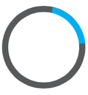

////

|metadata|
{
    "name": "igprogressview-adding-progress-view",
    "tags": ["Getting Started","How Do I"],
    "controlName": ["IGProgressView"],
    "guid": "16f823bb-e929-439a-9f86-61ff0524ad18",  
    "buildFlags": [],
    "createdOn": "2013-08-26T13:57:32.1346233Z"
}
|metadata|
////

= Adding a Progress View to a View

== Topic Overview

=== Purpose

This topic explains, with a code example how to create a basic instance of the  _IGProgressView_™ control and display it on a view.

=== Required background

The following table lists the prerequisite topic required to understanding this topic.

[options="header", cols="a,a"]
|====
|Topic|Purpose

| link:iggridview-adding-the-ig-framework-file.html[Adding the IG Framework File]
|This topic explains how to add the IG framework file to a project.

|====

=== In this topic

This topic contains the following sections:

* <<_Ref328621638, Displaying an IGProgressView – Code Example >>

** <<_Ref323199287,Description>>
** <<_Ref357071611,Preview>>
** <<_Ref323199293,Code>>

* <<_Ref323199323, Related Content >>

[[_Ref323199279]]
[[_Ref328621638]]
[[_Ref323111244]]
== Displaying an  _IGProgressView_   – Code Example

[[_Ref323199287]]

=== Description

This code example illustrates how to create a radial progress indicator with a height and width of 200 pixels, and centered vertically and horizontally in the current device orientation. After which, it is added to a view.

[[_Ref357071611]]

=== Preview

[[_Ref323199293]]

=== Code

To start, the background color of the view controller’s view is set to white.

*In Objective-C:*

[source,csharp]
----
self.view.backgroundColor = [UIColor whiteColor];
----

*In C#:*

[source,csharp]
----
this.View.BackgroundColor = UIColor.White;
----

Next, using the `initWithStyle:` constructor, create an instance of the  _IGProgressView_    __using the__  `IGProgressViewStyleRadialIndeterminate`  __style__ .

*In Objective-C:*

[source,csharp]
----
IGProgressView *progressView = [[IGProgressView alloc] initWithStyle:IGProgressViewStyleRadialIndeterminate];
progressView.frame = CGRectMake((self.view.bounds.size.width / 2) - 100, (self.view.bounds.size.height / 2) - 100, 200, 200);
progressView.autoresizingMask = UIViewAutoresizingFlexibleTopMargin|UIViewAutoresizingFlexibleLeftMargin|UIViewAutoresizingFlexibleRightMargin|UIViewAutoresizingFlexibleBottomMargin;
[self.view addSubview:progressView];
----

*In C#:*

[source,csharp]
----
IGProgressView progressView = new IGProgressView (IGProgressViewStyle.IGProgressViewStyleRadialIndeterminate);
progressView.Frame = new RectangleF((this.View.Bounds.Size.Width / 2) - 100, (this.View.Bounds.Size.Height / 2) - 100, 200, 200);
progressView.AutoresizingMask = UIViewAutoresizing.FlexibleTopMargin|UIViewAutoresizing.FlexibleBottomMargin|UIViewAutoresizing.FlexibleLeftMargin|UIViewAutoresizing.FlexibleRightMargin;
this.View.Add(progressView);
----

Next, configure the height and width to equal 200 and center the progress in the center of the view.

*In Objective-C:*

[source,csharp]
----
progressView.frame = CGRectMake((self.view.bounds.size.width / 2) - 100, (self.view.bounds.size.height / 2) - 100, 200, 200);
----

*In C#:*

[source,csharp]
----
progressView.Frame = new RectangleF((this.View.Bounds.Size.Width / 2) - 100, (this.View.Bounds.Size.Height / 2) - 100, 200, 200);
----

Next, set the auto-resizing mask to allow the progress to float in the center of the current device orientation without requiring a size adjustment.

*In Objective-C:*

[source,csharp]
----
progressView.autoresizingMask = UIViewAutoresizingFlexibleTopMargin|UIViewAutoresizingFlexibleLeftMargin|UIViewAutoresizingFlexibleRightMargin|UIViewAutoresizingFlexibleBottomMargin;
----

*In C#:*

[source,csharp]
----
progressView.AutoresizingMask = UIViewAutoresizing.FlexibleTopMargin|UIViewAutoresizing.FlexibleBottomMargin|UIViewAutoresizing.FlexibleLeftMargin|UIViewAutoresizing.FlexibleRightMargin;
----

Finally, add the progress to the view.

*In Objective-C:*

[source,csharp]
----
 [self.view addSubview:progressView];
----

*In C#:*

[source,csharp]
----
this.View.Add(progressView);
----

[[_Ref323199323]]
== Related Content

=== Topics

The following topic provides additional information related to this topic.

[options="header", cols="a,a"]
|====
|Topic|Purpose

| link:igprogressview.html[IGProgressView]
|This topic provides a conceptual overview of the _IGProgressView_ control and its key features.

|====