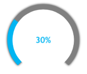
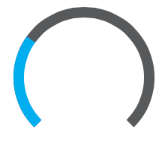

////

|metadata|
{
    "name": "igprogressview-configuring-radial-angles",
    "tags": ["Getting Started","How Do I"],
    "controlName": ["IGProgressView"],
    "guid": "3675e5f8-48aa-44ce-9a21-f6febc9e2050",  
    "buildFlags": [],
    "createdOn": "2013-08-26T14:17:40.0234001Z"
}
|metadata|
////

= Configuring Radial Angles

== Topic Overview

=== Purpose

This topic provides an introduction to configuring radial angles on the  _IGProgressView_™ control and using a code example, demonstrates how to configure them.

=== In this topic

This topic contains the following sections:

* <<_Ref324841248, Introduction >>
* <<_Ref327936206, Configuring Radial Angles – Code Example >>

** <<_Ref327344209,Description>>
** <<_Ref327523606,Prerequisites>>
** <<_Ref231532531,Preview>>
** <<_Ref327344217,Code>>

* <<_Ref215823716, Related Content >>

[[_Ref324841248]]
== Introduction

[[_Ref215796828]]

=== Radial angles summary

The `IGProgressViewStyleRadial` and `IGProgressViewStyleRadialIndeterminate` progress types can have their start and end angles customized through the `radialStartAngle` and `radialEndAngle` properties respectively. Each property accepts a  _CGFloat_   value representing the angle in degrees. The illustration below demonstrates the `radialStartAngle` of 135.0 and a `radialEndAngle` of 45.0.

[[_Ref327936206]]
[[_Ref324841253]]
== Configuring Radial Angles – Code Example

[[_Ref327344209]]

=== Description

The code example below sets the view background color to white, instantiates an  _IGProgressView_   with its progress set to 30%, with the radial start angle set to 135 degrees, and radial end angle set to 45 degrees.

[[_Ref327523606]]

=== Prerequisites

This code example requires the inclusion of the  __IG__  framework; details about how to add this framework are available in the link:iggridview-adding-the-ig-framework-file.html[Adding the IG Framework File] topic.

[[_Ref231532531]]

=== Preview

[[_Ref327344217]]

=== Code

*In Objective-C:*

[source,csharp]
----
self.view.backgroundColor = [UIColor whiteColor];
CGFloat centerX, centerY;
centerX = CGRectGetMidX(self.view.bounds);
centerY = CGRectGetMidY(self.view.bounds);
IGProgressView *progressView = [[IGProgressView alloc] initWithStyle:IGProgressViewStyleRadial];
progressView.frame = CGRectMake(centerX - 100, centerY - 100, 200, 200);
progressView.autoresizingMask = UIViewAutoresizingFlexibleTopMargin|UIViewAutoresizingFlexibleLeftMargin|UIViewAutoresizingFlexibleRightMargin|UIViewAutoresizingFlexibleBottomMargin;
progressView.progress = 0.3;
progressView.radialStartAngle = 135.0;
progressView.radialEndAngle = 45.0;
[self.view addSubview:progressView];
----

*In C#:*

[source,csharp]
----
this.View.BackgroundColor = UIColor.White;
float centerX, centerY;
centerX = this.View.Bounds.Width / 2;
centerY = this.View.Bounds.Height / 2;
IGProgressView progressView = new IGProgressView (IGProgressViewStyle.IGProgressViewStyleRadial);
progressView.Frame = new RectangleF(centerX - 100, centerY - 100, 200, 200);
progressView.AutoresizingMask = UIViewAutoresizing.All;
progressView.Progress = 0.3f;
progressView.RadialStartAngle = 135.0f;
progressView.RadialEndAngle = 45.0f;
this.View.Add(progressView);
----

[[_Ref215823716]]
== Related Content

=== Topics

The following topic provides additional information related to this topic.

[options="header", cols="a,a"]
|====
|Topic|Purpose

| link:igprogressview.html[IGProgressView]
|The topics in this group cover enabling, configuring, and using the _IGProgressView_ control’s supported features.

|====