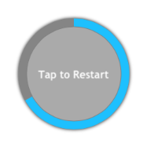

////

|metadata|
{
    "name": "igprogressview",
    "controlName": ["IGProgressView"],
    "tags": ["Getting Started"],
    "guid": "6d686298-cadc-48d9-a15b-df9d3e879ee3",  
    "buildFlags": [],
    "createdOn": "2013-05-21T13:23:43.8354311Z"
}
|metadata|
////

= IGProgressView

This section gives you an overview of the use of the  _IGProgressView_™ control. It contains information ranging from what the control does to the step-by-step procedures on how to accomplish common tasks using the control.

Click the links below to access important information about the  _IGProgressView_   control.

== About IGProgressView

The  _IGProgressView_   is a multifaceted progress control capable of rendering standard, radial, or even custom progress shapes. In addition, to the  _IGProgressView_   looking great out of the box, nearly every part  _IGProgressView_   can be styled to look great in your app. Properties such as `progressTintColor` and `progressTrackTintColor` make it simple to adjust the color of the  _IGProgressView_  . Although, if you require finer tuning; `progressShapeLayer`, `progressTrackShapeLayer`, and `radialInsertShapeLayer` are exposed to give you complete control over the progress appearance all the way down to the stroke used. The styling doesn't stop at only visual appearance, the properties `progressAnimationDuration` and `progressAnimationTimingFunction` allow for polishing the animation that occurs when the progress changes value.

== link:iggridview-adding-the-ig-framework-file.html[Adding the IG Framework File]

This topic demonstrates how to add the IG framework file to a project.

== link:igprogressview-adding-progress-view.html[Adding a Progress View to a View]

This topic provides basic information about creating an instance of the  _IGProgressView_   to help you get up and running with this control.

== link:igprogressview-configuring-igprogressview.html[Configuring IGProgressView]

The topics in this group explain and demonstrate enabling, configuring, and using the  _IGProgressView_   control’s supported features.

== link:igprogressview-progress-types.html[Progress Types]

This topic provides an introduction to the progress bar types available with the  _IGProgressView_   control.