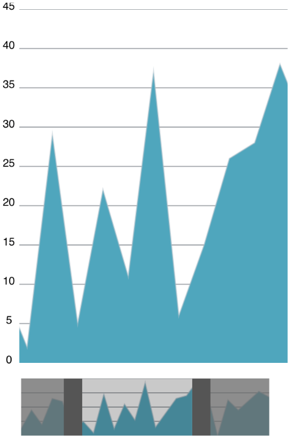

////

|metadata|
{
    "name": "igrangeselectorview-adding-range-selector-view",
    "tags": ["Getting Started","How Do I"],
    "controlName": ["IGRangeSelectorView"],
    "guid": "c8ca8c73-39f3-48be-9cef-1af4c9d0abfa",  
    "buildFlags": [],
    "createdOn": "2013-09-25T12:32:38.3317434Z"
}
|metadata|
////

= Adding the Range Selector to a View

== Topic Overview

=== Purpose

This topic explains, with a code example how to create a basic instance of the  _IGRangeSelectorView_™ control and display it on a view.

=== Required background

The following table lists the prerequisite topics required to understanding this topic.

[options="header", cols="a,a"]
|====
|Topic|Purpose

| link:igchartview-adding-the-chart-framework-file.html[Adding the Chart Framework File]
|This topic explains how to add the Chart framework file to a project.

| link:igchartview-adding-igchartview-uiview.html[Adding the IGChartView to a UIView]
|This topic provides basic information about creating an instance of the _IGChartView_ and displaying a chart to help you get up and running with this control.

|====

=== In this topic

This topic contains the following sections:

* <<_Ref238790440, Displaying an IGRangeSelectorView – Code Example >>

** <<_Ref323199287,Description>>
** <<_Ref357071611,Preview>>
** <<_Ref323199293,Code>>

* <<_Ref323199323, Related Content >>

[[_Ref323199279]]
[[_Ref328621638]]
[[_Ref238790440]]
[[_Ref323111244]]
== Displaying an  _IGRangeSelectorView_  – Code Example

[[_Ref323199287]]

=== Description

This code example illustrates how to create and add an instance of the  _IGRangeSelectorView_   to a view.

[[_Ref357071611]]

=== Preview

[[_Ref323199293]]

=== Code

To start, initialize the  _IGRangeSelectorView_   instance with its frame size and position.

*In Objective-C:*

[source,csharp]
----
IGRangeSelectorView *rangeSelectorView = [[IGRangeSelectorView alloc] initWithFrame:CGRectInset(rangeRect, 5, 5)];
----

*In C#:*

[source,csharp]
----
IGRangeSelectorView rangeSelectorView = new IGRangeSelectorView();
rangeRect.Inflate (-5, -5);
rangeSelectorView.Frame = rangeRect;
----

Next, set the auto-resizing mask allowing the range selector to adjust its height and width during rotations and account for the chart above its position.

*In Objective-C:*

[source,csharp]
----
rangeSelectorView.autoresizingMask = UIViewAutoresizingFlexibleHeight|UIViewAutoresizingFlexibleWidth|UIViewAutoresizingFlexibleTopMargin;
----

*In C#:*

[source,csharp]
----
rangeSelectorView.AutoresizingMask = UIViewAutoresizing.FlexibleHeight|UIViewAutoresizing.FlexibleWidth|UIViewAutoresizing.FlexibleTopMargin;
----

Add the range selector to the view.

*In Objective-C:*

[source,csharp]
----
 [self.view addSubview:rangeSelectorView];
----

*In C#:*

[source,csharp]
----
this.View.Add (rangeSelectorView);
----

Reference the range selector through the `zoombar` property of the  _IGChartView_   instance.

*In Objective-C:*

[source,csharp]
----
chartView.zoombar = rangeSelectorView;
----

*In C#:*

[source,csharp]
----
chartView.Zoombar = rangeSelectorView;
----

Next, create a dark gray view to later act as the `minimumThumbView`.

*In Objective-C:*

[source,csharp]
----
UIView *minValueView = [[UIView alloc] init];
minValueView.backgroundColor = [UIColor darkGrayColor];
----

*In C#:*

[source,csharp]
----
UIView minValueView = new UIView ();
minValueView.BackgroundColor = UIColor.DarkGray;
----

Create another dark gray view to later act as the `maximumThumbView`.

*In Objective-C:*

[source,csharp]
----
UIView *maxValueView = [[UIView alloc] init];
maxValueView.backgroundColor = [UIColor darkGrayColor];
----

*In C#:*

[source,csharp]
----
UIView maxValueView = new UIView ();
maxValueView.BackgroundColor = UIColor.DarkGray;
----

Next, create the transparent gray view that will appear between the `minimumThumbView` and `maximumThumbView`.

*In Objective-C:*

[source,csharp]
----
UIView *thumbView = [[UIView alloc] init];
thumbView.backgroundColor = [UIColor colorWithWhite:0.15 alpha:0.25];
----

*In C#:*

[source,csharp]
----
UIView thumbView = new UIView();
thumbView.BackgroundColor = UIColor.FromWhiteAlpha (0.15f, 0.25f);
----

Add the `shadeColor` that appears behind the `minimumThumbView` and `maximumThumbView` after dragging.

*In Objective-C:*

[source,csharp]
----
rangeSelectorView.shadeColor = [UIColor colorWithWhite:0.4 alpha:0.75];
----

*In C#:*

[source,csharp]
----
rangeSelectorView.ShadeColor = UIColor.FromWhiteAlpha (0.4f, 0.75f);
----

Next, add the create views to the `minimumThumbView`, `maximumThumbView` and `thumbView`.

*In Objective-C:*

[source,csharp]
----
rangeSelectorView.minimumThumbView = minValueView;
rangeSelectorView.maximumThumbView = maxValueView;
rangeSelectorView.thumbView = thumbView;
----

*In C#:*

[source,csharp]
----
rangeSelectorView.MinimumThumbView = minValueView;
rangeSelectorView.MaximumThumbView = maxValueView;
rangeSelectorView.ThumbView = thumbView;
----

Optionally, add the duplicate chart instance to the `contentView` of the range selector.

*In Objective-C:*

[source,csharp]
----
rangeSelectorView.contentView = chartViewSelector;
----

*In C#:*

[source,csharp]
----
rangeSelectorView.ContentView = chartViewSelector;
----

=== Code: Complete Listing

*In Objective-C:*

[source,csharp]
----
- (void)viewDidLoad
{
    [super viewDidLoad];
    self.view.backgroundColor = [UIColor whiteColor];
    CGRect chartRect, rangeRect;
    CGRectDivide(self.view.bounds, &chartRect, &rangeRect, self.view.bounds.size.height * 0.85, CGRectMinYEdge);
    NSMutableArray *data = [[NSMutableArray alloc] init];
    for (int i = 0; i < 25; i++)
    {
        double value = arc4random() % 40;
        [data addObject:[[NSNumber alloc] initWithDouble:value]];
    }
    IGCategorySeriesDataSourceHelper *source = [[IGCategorySeriesDataSourceHelper alloc] initWithValues:data];
    IGChartView *chartView = [[IGChartView alloc] initWithFrame:CGRectInset(chartRect, 5, 5)];
    [chartView setAutoresizingMask:UIViewAutoresizingFlexibleWidth | UIViewAutoresizingFlexibleHeight];
    chartView.zoomDisplayType = IGChartZoomHorizontal;
    [self.view addSubview:chartView];
    IGAreaSeries *areaSeries = (IGAreaSeries * ) [chartView addSeriesForType:[IGAreaSeries class] usingKey:@"areaSeries" withDataSource:source firstAxisKey:@"xAxis" secondAxisKey:@"yAxis"];
    areaSeries.xAxis.labelsVisible = NO;
    areaSeries.yAxis.minimum = 0;
    areaSeries.yAxis.maximum = 45;
    IGChartView *chartViewSelector = [[IGChartView alloc] init];
    [chartViewSelector setAutoresizingMask:UIViewAutoresizingFlexibleWidth | UIViewAutoresizingFlexibleHeight];
    IGAreaSeries *areaSeries1 = (IGAreaSeries * ) [chartViewSelector addSeriesForType:[IGAreaSeries class] usingKey:@"areaSeries" withDataSource:source firstAxisKey:@"xAxis" secondAxisKey:@"yAxis"];
    areaSeries1.xAxis.labelsVisible = NO;
    areaSeries1.yAxis.labelsVisible = NO;
    IGRangeSelectorView *rangeSelectorView = [[IGRangeSelectorView alloc] initWithFrame:CGRectInset(rangeRect, 5, 5)];
    rangeSelectorView.autoresizingMask = UIViewAutoresizingFlexibleHeight|UIViewAutoresizingFlexibleWidth|UIViewAutoresizingFlexibleTopMargin;
    [self.view addSubview:rangeSelectorView];
    chartView.zoombar = rangeSelectorView;
    UIView *minValueView = [[UIView alloc] init];
    minValueView.backgroundColor = [UIColor darkGrayColor];
    UIView *maxValueView = [[UIView alloc] init];
    maxValueView.backgroundColor = [UIColor darkGrayColor];
    UIView *thumbView = [[UIView alloc] init];
    thumbView.backgroundColor = [UIColor colorWithWhite:0.15 alpha:0.25];
    rangeSelectorView.shadeColor = [UIColor colorWithWhite:0.4 alpha:0.75];
    rangeSelectorView.minimumThumbView = minValueView;
    rangeSelectorView.maximumThumbView = maxValueView;
    rangeSelectorView.thumbView = thumbView;
    rangeSelectorView.contentView = chartViewSelector;
}
- (BOOL)prefersStatusBarHidden
{
    return YES;
}
----

*In C#:*

[source,csharp]
----
namespace RangeSelectorGettingStarted_CS
{
      public partial class RangeSelectorGettingStarted_CSViewController : UIViewController
      {
            [DllImport (Constants.CoreGraphicsLibrary)]
            static extern void CGRectDivide (RectangleF rect, out RectangleF slice, out RectangleF remainder, float amount, CGRectEdge edge);
            public RangeSelectorGettingStarted_CSViewController ()
            {
            }
            public override void ViewDidLoad ()
            {
                  base.ViewDidLoad ();
                  this.View.BackgroundColor = UIColor.White;
                  RectangleF chartRect, rangeRect;
                  CGRectDivide (this.View.Bounds, out chartRect, out rangeRect, this.View.Bounds.Height * 0.85f, CGRectEdge.MinYEdge); 
                  List<NSObject> data = new List<NSObject>();
                  Random r = new Random(DateTime.Now.Millisecond);
                  for(int i = 0;i <25; i++)
                  {
                        double val = r.Next() % 40; 
                        data.Add(new NSNumber(val));
                  }
                  IGCategorySeriesDataSourceHelper source = new IGCategorySeriesDataSourceHelper(data.ToArray());
                  IGChartView chartView = new IGChartView ();
                  chartRect.Inflate (-5, -5);
                  chartView.Frame = chartRect;
                  chartView.AutoresizingMask = UIViewAutoresizing.FlexibleWidth | UIViewAutoresizing.FlexibleHeight;
                  chartView.ZoomDisplayType = IGChartZoom.IGChartZoomHorizontal;
                  this.View.Add (chartView);
                  IGAreaSeries areaSeries = chartView.AddSeries (new Class ("IGAreaSeries"), "areaSeries", source, "xAxis", "yAxis") as IGAreaSeries;
                  areaSeries.XAxis.LabelsVisible = false;
                  areaSeries.YAxis.Minimum = 0;
                  areaSeries.YAxis.Maximum = 45;
                  IGChartView chartViewSelector = new IGChartView();
                  chartViewSelector.AutoresizingMask = UIViewAutoresizing.FlexibleWidth|UIViewAutoresizing.FlexibleHeight;
                  IGAreaSeries areaSeries1 = chartViewSelector.AddSeries (new Class ("IGAreaSeries"), "areaSeries", source, "xAxis", "yAxis") as IGAreaSeries;
                  areaSeries1.XAxis.LabelsVisible = false;
                  areaSeries1.YAxis.LabelsVisible = false;
                  IGRangeSelectorView rangeSelectorView = new IGRangeSelectorView();
                  rangeRect.Inflate (-5, -5);
                  rangeSelectorView.Frame = rangeRect;
                  rangeSelectorView.AutoresizingMask = UIViewAutoresizing.FlexibleHeight|UIViewAutoresizing.FlexibleWidth|UIViewAutoresizing.FlexibleTopMargin;
                  this.View.Add (rangeSelectorView);
                  chartView.Zoombar = rangeSelectorView;
                  UIView minValueView = new UIView ();
                  minValueView.BackgroundColor = UIColor.DarkGray;
                  UIView maxValueView = new UIView ();
                  maxValueView.BackgroundColor = UIColor.DarkGray;
                  UIView thumbView = new UIView();
                  thumbView.BackgroundColor = UIColor.FromWhiteAlpha (0.15f, 0.25f);
                  rangeSelectorView.ShadeColor = UIColor.FromWhiteAlpha (0.4f, 0.75f);
                  rangeSelectorView.MinimumThumbView = minValueView;
                  rangeSelectorView.MaximumThumbView = maxValueView;
                  rangeSelectorView.ThumbView = thumbView;
                  rangeSelectorView.ContentView = chartViewSelector;
            }
      }
}
----

[[_Ref323199323]]
== Related Content

=== Topics

The following topic provides additional information related to this topic.

[options="header", cols="a,a"]
|====
|Topic|Purpose

| link:igrangeselectorview.html[IGRangeSelectorView]
|This topic provides a conceptual overview of the _IGRangeSelectorView_ control and its key features.

|====