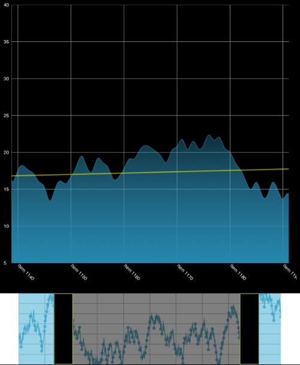

////

|metadata|
{
    "name": "igrangeselectorview",
    "tags": ["Getting Started","How Do I"],
    "controlName": ["IGRangeSelectorView"],
    "guid": "f143e803-2284-4260-81e8-66ef3795fceb",  
    "buildFlags": [],
    "createdOn": "2013-09-25T12:30:58.3987434Z"
}
|metadata|
////

= IGRangeSelectorView

This section gives you an overview of the use of the  _IGRangeSelectorView_™ control. It contains information ranging from what the control does to the step-by-step procedures on how to accomplish common tasks using the control.

Click the links below to access important information about the  _IGRangeSelectorView_   control.

== About IGRangeSelectorView

The  _IGRangeSelectorView_   control is used with the  _IGChartView_   to control zooming and scrolling when the  _IGChartView's_   `zoomDisplayType` is set to horizontal or vertical.

== link:igchartview-adding-the-chart-framework-file.html[Adding the Chart Framework File]

This topic demonstrates how to add the Chart framework file to a project.

== link:igrangeselectorview-adding-range-selector-view.html[Adding the Range Selector to a View]

This topic provides basic information about creating an instance of the  _IGRangeSelectorView_   to help you get up and running with this control.

== link:igrangeselectorview-styling-range-selector.html[Styling the Range Selector]

This topic provides an introductory overview of styling the  _IGRangeSelectorView_   control.