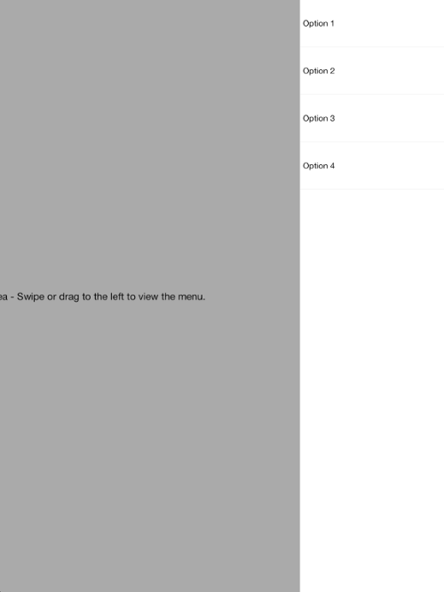

////

|metadata|
{
    "name": "igsidemenuview-configuring-side-menu-location",
    "tags": ["How Do I","Getting Started","Layouts"],
    "controlName": ["IGSideMenuView"],
    "guid": "826c7554-b464-4199-88fe-8e284b6cb9a5",  
    "buildFlags": [],
    "createdOn": "2014-09-15T11:47:44.4307618Z"
}
|metadata|
////

= Configuring the Side Menu Location

== Topic Overview

=== Purpose

This topic provides an overview of configuring the side menu location on the  _IGSideMenuView_™ control and demonstrates its configuration using a code example.

=== In this topic

This topic contains the following sections:

* <<_Ref324841248, Introduction >>
* <<_Ref248895787, Configuring the Side Menu Location – Code Example >>

** <<_Ref327344209,Description>>
** <<_Ref252521837,Preview>>
** <<_Ref327523606,Prerequisites>>
** <<_Ref327344217,Code>>

* <<_Ref215823716, Related Content >>

[[_Ref324841248]]
== Introduction

=== Side menu location summary

The  _IGSideMenuView_   uses the left and right sides of its view for displaying a  _UIView_   as a side menu. To assign the  _UIView_   as a side menu, set its instance to one of the following  _IGSideMenuView_   properties.

* `leftMenuView`
* `rightMenuView`

Changing the side menu setting changes the height of the  _IGSideMenuView_   view to match the control’s height and automatically configures the auto-resizing masks.

[[_Ref248895787]]
[[_Ref324841253]]
== Configuring the Side Menu Location – Code Example

[[_Ref327344209]]

=== Description

The code example below creates an instance of the  _IGSideMenuView_   and assigns an  _IGGridView_   to serve as the right menu.

[[_Ref252521837]]

=== Preview

[[_Ref327523606]]

=== Prerequisites

This code example requires the inclusion of the  __IG__  framework; details about how to add this framework are available in the link:iggridview-adding-the-ig-framework-file.html[Adding the IG Framework File] topic.

[[_Ref327344217]]

=== Code

*In Objective-C:*

[source,csharp]
----
@interface igViewController () <IGGridViewDelegate>
{
    IGSideMenuView *_sideMenuView;
    UILabel *_contentLabel;
    IGGridView *_gridMenu;
    IGGridViewDataSourceHelper *_dsh;
}
@end
@implementation igViewController
- (void)viewDidLoad
{
    [super viewDidLoad];
    _sideMenuView = [[IGSideMenuView alloc] initWithFrame:self.view.bounds];
    _sideMenuView.autoresizingMask = UIViewAutoresizingFlexibleHeight|UIViewAutoresizingFlexibleWidth;
    _sideMenuView.contentView.backgroundColor = [UIColor lightGrayColor];
    [self.view addSubview:_sideMenuView];
    _dsh = [[IGGridViewDataSourceHelper alloc] init];
    _dsh.data = @[@"Option 1", @"Option 2", @"Option 3", @"Option 4"];
    _contentLabel = [[UILabel alloc] initWithFrame:_sideMenuView.contentView.bounds];
    _contentLabel.autoresizingMask = UIViewAutoresizingFlexibleHeight|UIViewAutoresizingFlexibleWidth;
    _contentLabel.textAlignment = NSTextAlignmentCenter;
    _contentLabel.text = @"Content Area - Swipe or drag to the left to view the menu.";
    [_sideMenuView.contentView addSubview:_contentLabel];
    _gridMenu = [[IGGridView alloc] initWithFrame:CGRectMake(0, 0, 250, 1) style:IGGridViewStyleDefault];
    _gridMenu.headerHeight = 0;
    _gridMenu.rowSeparatorColor = [UIColor colorWithWhite:0.975 alpha:1.0];
    _gridMenu.emptyRows = NO;
    _gridMenu.dataSource = _dsh;
    _gridMenu.delegate = self;
    _sideMenuView.rightMenuView = _gridMenu;
}
- (void)gridView:(IGGridView *)gridView didSelectRowAtPath:(IGRowPath * )path
{
    [self performSelector:@selector(closeMenu) withObject:nil afterDelay:0.75];
}
- (void)closeMenu
{
    [_gridMenu deselectAll];
    [_sideMenuView closeSideMenu];
}
@end
----

*In C#:*

[source,csharp]
----
public class GridDelegate : IGGridViewDelegate
{
      [Export("SideMenu")]
      public IGSideMenuView SideMenu { get; set; }
      public override void DidSelectRow (IGGridView gridView, IGRowPath path)
      {
            NSTimer.CreateScheduledTimer (0.75f, () => {
                  SideMenu.CloseSideMenu();
                  gridView.DeselectAll();
            });
      }
}
public partial class SideMenuLocation_CSViewController : UIViewController
{
      IGSideMenuView _sideMenuView;
      IGGridView _gridMenu;
      IGGridViewDataSourceHelper _dsh;
      GridDelegate _gridDelegate;
      UILabel _contentLabel;
      public SideMenuLocation_CSViewController (IntPtr handle) : base (handle)
      {
      }
      public override void ViewDidLoad ()
      {
            base.ViewDidLoad ();
            _sideMenuView = new IGSideMenuView ();
            _sideMenuView.Frame = this.View.Bounds;
            _sideMenuView.AutoresizingMask = UIViewAutoresizing.FlexibleWidth | UIViewAutoresizing.FlexibleHeight;
            _sideMenuView.ContentView.BackgroundColor = UIColor.LightGray;
            this.View.AddSubview (_sideMenuView);
            _dsh = new IGGridViewDataSourceHelper ();
            _dsh.Data = new NSObject[] { new NSString("Option 1"), new NSString("Option 2"), 
                  new NSString("Option 3"), new NSString("Option 4") };
            _contentLabel = new UILabel (_sideMenuView.ContentView.Bounds);
            _contentLabel.AutoresizingMask = UIViewAutoresizing.FlexibleHeight | UIViewAutoresizing.FlexibleWidth;
            _contentLabel.TextAlignment = UITextAlignment.Center;
            _contentLabel.Text = "Content Area - Swipe or drag to the left to view the menu.";
            _sideMenuView.ContentView.AddSubview (_contentLabel);
            _gridMenu = new IGGridView (new RectangleF (0, 0, 250, 1), IGGridViewStyle.IGGridViewStyleDefault);
            _gridMenu.HeaderHeight = 0;
            _gridMenu.EmptyRows = false;
            _gridMenu.RowSeparatorColor = new UIColor (0.975f, 0.975f, 0.975f, 1.0f);
            _gridMenu.DataSource = _dsh;
            _gridMenu.Delegate = _gridDelegate = new GridDelegate() { SideMenu = _sideMenuView };
            _sideMenuView.RightMenuView = _gridMenu;
      }
}
----

[[_Ref215823716]]
== Related Content

=== Topics

The following topic provides additional information related to this topic.

[options="header", cols="a,a"]
|====
|Topic|Purpose

| link:igsidemenuview.html[IGSideMenuView]
|The topics in this group cover enabling, configuring, and using the _IGSideMenuView_ control’s supported features.

|====