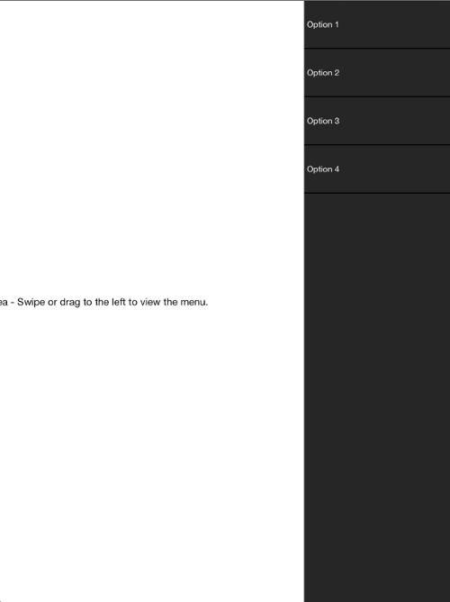

////

|metadata|
{
    "name": "igsidemenuview",
    "tags": ["Getting Started"],
    "controlName": ["IGSideMenuView"],
    "guid": "f8a08457-5c55-4b67-94d3-0d168c087873",  
    "buildFlags": [],
    "createdOn": "2014-09-15T11:35:24.8478109Z"
}
|metadata|
////

= IGSideMenuView

This section gives you an overview of the use of the  _IGSideMenuView_   control. It contains information ranging from what the control does to the step-by-step procedures on how to accomplish common tasks using the control. Click the links below to access important information about the  _IGSideMenuView_   control.

== About IGSideMenuView

The  _IGSideMenuView_   allows for a view to be exposed or hidden programmatically or through user interaction on the left or right side of the  _IGSideMenuView_  .

== link:iggridview-adding-the-ig-framework-file.html[Adding the IG Framework File]

This topic demonstrates how to add the IG framework file to a project.

== link:igsidemenuview-adding-side-menu-view.html[Adding the Side Menu to a View]

This topic explains, with a code example how to create a basic instance of the  _IGSideMenuView_   control and display it on a view.

== link:igsidemenuview-configuring-igsidemenuview.html[Configuring IGSideMenuView]

The topics in this group cover enabling configuring, and using the  _IGSideMenuView_   control’s supported features.