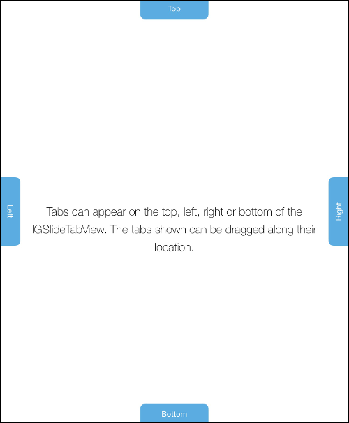

////

|metadata|
{
    "name": "igslidetabview-configuring-tab-locations",
    "tags": ["How Do I","Getting Started","Layouts"],
    "controlName": ["IGSlideTabView"],
    "guid": "1785f974-b90b-4596-94ec-1ae8eeaf5390",  
    "buildFlags": [],
    "createdOn": "2014-03-18T13:36:10.4998677Z"
}
|metadata|
////

= Configuring Tab Locations

== Topic Overview

=== Purpose

This topic provides a conceptual overview of tab locations on the  _IGSlideTabView_™ control.

=== In this topic

This topic contains the following sections:

* <<_Ref324841248, Introduction >>
* <<_Ref215823716, Related Content >>

[[_Ref324841248]]
== Introduction

=== Tab locations summary

Tab items can be placed on the bottom, left, top and right of the  _IGSlideTabView_  . The default tab item location is the top and can be changed by setting the `tabLocation` property found on the  _IGSlideTabItem_   instance. The `tabLocation` property supports the subsequent enumeration values:

* `IGSlideTabLocationTop`
* `IGSlideTabLocationBottom`
* `IGSlideTabLocationLeft`
* `IGSlideTabLocationRight`

The image below displays tab items on the top, right, bottom and left of the  _IGSlideTabView_  . As illustrated, each tab item is labeled with its location.

Once displayed tab items can have their `tabLocation` moved by simply setting its property to one of the supported enumerations.

[[_Ref324841253]]
[[_Ref215823716]]
== Related Content

=== Topics

The following topic provides additional information related to this topic.

[options="header", cols="a,a"]
|====
|Topic|Purpose

| link:igslidetabview.html[IGSlideTabView]
|The topics in this group cover enabling, configuring, and using the _IGSlideTabView_ control’s supported features.

|====