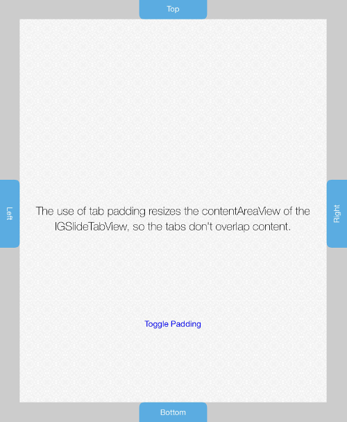

////

|metadata|
{
    "name": "igslidetabview-configuring-tab-padding",
    "tags": ["How Do I","Getting Started","Layouts"],
    "controlName": ["IGSlideTabView"],
    "guid": "8f81691b-e1a5-42da-bdc1-b68205213525",  
    "buildFlags": [],
    "createdOn": "2014-03-18T13:38:57.0543941Z"
}
|metadata|
////

= Configuring Tab Padding

== Topic Overview

=== Purpose

This topic introduces tab padding on the  _IGSlideTabView_™ control.

=== In this topic

This topic contains the following sections:

* <<_Ref324841248, Introduction >>
* <<_Ref215823716, Related Content >>

[[_Ref324841248]]
== Introduction

=== Tab padding summary

Tab items added to the  _IGSlideTabView_   overlap the views added to the `contentAreaView`. The illustration below demonstrates tabs overlapping the `contentAreaView`.

To prevent the tabs from overlapping content contained in the `contentAreaView` use the `useTabPadding` property available on the  _IGSlideTabView_   instance. The `useTabPadding` property resizes the `contentAreaView` based on the largest tab width or height so that no tabs are overlapping. The illustration below demonstrates the use of `useTabPadding` when set to `YES`; the light gray area signifies the padded tab area and is shaded for illustrative purposes only.

[[_Ref324841253]]
[[_Ref215823716]]
== Related Content

=== Topics

The following topic provides additional information related to this topic.

[options="header", cols="a,a"]
|====
|Topic|Purpose

| link:igslidetabview.html[IGSlideTabView]
|The topics in this group cover enabling, configuring, and using the _IGSlideTabView_ control’s supported features.

|====