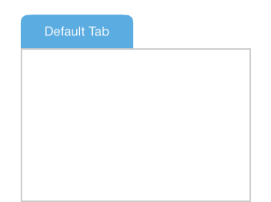

////

|metadata|
{
    "name": "igslidetabview-configuring-the-content-view",
    "tags": ["How Do I","Getting Started"],
    "controlName": ["IGSlideTabView"],
    "guid": "4920eceb-52a0-4b47-ace5-a3d334ecded0",  
    "buildFlags": [],
    "createdOn": "2014-03-18T13:41:11.3850773Z"
}
|metadata|
////

= Configuring the Content View

== Topic Overview

=== Purpose

This topic provides a conceptual overview of configuring the content view on the  _IGSlideTabView_™ control and uses a code example to illustrate its operation.

=== In this topic

This topic contains the following sections:

* <<_Ref324841248, Introduction >>
* <<_Ref248895787, Configuring the Content View – Code Example >>

** <<_Ref327344209,Description>>
** <<_Ref327523606,Prerequisites>>
** <<_Ref327344217,Code>>

* <<_Ref215823716, Related Content >>

[[_Ref324841248]]
== Introduction

=== Configuring the content view summary

The `contentView` is a  _UIView_   that sits off screen next to the tab view, along one of the edges of the  _IGSlideTabView_  . Animation brings this area into and out of view by either tapping or swiping the tab. By default, the content view appears as a white view with a gray border as shown in the following illustration.

You can replace the default `contentView` with any custom view by setting the `contentView` property to `UIView`. Moreover, you can add any content to the default `contentView` using the `addSubview:` method on the `contentView`.

.Note:
[NOTE]
====
Regardless of whether it is a custom or default view you must first set the `contentSize` property or the `contentView` will not display.
====

[[_Ref248895787]]
[[_Ref324841253]]
== Configuring the Content View – Code Example

[[_Ref327344209]]

=== Description

The code example below creates and adds a custom `tabView` containing a loupe to the  _IGSlideTabView_    __and__   __allows__  dragging  __of the__   __tab__   __item__   __when open__  __ed__   __or closed__ . When the tab is exposing the `contentView,` a search box is brought into view.

=== Preview

[[_Ref327523606]]

=== Prerequisites

This code example requires the inclusion of the  __IG__  framework; details about how to add this framework are available in the link:iggridview-adding-the-ig-framework-file.html[Adding the IG Framework File] topic.

[[_Ref327344217]]

=== Code

*In Objective-C:*

[source,csharp]
----
- (void)viewDidLoad
{
    [super viewDidLoad];
    self.view.backgroundColor = [UIColor whiteColor];
    IGSlideTabView *slideTabView = [[IGSlideTabView alloc] initWithFrame:self.view.bounds];
    slideTabView.autoresizingMask = UIViewAutoresizingFlexibleHeight|UIViewAutoresizingFlexibleWidth;
    [self.view addSubview:slideTabView];
    UIView *tabView = [self createTabView];
    IGSlideTabItem *tabItem = [IGSlideTabItem tabWithLocation:IGSlideTabLocationRight title:nil tabView:tabView contentView:nil];
    tabItem.tabSize = CGSizeMake(48, 48);
    tabItem.tabOffset = CGPointMake(2, 0);
    tabItem.tabPosition = 5;
    tabItem.isDraggable = IGSlideTabDragOpenedOrClosed;
    tabItem.contentSize = [IGSlideTabContentSize sizeWithPercentageWidth:0.4 fixedHeight:48];
    [slideTabView addTab:tabItem];
    UITextView *textView = [[UITextView alloc] initWithFrame:tabItem.contentView.bounds];
    textView.autoresizingMask = UIViewAutoresizingFlexibleWidth|UIViewAutoresizingFlexibleHeight;
    textView.textAlignment = NSTextAlignmentCenter;
    textView.font = [UIFont fontWithName:@"HelveticaNeue-Thin" size:20.0];
    textView.text = @"Search Text";
    [tabItem.contentView addSubview:textView];
    tabItem.isExpanded = YES;
}
- (UIView *)createTabView
{
    UIView *view = [[UIView alloc] initWithFrame:CGRectMake(0, 0, 48, 48)];
    view.backgroundColor = [UIColor colorWithWhite:0.8 alpha:1.0];
    CAShapeLayer *loupeShape = [CAShapeLayer layer];
    loupeShape.fillColor = [UIColor whiteColor].CGColor;
    loupeShape.strokeColor = [UIColor darkGrayColor].CGColor;
    loupeShape.lineWidth = 2;
    loupeShape.path = [self createLoupePath].CGPath;
    [view.layer addSublayer:loupeShape];
    return view;
}
- (UIBezierPath *)createLoupePath
{
    UIBezierPath *loupePath = [UIBezierPath bezierPath];
    [loupePath moveToPoint:CGPointMake(29.94, 8.37)];
    [loupePath addCurveToPoint:CGPointMake(30.31, 26.72) controlPoint1:CGPointMake(35.63, 13.42) controlPoint2:CGPointMake(35.76, 21.53)];
    [loupePath addCurveToPoint:CGPointMake(32.18, 27.15) controlPoint1:CGPointMake(30.96, 26.51) controlPoint2:CGPointMake(31.7, 26.66)];
    [loupePath addLineToPoint:CGPointMake(41.91, 37.16)];
    [loupePath addCurveToPoint:CGPointMake(41.73, 39.29) controlPoint1:CGPointMake(42.52, 37.79) controlPoint2:CGPointMake(42.44, 38.74)];
    [loupePath addLineToPoint:CGPointMake(40.12, 40.52)];
    [loupePath addCurveToPoint:CGPointMake(37.71, 40.36) controlPoint1:CGPointMake(39.4, 41.07) controlPoint2:CGPointMake(38.33, 40.99)];
    [loupePath addLineToPoint:CGPointMake(27.98, 30.36)];
    [loupePath addCurveToPoint:CGPointMake(27.78, 28.64) controlPoint1:CGPointMake(27.51, 29.87) controlPoint2:CGPointMake(27.45, 29.18)];
    [loupePath addCurveToPoint:CGPointMake(8.87, 27.06) controlPoint1:CGPointMake(21.98, 32.15) controlPoint2:CGPointMake(14.01, 31.62)];
    [loupePath addCurveToPoint:CGPointMake(8.87, 8.37) controlPoint1:CGPointMake(3.04, 21.9) controlPoint2:CGPointMake(3.04, 13.53)];
    [loupePath addCurveToPoint:CGPointMake(29.94, 8.37) controlPoint1:CGPointMake(14.69, 3.21) controlPoint2:CGPointMake(24.12, 3.21)];
    [loupePath closePath];
    return loupePath;
}
----

*In C#:*

[source,csharp]
----
public override void ViewDidLoad ()
{
      base.ViewDidLoad ();
      this.View.BackgroundColor = UIColor.White;
      IGSlideTabView slideTabView = new IGSlideTabView ();
      slideTabView.Frame = this.View.Bounds;
      slideTabView.AutoresizingMask = UIViewAutoresizing.FlexibleWidth | UIViewAutoresizing.FlexibleHeight;
      this.View.Add (slideTabView);
      UIView tabView = CreateTabView();
      IGSlideTabItem tabItem = new IGSlideTabItem ();
      tabItem.TabLocation = IGSlideTabLocation.IGSlideTabLocationRight;
      tabItem.IsDraggable = IGSlideTabDrag.IGSlideTabDragOpenedOrClosed;
      tabItem.TabView = tabView;
      tabItem.TabSize = new SizeF (48, 48);
      tabItem.TabOffset = new PointF (2, 0);
      tabItem.TabPosition = 5;
      tabItem.ContentSize = IGSlideTabContentSize.CreatePercentageWidthFixedHeightSize (0.4f, 48);
      slideTabView.AddTab(tabItem);
      UITextView textView = new UITextView ();
      textView.Frame = tabItem.ContentView.Bounds;
      textView.AutoresizingMask = UIViewAutoresizing.FlexibleWidth|UIViewAutoresizing.FlexibleHeight;
      textView.TextAlignment = UITextAlignment.Center;
      textView.Font = UIFont.FromName ("HelveticaNeue-Thin", 20.0f);
      textView.Text = @"Search Text";
      tabItem.ContentView.Add (textView);
      tabItem.IsExpanded = true;
}
public UIView CreateTabView()
{
      UIView view = new UIView ();
      view.Frame = new RectangleF (0, 0, 48, 48);
      view.BackgroundColor = UIColor.FromWhiteAlpha (0.8f, 1.0f);
      CAShapeLayer loupeShape = new CAShapeLayer();
      loupeShape.FillColor = UIColor.White.CGColor;
      loupeShape.StrokeColor = UIColor.DarkGray.CGColor;
      loupeShape.LineWidth = 2;
      loupeShape.Path = CreateLoupePath().CGPath;
      view.Layer.AddSublayer (loupeShape);
      return view;
}
public UIBezierPath CreateLoupePath()
{
      UIBezierPath loupePath = new UIBezierPath();
      loupePath.MoveTo(new PointF(29.94f, 8.37f));
      loupePath.AddCurveToPoint(new PointF(30.31f, 26.72f), new PointF(35.63f, 13.42f), new PointF(35.76f, 21.53f));
      loupePath.AddCurveToPoint(new PointF(32.18f, 27.15f), new PointF(30.96f, 26.51f), new PointF(31.7f, 26.66f));
      loupePath.AddLineTo(new PointF(41.91f, 37.16f));
      loupePath.AddCurveToPoint(new PointF(41.73f, 39.29f), new PointF(42.52f, 37.79f), new PointF(42.44f, 38.74f));
      loupePath.AddLineTo(new PointF(40.12f, 40.52f));
      loupePath.AddCurveToPoint(new PointF(37.71f, 40.36f), new PointF(39.4f, 41.07f), new PointF(38.33f, 40.99f));
      loupePath.AddLineTo(new PointF(27.98f, 30.36f));
      loupePath.AddCurveToPoint(new PointF(27.78f, 28.64f), new PointF(27.51f, 29.87f), new PointF(27.45f, 29.18f));
      loupePath.AddCurveToPoint(new PointF(8.87f, 27.06f), new PointF(21.98f, 32.15f), new PointF(14.01f, 31.62f));
      loupePath.AddCurveToPoint(new PointF(8.87f, 8.37f), new PointF(3.04f, 21.9f), new PointF(3.04f, 13.53f));
      loupePath.AddCurveToPoint(new PointF(29.94f, 8.37f), new PointF(14.69f, 3.21f), new PointF(24.12f, 3.21f));
      loupePath.ClosePath();
      return loupePath;
}
----

[[_Ref215823716]]
== Related Content

=== Topics

The following topic provides additional information related to this topic.

[options="header", cols="a,a"]
|====
|Topic|Purpose

| link:igslidetabview.html[IGSlideTabView]
|The topics in this group cover enabling, configuring, and using the _IGSlideTabView_ control’s supported features.

|====