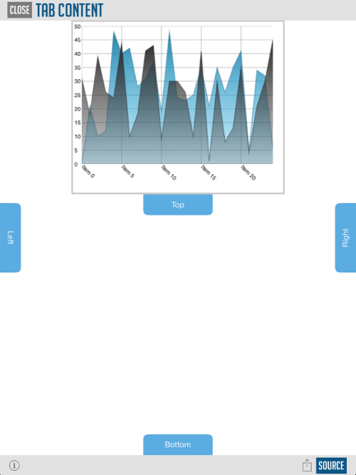

////

|metadata|
{
    "name": "igslidetabview",
    "tags": ["Getting Started"],
    "controlName": ["IGSlideTabView"],
    "guid": "a5e50322-219a-4d6e-8cf8-c67657c65392",  
    "buildFlags": [],
    "createdOn": "2014-03-18T13:11:15.0583333Z"
}
|metadata|
////

= IGSlideTabView

This section gives you an overview of the use of the  _IGSlideTabView_   control. It contains information ranging from what the control does to the step-by-step procedures on how to accomplish common tasks using the control. Click the links below to access important information about the  _IGSlideTabView_   control.

== About IGSlideTabView

The  _IGSlideTabView_   allows you to easily create a tab item on any side of the contained view that slides out content when tapped or swiped. Customization options include a property named `useTabPadding` that allows you to provide padding around the `contentAreaView` so that your views are not overlapped by tabs, pulsing a tab item to draw attention and full flexibility to create your own tab view and tab content view.

== link:iggridview-adding-the-ig-framework-file.html[Adding the IG Framework File]

This topic demonstrates how to add the IG framework file to a project.

== link:igslidetabview-adding-the-slide-tab-view.html[Adding the Slide Tab View to a View]

This topic provides basic information about creating an instance of the  _IGSlideTabView_   to help you get up and running with this control.

== link:igslidetabview-configuring-igslidetabview.html[Configuring IGSlideTabView]

The topics in this group cover enabling configuring, and using the  _IGSlideTabView_   control’s supported features.